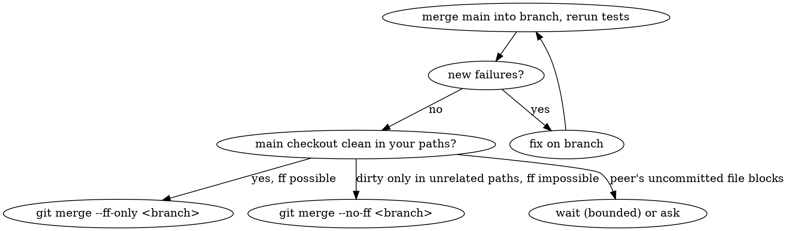

# Landing work on local main in a shared checkout

## Overview

The main checkout (`Rosy OS/`) is shared: several sessions edit, stage and commit there,
and **one `.git/index` serves all of them**. Anything you did not write is a peer's
in-flight work — never stage, revert, stash, amend over, or "clean up" it.
Work in your own worktree; touch main only to fast-forward it.

## Before you start

```bash
cd "<repo>/Rosy OS"                      # quote: the path has a space
git status --short --branch; git worktree list
git worktree add --relative-paths .worktrees/<short-name> -b <type>/<topic> main
```

- `.worktrees/` is gitignored; do not create worktrees elsewhere on F:. Scratch files go to `X:\DevTemp`.
- Check `ListAgents` (when available) for peers and what they own.
- Background executors: commit after every step, and the dispatcher runs a commit monitor
  — 40 minutes without a new commit on the branch is a warning to check on the executor.

## Committing

- `git add <path> ...` with **only** paths you created or changed, taken from `git status --short`.
  Never `git add -A`, `git add .`, or a directory. One wrong path aborts the whole `git add`,
  so check the exit code before committing.
- Before a pathspec-less commit: `git diff --cached --name-only` must equal your list. If a
  peer staged something in a shared index, commit with `git commit --only <your paths>` —
  only for files that are wholly yours, because `--only` records their working-tree content.
- Never `--amend`, `rebase`, `reset --hard`, or `stash` in the shared checkout: HEAD may be
  a peer's commit by then. Never `git commit -- <shared file>` (it takes the working tree,
  sweeping in a peer's rows).
- Append-only shared files (`docs/reference/ROSY ADR Log.md`, `docs/logs.md`) may hold a
  peer's uncommitted rows: stage only your line (`git apply --cached --unidiff-zero my-row.patch`),
  then verify `git diff --cached -- <file>` shows only yours.
- Docs that name a branch use the exact `git branch` name (`feat/rosy-skills`), never a paraphrase.

## Tests: yours or pre-existing?

Run the relevant suites in your worktree, then compare against the list of failures that
already exist on main:

```bash
python -m pytest <paths> -q -rfE -p no:cacheprovider > X:/DevTemp/<name>/run.txt
python test/known_failures.py X:/DevTemp/<name>/run.txt     # exit 1 = a NEW failure
```

A `NEW` line is yours until proven otherwise (check it on a clean `main` worktree). If
your change fixes a listed failure, delete its line from `test/known_failures.txt` in the
same commit. Never add a line to hide a failure your branch introduced.

## ADR numbers

Re-check **right before writing** — peers take numbers minutes apart:

1. `ls docs/adr` on main **and** the working tree (a peer's untracked file), plus
   `git for-each-ref refs/heads` branches (`git ls-tree -r --name-only <branch> docs/adr`).
2. `| D-nnn |` rows in `docs/reference/ROSY ADR Log.md` (a row can exist before its file).
3. `adr_gaps` in `tools/harness/harness.yaml` (reserved or skipped numbers).

Take the next free number. Commit the ADR file **and** its Log row together (the Log is
UTF-8 with BOM and **CRLF** — keep both), then `python tools/harness/rosy_harness.py lint`.
A number lost to a collision goes into `adr_gaps` with the reason.

## Landing



1. In the worktree: `git merge main`, rerun the relevant tests, compare with `known_failures`.
2. In the main checkout: `git merge --ff-only <branch>`. If main moved and ff is impossible,
   repeat step 1. Use `--no-ff` only when main is dirty in paths your branch does not touch.
3. If git refuses because a peer's uncommitted file would be overwritten: **do not touch that
   file.** Wait in a bounded loop (e.g. 10 × 60 s re-trying `git merge --ff-only`) or ask the
   user/peer. Never stash, checkout, or delete it.
4. Do not push unless the task says so. Local main ahead of `origin/main` has no CI evidence.

## Red flags — stop

- "I'll just `git add -A`, the other files are probably fine."
- "The failing test is unrelated" — without running `test/known_failures.py`.
- "D-26x looked free ten minutes ago."
- "I'll stash their change and put it back after the merge."
- "Amend is quicker than a new commit."

Background: `docs/solutions/workflow-issues/adr-numbers-collide-between-concurrent-sessions-2026-09-25.md`.
