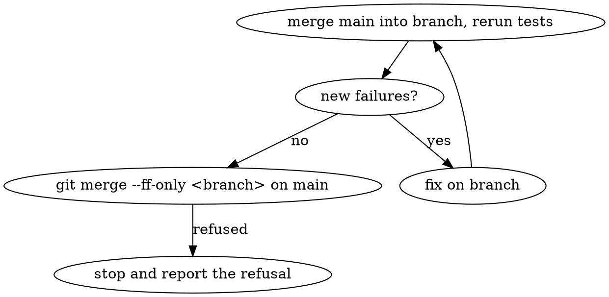

# Landing work on local main in a shared checkout

## Overview

The full record is `AGENTS.md` section 「같이 하는 깃」.
`docs/reference/shared-checkout.md` section 「같이 하는 깃」 is the same start order.
This file repeats those commands. A wording change updates `AGENTS.md` and `docs/reference/shared-checkout.md` in one commit.
The lab umbrella `F:\Dev\Control\Robot\Rosy\Agents.md` records the same procedure.
The repo is `F:\Dev\Control\Robot\Rosy\rosy-platform` (no space). One `.git/index` serves the
shared `main` checkout. A path you did not write belongs to another session.

## Before you start

```bash
cd F:\Dev\Control\Robot\Rosy\rosy-platform
git status --short --branch; git worktree list
git worktree add --relative-paths .worktrees/<short-name> -b <type>/<topic> main
```

- `.worktrees/` is gitignored; do not create worktrees elsewhere on F:. Scratch files go to `X:\DevTemp`.
- Check `ListAgents` (when available) for peers and what they own.
- Background executors: commit after every step, and the dispatcher runs a commit monitor
  — 40 minutes without a new commit on the branch is a warning to check on the executor.

## Committing

- `git add <path> ...` with **only** paths you created or changed, taken from `git status --short`.
  Never `git add -A`, `git add .`, or a directory. One wrong path aborts the whole `git add`,
  so check the exit code before committing.
- Before a pathspec-less commit: `git diff --cached --name-only` must equal your list. If a
  peer staged something in a shared index, commit with `git commit --only <your paths>` —
  only for files that are wholly yours, because `--only` records their working-tree content.
- Never `--amend`, `rebase`, `reset --hard`, or `stash` in the shared checkout: HEAD may be
  a peer's commit by then. Never `git commit -- <shared file>` (it takes the working tree,
  sweeping in a peer's rows).
- Append-only shared files (`docs/reference/ROSY ADR Log.md`, `docs/logs.md`) may hold a
  peer's uncommitted rows: stage only your line (`git apply --cached --unidiff-zero my-row.patch`),
  then verify `git diff --cached -- <file>` shows only yours.
- Docs that name a branch use the exact `git branch` name (`feat/rosy-skills`), never a paraphrase.

## Tests: yours or pre-existing?

Run the relevant suites in your worktree, then compare against the list of failures that
already exist on main:

```bash
python -m pytest <paths> -q -rfE -p no:cacheprovider > X:/DevTemp/<name>/run.txt
python test/known_failures.py X:/DevTemp/<name>/run.txt     # exit 1 = a NEW failure
```

A `NEW` line is yours until proven otherwise (check it on a clean `main` worktree). If
your change fixes a listed failure, delete its line from `test/known_failures.txt` in the
same commit. Never add a line to hide a failure your branch introduced.

## ADR numbers

Reserve **right before writing** — peers take numbers minutes apart (D-508):

```bash
python tools/harness/adr_reserve.py next "<topic>"   # prints D-nnn; use it
python tools/harness/adr_reserve.py list               # current refs/adr reservations
python tools/harness/adr_reserve.py release D-nnn      # give back an unused number
```

The tool scans `docs/adr`, Log rows and gaps on every branch and worktree plus
`refs/adr/D-*`, then creates `refs/adr/D-nnn` create-only; only one session can win a
number. Commit the ADR file **and** its Log row together (the Log is UTF-8 with BOM and
**CRLF** — keep both), then `python tools/harness/rosy_harness.py lint`. A number lost to a
collision goes into `tools/harness/adr_gaps.txt` as one `D-nnn reason` line.
The Log, `logs.md` and `adr_gaps.txt` merge with `merge=union`; regenerate `index.md`
conflicts with `python tools/harness/rosy_harness.py generate`.

## Landing


```dot
digraph land {
  "merge main into branch, rerun tests" -> "new failures?";
  "new failures?" -> "fix on branch" [label="yes"];
  "fix on branch" -> "merge main into branch, rerun tests";
  "new failures?" -> "git merge --ff-only <branch> on main" [label="no"];
  "git merge --ff-only <branch> on main" -> "stop and report the refusal" [label="refused"];
}
```

1. In the worktree: `git merge main`, rerun the relevant tests, compare with `known_failures`.
2. In the main checkout: `git merge --ff-only <branch>`. If main has new commits, repeat step 1
   and try `--ff-only` again. There is no `--no-ff` landing.
3. If git refuses because a peer's uncommitted file would be overwritten: leave that file.
   Report the refusal. Do not stash, checkout, or delete it, and do not clean the file and retry.
4. Push only when the task says to push, and then only in the D-427 order in `AGENTS.md`.
   Local main ahead of `origin/main` has no CI evidence.

## Red flags — stop

- "I'll just `git add -A`, the other files are probably fine."
- "The failing test is unrelated" — without running `test/known_failures.py`.
- "D-26x looked free ten minutes ago."
- "I'll stash their change and put it back after the merge."
- "Amend is quicker than a new commit."

Background: `docs/solutions/workflow-issues/adr-numbers-collide-between-concurrent-sessions-2026-09-25.md`.
