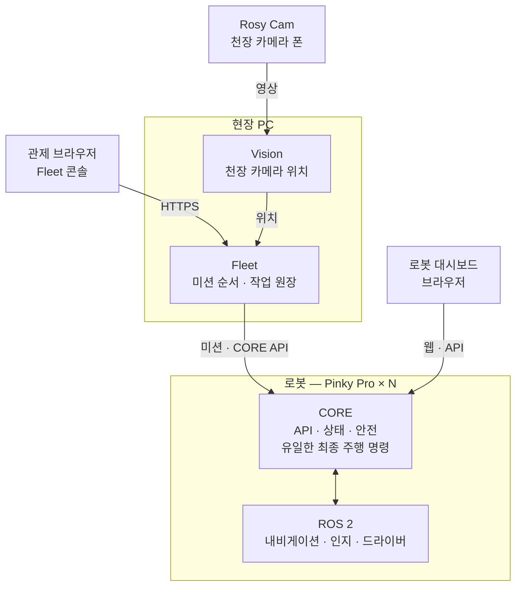

# ROSY Platform

[](https://github.com/robotics-team-1213/rosy-platform/actions/workflows/ci.yml)
[](LICENSE)


> 어떤 로봇이든 웹·표준 API로 제어하고, 현장 Fleet이 여러 대에 미션을 나눠 주는 로봇 플랫폼.
> 첫 하드웨어는 **Pinky Pro** (Raspberry Pi 5). [pinky_pro](https://github.com/pinklab-kr/pinky_pro) 포크에서 출발했다.

## 한눈에 보기



| 구성 | 어디서 도나 | 하는 일 |
|---|---|---|
| **CORE** | 각 로봇 | 외부와 말하는 유일한 창구. 상태·안전을 지키고 최종 주행 명령을 혼자 낸다 |
| **Fleet** | 현장 PC | 여러 로봇에 미션을 나누고 작업 원장을 소유한다. 로봇 모터를 직접 움직이지 않는다 |
| **Vision** | 현장 PC | 천장 카메라 영상에서 로봇 위치를 뽑아 Fleet에 준다 |
| **인지·내비게이션** | 각 로봇 | 차선·장애물 증거, 경로 계획. 명령은 CORE를 거친다 |
| **학습** | 모델 PC | 주행 데이터로 인지 모델을 학습해 로봇에 배달한다 |

## 시작하기

| 나는 | 여기부터 |
|---|---|
| 🆕 새로 합류한 팀원 | **[팀 가이드](docs/reference/team-guide.md)** — 초대 수락부터 첫 PR까지 순서대로 |
| 🔀 PR을 올리려는 사람 | [기여 안내](.github/CONTRIBUTING.md) |
| 🛠️ 빌드·시뮬·테스트·배포 | [개발 가이드](docs/reference/developer-guide.md) |
| 📊 지금 무엇이 되고 안 되나 | [STATUS.md](STATUS.md) — 모듈별 게이트 |
| 🤖 실험실 PC 공유 체크아웃의 AI 세션 | [같이 하는 깃](docs/reference/shared-checkout.md) · [AGENTS.md](AGENTS.md) |


## 문서 지도

| 분류 | 문서 |
|---|---|
| 제품 | [PRODUCT.md](PRODUCT.md) 누구를 위한 제품인가 · [CONCEPTS.md](CONCEPTS.md) 공통 용어 · [DESIGN.md](DESIGN.md) 화면 규칙 |
| 요구사항·계약 | [CORE SRS](docs/spec/ROSY%20CORE%20SRS.md) · [FLEET SRS](docs/spec/ROSY%20FLEET%20SRS.md) · [API & Protocol Reference](docs/reference/ROSY%20API%20&%20Protocol%20Reference.md) |
| 결정 | [ADR Log](docs/reference/ROSY%20ADR%20Log.md) · [개별 ADR](docs/adr/) |
| 설계 | [목표 아키텍처](docs/architecture/) |
| 배포 | [로봇 배포](docs/deployment/) · [현장 PC 배포](deploy/site/README.md) |
| 기록 | [해결 기록](docs/solutions/) · [전체 색인](docs/index.md) |

문서끼리 다르면 **SRS · API reference · ADR**이 이긴다.

## 핵심 계약

아래 불변식은 코드와 문서 전체에서 성립한다. 변경하려면 대응 SRS·API reference·ADR를
먼저 읽는다.

- **CORE 단일 게이트웨이** — 외부 클라이언트는 ROS를 직접 쓰지 않고 CORE API로만
  말한다(CORE SRS §1.3). `core`(`middleware/core/gateway`)가 유일한 외부 접점이다.
- **유일한 `cmd_vel` publisher** — Command Manager(`core_features.command`)만 최종
  주행 명령을 발행한다(D-2). `control`(`middleware/perception`)의 legacy 최종
  publisher는 CORE와 병행하지 않는다.
- **단일 프로세스** — CORE는 한 프로세스에서 메인 스레드 rclpy `MultiThreadedExecutor`,
  워커 스레드 uvicorn+FastAPI로 돈다(D-1). 진입점은 `ros2 run core core`.
- **폴더는 역할 분류** — 디렉터리 경로가 writer 권한·호스트 배치·이미지 closure를
  결정하지 않는다(D-315). 실제 패키지 소비와 설치 묶음은 `deploy/`와 각
  `package.xml`로 확인한다.
- **공개 저장소 경계** — 이 저장소는 공개다. 실제 장치 주소·계정·채워진 장치 설정은
  gitignored `private/`에 두고 공개 문서에는 `<robot-ip>` 표기를 쓴다(D-226).
  날짜 증거는 `docs/validation/<topic>-<YYYY-MM-DD>/`, 모듈 안내은 해당 모듈의
  `docs/` 하나에 둔다.

## 로봇 실행

**로봇은 네이티브로 돈다.** 제품 런타임은 Docker가 아니라 Ubuntu Server 24.04 arm64 위의 ROS 2 Jazzy + systemd다 (D-161). Docker/Compose는 개발·CI 전용이다. 장치마다 컨테이너를 켜고 끄는 옵션은 없다 (D-197, D-246).

```bash
cd deploy/robot/pinky_pro
sudo ROSY_ROBOT_NUMBER=1 bash ./install-pi.sh   # 신원은 로봇 번호 하나에서 (D-33)
sudo ./runtime-mode.sh up
```

SD 카드·Wi-Fi 첫 설정은 [`docs/deployment/raspberry-pi-wifi-image.md`](docs/deployment/raspberry-pi-wifi-image.md), 슬라이스·대시보드·모터 경계는 [개발 가이드 「Raspberry Pi 5 런타임」](docs/reference/developer-guide.md#raspberry-pi-5-런타임).

## 라이선스

[Apache-2.0](LICENSE). [pinky_pro](https://github.com/pinklab-kr/pinky_pro) 포크에서 전면 리네임(D-16)으로 파생되었다.
