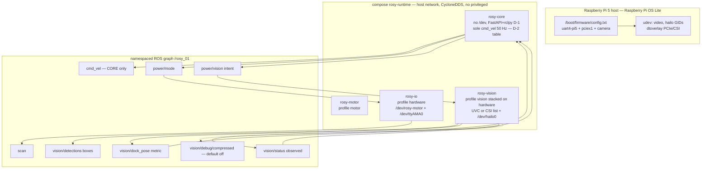
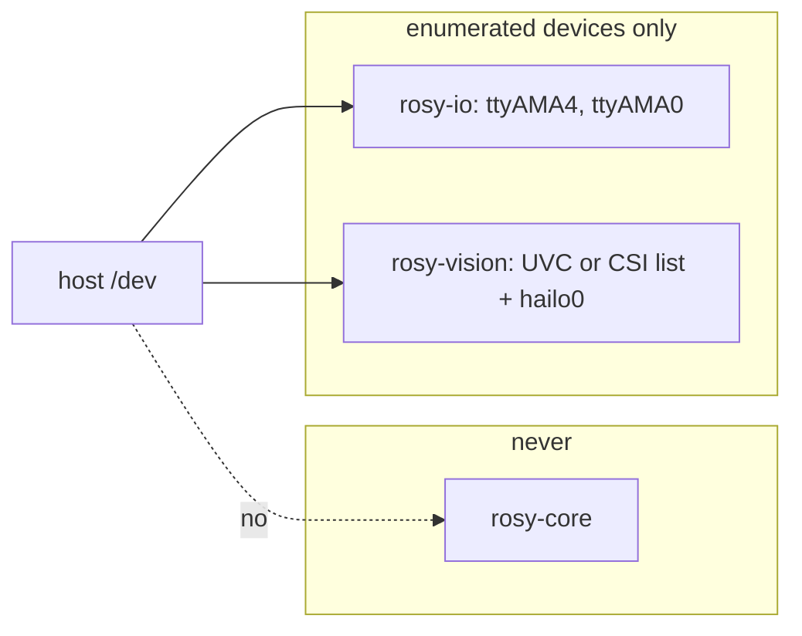
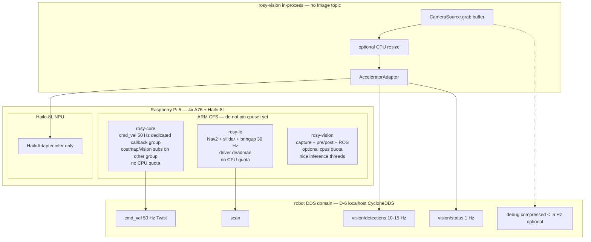
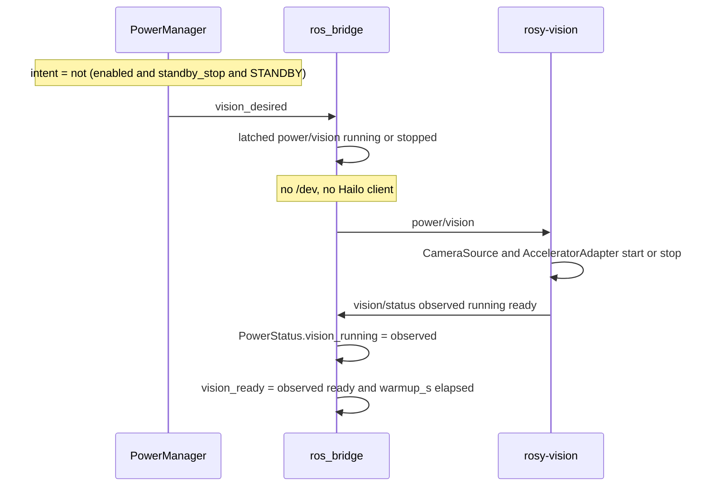
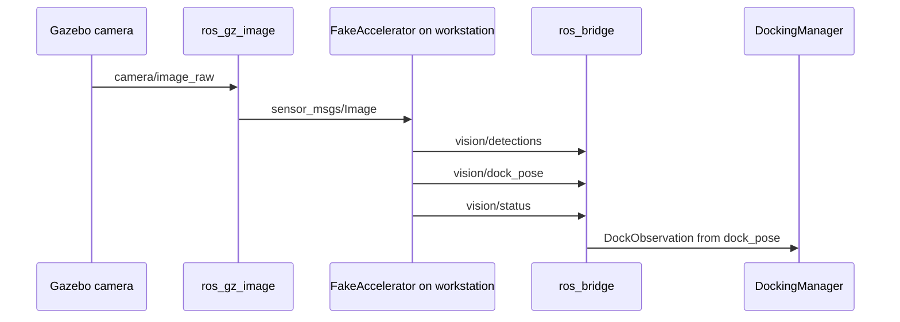

> **Historical camera draft.** This 2026-09-05 accelerator proposal is retained for design rationale. The proposed vision profile is not the current Compose baseline; camera placement and handoff remain governed by D-52 and the 2026-09-13 Device validation plan.

# Raspberry Pi 5 비전 가속 쉴드 설계

| 항목 | 값 |
|------|-----|
| Document | ROSY Vision Accelerator Shield Design |
| Author | TBD |
| Date | 2026-09-05 |
| Status | Draft |
| Proposed ADR | D-29 (Accepted로 ADR Log에 올리지 않음) |
| Related | D-1, D-2, D-4, D-6, D-11, D-14, D-22, D-23, D-24, D-25, D-28; CAP-002; HWA-001/002; AIV-001; PWR-005 |

## Overview

Raspberry Pi 5에 공식급 M.2 AI Kit / AI HAT를 얹으면 INT8 기준 십수 TOPS의
영상 추론을 로봇 옆에서 돌릴 수 있다. 이 문서는 그 경우를 **기존 런타임·안전·
API 계약을 깨지 않고** 로봇 쪽에 붙이는 설계다. 첫 구체 SKU는 Hailo-8L
(~13 TOPS)이지만, 어댑터 경계는 Hailo 전용이 아니다. Pinky Pro가 모터 어댑터
1번인 것과 같은 자리(HWA-002, D-14)다.

추천 형태는 네 번째 `ROSY_RUNTIME_MODE`가 아니다. `hardware` 위에 Compose
profile `vision`으로 세 번째 I/O 컨테이너 `rosy-vision`을 쌓는다. 카메라는 버스별 열거 목록(UVC는 단일 노드, CSI는 미디어 그래프 실명 +
`/run/udev:ro`), 가속기는 `/dev/hailo0`으로 **열거된 장치만** 그 컨테이너에
넘긴다. CSI 노드를 `/dev/rosy-camera`로 바꾸지 않는다. `rosy-core`는 여전히 `/dev`가 없고(D-22),
Command Manager만 `cmd_vel`을 발행한다(D-2). 그 규칙을 **소유 토픽 전체**로
넓힌다: 이름 있는 토픽마다 합법 퍼블리셔 프로세스는 하나이고, 이중 발행은
결함이다. 온보드 추론은 인지(perception)이며 두 번째 Command Manager가
아니다(AIV-001). 카메라는 비전 프로세스 안의 버퍼로만 움직이고, Hailo NPU가
추론을 맡으며, ARM·DDS 예산은 Nav2와 CORE `cmd_vel` 50 Hz와 안전 경로가
굶지 않도록 캡한다. 비전은 best-effort perception이다.

## Background & Motivation

트리는 카메라를 URDF와 Gazebo에만 가지고 있다.
`src/rosy_description/urdf/rosy.urdf.xacro`의 `front_camera_mount`는
`xyz="0.020 0 0.0495"`에 붙어 있고,
`src/rosy_description/urdf/rosy_gz.urdf.xacro`는 그 링크에 1280×720 / 30 Hz
Gazebo `camera` 센서를 달아 `${namespace}camera/image_raw`로 보낸다.
`src/rosy_gz_sim/launch/launch_sim.launch.xml`은 `ros_gz_image` `image_bridge`로
그 토픽을 ROS에 넘긴다. 워크스페이스 전체에서 `v4l2`, `libcamera`, `apriltag`는
검색되지 않는다.

도킹 설계는 그 공백을 이미 경계로 못 박았다.
`docs/plans/2026-09-02-docking-station-design.md`와
`src/rosy_core/rosy_core/docking/detector.py`는 LiDAR 역반사판 / IR 비콘 /
카메라 태그 선택을 **하지 않고** `DockDetector` 뒤로 밀었다. D-28 Consequences도
같다. 카메라가 실기 드라이버를 갖는 순간은 그 경계를 구현하는 때이지, 도킹 REST를
새로 여는 때가 아니다.

한편 현장 Pi 5 런타임은 장치를 세 모드로만 나눈다.
`deploy/robot/config/board.yaml`의 `modes`는 `core` / `motor` / `hardware`이고
`pi5-lite`는 별칭이다. `deploy/robot/compose.yaml`은 `rosy-core`(항상),
`rosy-motor`(profile `motor`, `/dev/ttyAMA4` → `/dev/rosy-motor`),
`rosy-io`(profile `hardware`, 모터 + `/dev/ttyAMA0` LiDAR)다.
`capabilities.hardware.yaml`의 `sensors`는 `[lidar, encoder]`이고
`docking.supported: false`, `slam: false`다. IMU·ADC·LCD는 io 이미지에도 없다
(`docs/deployment/pinky-pro-board-support.md`).

이 상태에서 HailoRT와 카메라 스택을 `rosy-io`에 밀어 넣거나, 네 번째 런타임
모드를 만들거나, CORE FastAPI 프로세스에서 추론을 돌리면 D-1 / D-22 / 런타임
유지보수 규칙이 한꺼번에 깨진다. 쉴드는 **hardware 위에 쌓는 인지 슬라이스**로
들어가야 한다.

### 코드가 이미 정해 둔 것

설계가 시작되기 전에 트리가 잠가 둔 제약은 여섯이다.

1. **CORE는 `/dev`가 없다.** `test/test_robot_runtime.py`의
   `test_runtime_separates_core_from_hardware_devices`와
   `test/test_release_boundary_guards.py`의 `test_core_is_not_privileged` /
   `test_core_never_receives_a_container_runtime_socket`이 이를 고정한다.
   `privileged`는 세 서비스 모두 금지이고, Docker socket도 CORE에 없다(D-22,
   D-23).
2. **Command Manager만 `cmd_vel`을 발행한다.**
   `rosy_core/bridge/ros_bridge.py`는 50 Hz로 `cmd_vel`을 쓰고 Nav2 출력은
   `nav_cmd_vel`로만 받는다(D-2). 중재 우선순위는
   `rosy_core/command/arbitration.py` — EMERGENCY 1 … DOCKING 4 … FLEET 6.
   비전 노드는 이 표에 칸이 없다.
3. **Capability는 정적 YAML이고 추가 전용이다.** D-11, CAP-002, HWA-003.
   오늘은 `capabilities.${ROSY_RUNTIME_MODE}.yaml`이 `/etc/rosy/capabilities.yaml`
   로 마운트된다. 비전 스택은 그 바인드를 `.generated/` 파일로 바꾸고,
   catalog 모드 YAML은 그대로 둔다. 소비자는 모르는 필드를 무시한다.
   필드 제거·의미 변경만 `capability_version`을 올린다.
4. **카탈로그 모드는 셋이다.** `docs/plans/2026-09-03-runtime-maintainability-rules.md`
   규칙 1: overlay YAML은 `core` / `motor` / `hardware`에만 존재한다. 별칭은
   `resolve-mode.sh`가 풀고 YAML 복사본을 두지 않는다.
   `test_board_catalog_lists_every_runtime_overlay`가
   `set(catalog["modes"]) == {"core", "motor", "hardware"}`를 고정한다.
   `test_pi5_lite_is_a_board_alias_not_a_copied_overlay`가 복사 YAML을 거부한다.
5. **광고는 호스트가 마운트한 capability 문서와 같아야 한다.** 규칙 5.
   `hardware`가 `goal_navigation: true`인 이유는 `hardware.launch.py`가 Nav2를
   시작하기 때문이다. `host_commissioning`은 `/dev`를 보지 않고
   `runtime.mode`만 본다: `motor_hold = mode == "core"`,
   `lidar_hold = mode != "hardware"`, `slam_hold`는 slam을 이 슬라이스가
   **절대 안 띄워서** 항상 참이다. 비전 홀드는 slam이 아니라 **lidar_hold
   쪽**이다 — 스택을 켠 호스트 문서가 카메라를 광고하면 홀드가 풀리고,
   컨테이너가 죽어도 문서를 다시 쓰기 전에는 광고가 남는다.
6. **선택 의존성은 모듈 최상단에서 임포트하지 않는다.**
   `src/rosy_core/package.xml` 주석과 `ros_bridge.py` 생성자의 `SaveMap`
   try/except. core 이미지에는 slam_toolbox가 없고, 없으면 맵 저장만 비활성이다.
   HailoRT·vision_msgs도 같은 패턴이어야 한다.

## Goals & Non-Goals

### Goals

- Pi 5 + 공식급 M.2 AI Kit / AI HAT에서 TOPS급 영상 추론을 로봇 옆에서 돌린다.
- 첫 어댑터는 Hailo-8L. 인터페이스는 벤더 잠금이 아니다.
- `hardware` 위에 Compose profile `vision`으로 쌓는다. 네 번째
  `ROSY_RUNTIME_MODE`는 만들지 않는다.
- 카메라는 인지 토픽만 발행한다. `cmd_vel`·안전 중재·모터 UART는 그대로다.
- `CameraDockDetector`는 기존 `DockDetector`를 구현하고 `vision/dock_pose`만
  소비한다. 도킹 REST는 추가하지 않는다. 픽셀 박스는 포즈가 아니다.
- STANDBY에서 카메라 스트림과 NPU 추론을 멈출 수 있는 경로를 만든다. 기본값은
  LiDAR `power.lidar.standby_stop`와 같이 **꺼짐**이다.
- Gazebo 카메라로 같은 ROS 메시지 계약을 만족하는 시뮬 경로를 둔다.
- 생 프레임은 인증 없는 `:8080` MJPEG가 되지 않는다.
- 소유 토픽마다 합법 퍼블리셔 프로세스는 하나다. `rosy-vision`은
  `cmd_vel` / `scan` / `odom` / `map` / costmaps / `power/mode` /
  `initialpose`를 발행하지 않고, CORE는 `vision/*`를 발행하지 않는다.
- 비전 ARM·NPU·DDS 점유를 정해 Nav2와 CORE `cmd_vel` 50 Hz와 LiDAR를
  보호한다. CPU 부하가 높으면 비전 fps를 먼저 버린다.

### Non-Goals

- `rosy_fleet` / swarm REST / VLA 모터 제어 구현. AIV-001은 Fleet API만 명령
  경로로 둔다. Hailo-10H(AI HAT+ 2)가 VLM을 돌릴 수 있어도 이 설계는 그 출력에
  모터 경로를 주지 않는다.
- 네 번째 `ROSY_RUNTIME_MODE`. `vision`은 모드가 아니라 hardware 위의 스택
  플래그다.
- `privileged` 컨테이너, CORE의 `/dev`, CORE의 Docker socket, host root.
- Hailo를 유일한 합법 가속기로 고정.
- 이 설계에서 LiDAR 내비게이션을 카메라 전용 SLAM으로 대체.
- FastAPI/rclpy 프로세스(D-1) 안에서 추론.
- colcon `build/` `install/` `log/` 커밋.
- 존재하지 않는 REST 경로를 이미 있는 것처럼 적기. 새 필드는 **proposed
  additive**(CAP-002)로만 표시한다.
- IMU/ADC/LCD/LED를 io 이미지에 넣는 일(보드 지원 문서가 아직 HOLD).
- 도킹 감지 방식을 이 문서에서 LiDAR/IR 대신 카메라로 확정하는 일. 카메라는
  `DockDetector` 구현 하나를 가능하게 할 뿐, D-28이 유보한 기본 감지기를
  바꾸지 않는다.
- 실기 로봇 도메인에 raw `sensor_msgs/Image`를 “유연성” 때문에 릴레이.
- HailoAdapter가 살아있는 동안 CPU YOLO를 같이 돌리는 일.
- 벤치 없이 `cpuset` 코어 핀 맵을 고정하는 일.
- CORE 또는 `rosy-io`에 CPU quota를 걸어 안전·모터 경로를 CFS로 조이는 일.
- CORE에 Docker socket을 줘 컨테이너 cgroup을 샘플하는 일 (D-23).

## Proposed Design

### 한 장



외부 클라이언트는 ROS를 말하지 않는다. CORE가 REST/WS 게이트웨이다. 비전
컨테이너는 DDS로 인지 토픽만 내보내고, CORE `ros_bridge`가 선택적으로 구독한다.

### 카탈로그 모드는 셋, 비전은 스택이다

`board.yaml`의 `modes`에 `vision`을 추가하지 않는다. 그렇게 하면
`capabilities.vision.yaml` / `profile.vision.yaml`이 생기고, 규칙 1과
`test_board_catalog_lists_every_runtime_overlay`가 깨지며, 별칭 YAML 복사와
같은 종류의 드리프트가 열린다. `hardware`를 비전으로 *교체*하는 것도 안 된다.
LiDAR·Nav2·모터가 빠지면 로봇이 보지 못하는 게 아니라 움직이지 못한다.

비전은 **hardware 위에 켜는 Compose profile**이다.

```text
ROSY_RUNTIME_MODE=hardware          # 카탈로그 모드 — 변함없음
ROSY_VISION_ENABLED=0               # 기본. 1 은 hardware 에서만 허용
```

`ROSY_VISION_ENABLED=1`인데 해석된 모드가 `hardware`가 아니면
`runtime-mode.sh`는 overlay 누락과 같이 **exit 2로 거절**한다. core/motor에서
플래그를 무시하지 않는다. 카메라 도킹과 주행 중 인지는 Nav2/LiDAR 슬라이스를
전제로 하고, 모터 벤치에 NPU를 올리는 것은 시운전 순서를 거꾸로 뒤집는다.

`down` / `status`는 오늘 `compose --profile motor --profile hardware`만 넘긴다.
Compose는 켜지지 않은 profile의 서비스를 멈추지 않으므로, 비전을 한 번이라도
올렸다면 `down`이 `rosy-vision`을 흘린다. **`down`과 `status`는 항상**
`--profile motor --profile hardware --profile vision`을 붙인다. 서비스를 안
띄웠으면 무해하다.

`up`은 모드 분기를 유지하되, hardware + 플래그 1일 때만 vision profile을 켠다.
`compose()` 헬퍼는 **항상** `-f compose.yaml -f config/.generated/compose.overlay.yaml`
를 붙인다. overlay 파일은 아래 물질화 단계에서 매 액션마다 정규 파일로 만든다
(플래그 0이면 `{services: {}}`).

```bash
# compose() 가 두 -f 를 붙인 뒤:
# hardware, ROSY_VISION_ENABLED=0 (기본)
compose --profile hardware up -d --remove-orphans
# hardware, ROSY_VISION_ENABLED=1
compose --profile hardware --profile vision up -d --remove-orphans
# 모든 모드의 down / status
compose --profile motor --profile hardware --profile vision down --timeout 10
compose --profile motor --profile hardware --profile vision ps
```

`board.yaml`에는 모드가 아니라 **스택 힌트**만 적는다. 예:

```yaml
# proposed — 카탈로그 모드가 아님
stacks:
  vision:
    requires_mode: hardware
    compose_profile: vision
    capabilities_overlay: vision.stack.yaml
    profile_overlay: vision.profile.stack.yaml
```

#### 호스트 병합 — 생성 파일, catalog YAML은 손대지 않는다

지금 compose는 카탈로그 파일을 직접 마운트한다. 테스트가 그 문자열을 잠근다.

```
./config/capabilities.${ROSY_RUNTIME_MODE:-core}.yaml:/etc/rosy/capabilities.yaml:ro
./config/profile.${ROSY_RUNTIME_MODE:-core}.yaml:/etc/rosy/profile.yaml:ro
```

(`test_core_data_is_a_host_owned_bind_and_capabilities_match_the_slice`).
`runtime-mode.sh`는 `capabilities.${MODE}.yaml`이 **있는지만** 보고, 합치지
않는다. 이 바인드를 그대로 두면 `vision.stack.yaml`은 CORE가 영원히 못 본다.

PR 1이 고치는 호스트 경로(유일):

1. `runtime-mode.sh`의 **모든** 액션(`up` / `down` / `status`)은 compose를
   부르기 **전에** `.generated/`를 물질화한다. `install-pi.sh`는 빈 트리에서
   `runtime-mode.sh down`을 먼저 돌린다 (`build_and_start_core`). gitignore된
   바인드 소스가 없으면 Docker가 **디렉터리**를 만들고, 다음 `up`이 YAML을
   쓰지 못한다.
   - `mkdir -p config/.generated`
   - `config/.generated/capabilities.yaml`,
     `config/.generated/profile.yaml`,
     `config/.generated/compose.overlay.yaml` 중 하나라도 **디렉터리**이면
     exit 2 (직접 지우라고 메시지를 남긴다).
   - 그 세 경로를 **정규 파일**로 쓴다. capabilities/profile은 catalog 사본
     또는 `merge-stack.py` 결과. compose overlay는 **한 작성자**만 쓴다 —
     아래 “durable vs generated”.
2. 입력이 되는 catalog 파일 `capabilities.{core,motor,hardware}.yaml`과
   `profile.{core,motor,hardware}.yaml`은 **절대 덮어쓰지 않는다.**
   `capabilities.vision.yaml` / `profile.vision.yaml`은 만들지 않는다.
3. compose 바인드를 생성 파일로 바꾼다.

```
./config/.generated/capabilities.yaml:/etc/rosy/capabilities.yaml:ro
./config/.generated/profile.yaml:/etc/rosy/profile.yaml:ro
```

4. 병합 러너는 bash가 아니다. `deploy/robot/config/merge-stack.py`가
   catalog + 스택 조각을 읽어 stdout에 YAML을 쓴다. 호스트 의존은
   `python3-yaml`(Pi apt). `install-pi.sh`가 그 패키지를 설치한다.
   알고리즘:
   - 해석된 `MODE`의 catalog YAML을 로드한다.
   - `ROSY_VISION_ENABLED`가 0이거나 모드가 hardware가 아니면: 그 사본을
     `.generated/`에 쓴다 (core/motor는 오늘과 비트 단위로 같은 내용).
   - hardware이고 플래그가 1이면: catalog 위에 스택 조각을 **깊은 병합**한다.
     - 매핑 키: 조각이 준 키는 추가 또는 교체. 조각이 안 준 키는 hardware 값
       유지 (`capability_version`, `navigation`, `slam` 등).
     - `sensors` 시퀀스는 **list-replace**. 조각이 광고할 전체 목록을 들고
       있다. union이 아니다 (중복·순서 드리프트 방지).
     - `profile.profile.sensors`도 같은 list-replace (HWA-003: Profile이
       Capability의 원천).
5. CORE는 여전히 정적 파일 하나(`/etc/rosy/capabilities.yaml`)만 읽는다
   (D-11). `/dev`를 열지 않고, 컨테이너 health를 보지 않고, 별도의
   `ROSY_VISION_ENABLED` env를 CORE에 넣지 않는다. 플래그의 유일한 소비자는
   `runtime-mode.sh`다.

#### durable vs generated compose overlay

`compose()`는 cwd `deploy/robot`에서 **항상** 두 파일을 넘긴다.

```bash
docker compose --env-file .env \
  -f compose.yaml \
  -f config/.generated/compose.overlay.yaml \
  …
```

경로를 `deploy/robot/.generated/`로 쓰지 않는다. CORE 바인드와 같은
`config/.generated/`다.

작성자는 둘이고 쓰는 파일은 다르다.

| 파일 | 작성자 | git |
|------|--------|-----|
| `config/vision.compose.overlay.yaml` | `configure-vision-pi5.sh`만 (PR 5) | 호스트 로컬, `.env`처럼 gitignore. catalog 아님 |
| `config/.generated/compose.overlay.yaml` | `runtime-mode.sh`만, 매 액션 | gitignore |

`runtime-mode.sh`는 durable 파일을 고치지 않는다. 물질화 규칙:

- 모드가 `hardware`이고 `ROSY_VISION_ENABLED=1`이고 durable 파일이 **정규
  파일**이고, 그 YAML `services.rosy-vision.devices`의 **호스트 경로가
  모두 존재**하면: 내용을 `config/.generated/compose.overlay.yaml`로 복사하고
  `up`에 `--profile vision`을 붙인다.
- 그 외(core/motor, 플래그 0, durable 없음, **또는 devices 호스트 경로가
  하나라도 없음**): no-op overlay `{services: {}}`. `up`에 `--profile
  vision`을 **붙이지 않는다**. CORE/io는 그대로 기동. `down`/`status`는
  잔여 컨테이너를 걷느라 계속 `--profile vision`을 붙인다.
- 플래그 1인데 장치를 건너뛰면 `verify-pi.sh`는 fail한다. 없는
  `/dev/hailo0`가 `docker compose up`을 non-zero로 만들어 `set -e` 래퍼가
  CORE/io를 반쯤 올리게 두지 않는다.

```yaml
# no-op — Compose 파일이므로 services 키가 필요하다. {} 는 금지.
services: {}
```

`{}`는 `services is required`로 core-only `up`/`down`/`status`까지 깨진다.
`compose()`가 두 번째 `-f`를 항상 붙이기 때문이다. PR 1 CI 테스트는
`yaml.safe_load`로 no-op 파일이 매핑이고 `services` 키가 있음을 잠근다
(`{}` 이면 fail). **jazzy CI 이미지에서 `docker compose … config`를 돌리지
않는다** (워크플로가 Docker를 설치하지 않음). 개발 호스트에서 compose
config를 확인하는 것은 허용이되 머지 게이트가 아니다.

Compose는 나중 `-f`의 시퀀스를 **통째로 교체**한다. durable 조각이
`group_add` / `devices` / `volumes`를 주면 커밋된 목록을 덮어쓰므로 **의도한
전체 목록**을 다시 적는다. `group_add` 예: video GID와 hailo GID를 함께.
`volumes` 예: 기존 tmpfs + `/run/udev:ro` + `/dev/dma_heap` **rw** 바인드. hailo
GID만 있는 overlay는 video 그룹을 떨어뜨리므로 금지.

`vision.stack.yaml` (capability 조각):

```yaml
sensors: [lidar, encoder, camera]   # list-replace
vision:
  supported: true
  accelerator: hailo-8l             # 어댑터 id, 칩 잠금 아님
  tops: 13                          # 선언값, 벤치마크 아님
  models: [coco-detection]
```

`vision.profile.stack.yaml` (HWA-001 조각). 카메라 버스 종류는 장치 맵
(`ROSY_CAMERA_BUS`)과 맞춘다. SKU 구매(Module 3 vs 어느 UVC)는 Open
Question으로 남기고, 프로필 값은 버스 enum이다.

```yaml
profile:
  sensors:
    - lidar: rplidar_c1
    - encoder: dynamixel
    - camera: uvc          # 또는 csi. list-replace
```

플래그 0이면 생성 파일은 hardware catalog와 같고 `vision_hold`는 참이다.
플래그 1이면 생성 파일이 카메라를 광고한다. **광고의 의미는 “호스트가 이
스택을 켜기로 했다”이지 “rosy-vision이 지금 healthy하다”가 아니다.**
Nav2가 재시작 중에도 `goal_navigation: true`인 것과 같은 종류의 거짓말이다.
crash 난 `rosy-vision`은 호스트가 플래그를 내리고 `up`을 다시 돌리기 전까지
capability에 남는다.

in-tree 원천 `src/rosy_core/config/profile.pinky_pro.yaml`은 지금도
lidar/imu/battery만 있다. 원천 프로파일에 카메라를 넣는 것은 실기 SKU 확정
뒤의 별도 변경이다.

호스트 테스트가 잠글 것:

- `set(catalog["modes"]) == {"core", "motor", "hardware"}`
- `capabilities.vision.yaml` / `profile.vision.yaml` 없음
- `capabilities.hardware.yaml`의 `sensors`는 계속 `[lidar, encoder]`
- 생성 디렉터리는 커밋하지 않음
- compose가 `config/.generated/capabilities.yaml`을 마운트함
- `runtime-mode.sh`가 플래그 1 + hardware에서 조각을 합치고, 플래그 1 +
  core/motor에서 exit 2. overlay `devices:` 호스트 경로가 없으면 `up`에
  `--profile vision`을 붙이지 않고 no-op overlay를 쓴다 (PR 5 tmp fixture)
- `down`/`status` 명령 문자열에 `--profile vision`이 있음
- 빈 트리에서 `down`을 시뮬한 뒤 `config/.generated/capabilities.yaml`과
  `profile.yaml`과 `compose.overlay.yaml`이 **파일**이지 디렉터리가 아님
- `merge-stack.py`: 매핑 키 유지 + `sensors` list-replace 단위 테스트
- `compose()`가 `-f compose.yaml`과 `-f config/.generated/compose.overlay.yaml`를 붙임
- no-op overlay는 `{services: {}}`이지 `{}`가 아님. `yaml.safe_load`로 검증
  (CI에서 `docker compose config` 호출 없음)
- `runtime-mode.sh`는 `config/vision.compose.overlay.yaml`을 쓰지 않음
- 빈 트리 `down` 물질화는 Docker를 부르지 않고 `.generated/` 파일을 만든다
- 커밋 `compose.yaml` 텍스트에 `ROSY_VISION_CPUS` / `ROSY_HAILO_GID` 없음
- `set(services) == {rosy-core, rosy-motor, rosy-io, rosy-vision}`; core 외는
  비어 있지 않은 `profiles`; `rosy-vision.profiles == ["vision"]`

### 왜 세 번째 컨테이너인가

두 후보를 비교하고 `rosy-vision`을 고른다.

| | `rosy-io`에 HailoRT+카메라 | 세 번째 서비스 `rosy-vision` |
|---|---|---|
| 이미지 크기 | `io` 타깃은 이미 Nav2 + `sllidar_ros2` pin (`Dockerfile` `SLLIDAR_COMMIT=34300099…`). HailoRT/TAPPAS는 수백 MB급. 모터 벤치 이미지까지 비대해진다. `rosy-motor`와 `rosy-io`는 같은 `target: io`를 쓴다. | `vision` 타깃은 `runtime-common`에서 갈라져 HailoRT+카메라만. Nav2/LiDAR를 싣지 않는다. |
| 폭발 반경 | Hailo 펌웨어 리셋·libcamera 행이 `rosy_bringup`·Nav2 lifecycle과 운명을 같이 한다. io healthcheck는 이미 `rosy_bringup` **그리고** `lifecycle_manager_navigation`을 요구한다. | 비전 재시작이 모터 deadman·LiDAR·Nav2를 건드리지 않는다. |
| STANDBY | 한 프로세스에서 LiDAR `stop_motor`와 NPU halt를 섞는다. 실패 모드가 얽힌다. | LiDAR 정지는 오늘처럼 CORE→`start_motor`/`stop_motor`. 카메라/NPU는 `power/vision` 의도를 vision이 래치. |
| 장치 GID | `group_add`는 지금 `ROSY_DIALOUT_GID`. `video`/`hailo`를 같은 컨테이너에 넣으면 권한 표면이 모터 UART까지 넓어진다. | vision만 `video`+`hailo`. io는 dialout 유지. |
| PCIe/udev | io 재시작이 PCIe 언바인드와 겹치면 LiDAR 시리얼까지 영향. | 가속기 수명 주기가 모터/LiDAR와 분리. |
| 운영 복잡도 | 서비스 수 유지. | compose 서비스 하나·이미지 하나·healthcheck 하나 추가. `test_runtime_separates_core_from_hardware_devices`의 `set(services)`가 네 개로 늘어난다. |

모터 deadman은 io 안에 있는 이유가 있다 — `cmd_vel`이 끊겨도 휠을 멈춘다
(`docs/deployment/raspberry-pi-runtime.md` §1). 추론 크래시가 그 경로를
재시작하게 만들 이유는 없다. 이미지 크기와 GID 분리만으로도 세 번째 서비스가
이긴다.

`rosy-vision`은 `x-runtime-defaults`를 그대로 쓴다: `network_mode: host`,
`read_only: true`, `cap_drop: [ALL]`, `security_opt: [no-new-privileges:true]`,
`privileged` 없음, 로그 `local` 10 m × 3. `tmpfs`는 프레임 버퍼 때문에 io의
256 m보다 큰 512 m를 제안한다(실측 후 조정).

**PR 1 스텁은 세 번째 이미지를 만들지 않는다.** 서명 릴리스는
`rosy_core`+`rosy_io` 두 OCI만 인정한다
(`deploy/release/manifest.schema.json` `additionalProperties: false`,
`image_checks.py` `REQUIRED_OCI_ARCHIVES`,
`test/test_release_signing.py`). `rosy-vision:dev` / `Dockerfile` `target:
vision`은 PR 6의 벤치 경로이고 출하 페이로드가 아니다. PR 1 서비스는 있는
이미지를 재사용한다.

```yaml
# PR 1 stub — 현장 플래그 기본 0. 켜도 출하 이미지가 생기지 않는다.
rosy-vision:
  <<: *runtime-defaults
  profiles: [vision]
  image: "${ROSY_IO_IMAGE:-rosy-io:dev}"   # 기존 이미지. target: vision 없음
  restart: "no"                            # 스텁 전용. x-runtime-defaults 의 unless-stopped 를 덮음
  user: "${ROSY_UID:-1000}:${ROSY_GID:-1000}"
  group_add:
    - "${ROSY_VIDEO_GID:-44}"               # Debian video. hailo 키는 여기 없음
  # devices: 없음. 카메라/hailo 노드는 PR 5 durable overlay 만.
  environment:
    <<: *ros-environment
  tmpfs:
    - /tmp:size=512m,mode=1777
  command: ["true"]
  healthcheck:
    test:
      - CMD-SHELL
      - "ros2 node list 2>/dev/null | grep -Fq '/${ROSY_NAMESPACE}/rosy_vision'"
    interval: 10s
    timeout: 5s
    retries: 3
    start_period: 20s
    disable: true                          # 스텁에서 끔. PR 6 실 런치에서 켬
```

`x-runtime-defaults`는 `restart: unless-stopped`다.
`test_runtime_uses_local_ros_network_and_bounded_logs`는 **모든** 서비스에
그 값을 요구한다. 스텁 `command: ["true"]`를 `unless-stopped`로 두면
entrypoint `exec "$@"`가 끝나자마자 재시작 루프다. 그래서 rosy-vision만
`restart: "no"`로 덮는다.

테스트 면제(PR 1에서 이름을 박는다): 모든 서비스는 `network_mode: host`와
bounded `local` 로그와 `ROS_DOMAIN_ID`를 유지한다. `restart: unless-stopped`는
`rosy-core` / `rosy-motor` / `rosy-io`에만 적용한다. `rosy-vision`은 PR 6까지
`"no"`일 수 있다. `services.values()`를 도는 이후 테스트도 같은 면제를 쓴다.

PR 6이 `command`를 `ros2 launch rosy_vision vision.launch.py`로, `restart`를
`unless-stopped`로, healthcheck `disable`을 풀고, 벤치 이미지로 교체한다.
그때 면제를 걷는다. healthcheck는 Nav2 lifecycle이 아니라 **비전 노드 이름**만
본다.

#### 장치 맵 — UVC와 CSI는 다르다. Hailo는 이름을 바꾸지 않는다

모터 rename(`/dev/ttyAMA4` → `/dev/rosy-motor`)은 드라이버가 **그 경로 하나**를
열기 때문에 된다. libcamera는 미디어 그래프를 **호스트 실명**으로 걷는다.
`/dev/video0`를 `/dev/rosy-camera`로 바꾸면 그래프가 깨진다. HailoRT 기본
노드도 `/dev/hailo0`이다. `/dev/rosy-accel`로 바꾸면 어댑터에 별도 device
인자가 강제되고, 커밋된 compose가 그 문자열을 얼린다.

두 카메라 버스를 **PR 5 durable overlay** 조각으로 고정한다. 커밋된
`compose.yaml`의 `rosy-vision`에는 `devices:`가 **없다** (`command: ["true"]`
는 장치가 필요 없고, 없는 `/dev/hailo0`가 `set -euo pipefail` `up`을
죽이면 CORE/io까지 같이 멈춘다). **어느 모듈을 살지는 Open Question으로
남기고, overlay에 쓸 장치 맵 모양은 닫는다.** `ROSY_CAMERA_BUS=uvc|csi`
(기본 `uvc` — 노드가 UART에 가깝다).

**Hailo (두 버스 공통).** 이름 변경 없음. 호스트 모듈이 만든 노드를 그대로
넘긴다.

```yaml
devices:
  - "${ROSY_ACCEL_DEVICE:-/dev/hailo0}:/dev/hailo0"
```

**UVC.** 단일 V4L2 노드는 모터와 같이 안정 이름으로 바꿔도 된다.

```yaml
devices:
  - "${ROSY_CAMERA_DEVICE:-/dev/video0}:/dev/rosy-camera"
  - "${ROSY_ACCEL_DEVICE:-/dev/hailo0}:/dev/hailo0"
```

**CSI / libcamera.** 원본 이름을 열거 목록으로 통과시킨다. `/run/udev:ro`는
`/dev`가 아니므로 D-22가 허용하는 범위에서 읽기 전용 마운트한다.
`privileged`는 여전히 금지. 와일드카드 `/dev/video*`는 쓰지 않는다.

```yaml
devices:
  - /dev/media0
  - /dev/media1
  - /dev/video19
  - /dev/video20
  - /dev/video21
  - /dev/video22
  - "${ROSY_ACCEL_DEVICE:-/dev/hailo0}:/dev/hailo0"
volumes:
  - /run/udev:/run/udev:ro
  - /dev/dma_heap:/dev/dma_heap:rw    # 디렉터리(linux,cma). devices: 금지. ioctl 할당이라 :ro 불가
shm_size: "256m"                     # CSI. Docker 기본 64m 로는 1280×720 파이프가 부족할 수 있음
```

`/dev/dma_heap`는 캐릭터 장치가 아니라 CMA 힙 디렉터리다. `devices:`에 넣으면
Compose가 장치 노드로 해석해 실패한다. **바인드**만 허용한다. libcamera/V4L2는
dma-heap 노드에 **쓰기 ioctl**로 CMA 버퍼를 요청한다. `read_only: true`
컨테이너에서 `:ro` 바인드면 캡처가 실패한다. CSI overlay는 `dma_heap`를
**rw**로 남기고, PR 5 verify가 `:ro`이면 fail한다. `privileged`는 여전히
금지. UVC 기본 버스는 `devices:` 캐릭터 노드라 이 바인드가 필요 없다.

실제 노드 번호는 보드마다 다르다. **커밋된 `compose.yaml`의 rosy-vision에는
`devices:`가 없다.** PR 5의 `configure-vision-pi5.sh`가 존재하는 media/video
노드와 hailo GID·(CSI면) `dma_heap` rw·`shm_size`를 **durable**
`config/vision.compose.overlay.yaml`에 쓴다. **`up`은 overlay를 복사하고
vision profile을 켜기 전에 `devices:` 호스트 경로 존재를 검사한다.**
`/dev/hailo0`(또는 카메라 노드)가 없으면 no-op overlay + vision profile
생략 — CORE/io는 기동하고 compose는 없는 장치를 열지 않는다.
`verify-pi.sh` 플래그 1은 그 경우 fail. 별도
`compose.vision.devices.yaml` / `compose.vision.gid.yaml`을 compose `-f`
목록에 직접 넣지 않는다. verify는 durable 파일의 목록을 검사한다. PR 1
테스트는 “CORE `devices` 없음, rosy-vision `devices` 키 없음 (따라서 모터
UART도 hailo도 없음), io가 hailo를 받지 않음, `privileged: false`”를 잠그고
**`/dev/rosy-camera` 문자열은 잠그지 않는다.**

**Hailo GID.** 커밋된 compose에 `group_add: "${ROSY_HAILO_GID:-}"`를 두지
않는다. 빈 기본값은 Compose가 `group_add: [""]`로 풀어 기동 실패한다.
`video`(기본 44)만 고정한다. `getent group hailo`가 성공하고 `/dev/hailo0`가
있을 때만 `configure-vision-pi5.sh`가 숫자 GID를 durable overlay의
`services.rosy-vision.group_add`에 **video GID와 함께** 적는다 (시퀀스 교체).
그룹이 없으면 hailo 항목을 생략하고, 그 경우 durable 파일을 만들지 않거나
CSI 장치 목록만 담는다. `.env`에 빈 `ROSY_HAILO_GID=`를 두지 않는다.

### 장치 소유권



CORE의 host 마운트는 오늘과 같다: `/proc/uptime` `/proc/loadavg` `/proc/stat`
`/proc/net/dev` `/proc/meminfo` `/sys/class/thermal` `/sys/devices/virtual/thermal`
`/etc/os-release` `/etc/hostname`. NPU sysfs를 CORE에 새로 넣지 않는다. 가속기
온도·로드는 `vision/status`로 비전 노드가 발행하고, `ros_bridge`가 선택 구독한다.
대시보드는 그 스냅샷만 본다(D-23).

Host Agent(`docs/reference/rosy-host-agent-contract.md`)는 임의 셸이 없고
unix socket `/run/rosy/host-agent.sock`만 말한다. 비전 때문에 CORE에 소켓
명령을 새로 만들지 않는다. PCIe/CSI overlay는 모터 UART와 같이 **호스트
스크립트 + 재부팅**이다.

### 어댑터: Hailo는 1번, 유일이 아니다

HWA-002는 모터·센서를 어댑터 뒤로 밀어 Pinky Pro를 첫 구현으로 두었다. 가속기도
같다.

```python
# rosy_vision 패키지 안 — rosy_core 가 아님
class AcceleratorAdapter(Protocol):
    def name(self) -> str: ...
    def tops_declared(self) -> float: ...
    def load(self, model_id: str) -> None: ...
    def infer(self, frame: Image) -> InferenceResult: ...
    def stop(self) -> None: ...          # 추론 루프 정지. STANDBY 경로.
    def power_gate(self, on: bool) -> None: ...  # 벤더가 지원할 때만


class CameraSource(Protocol):
    def start(self) -> None: ...
    def grab(self) -> Optional[Image]: ...
    def stop(self) -> None: ...          # 스트림 정지. STANDBY 경로.
```

첫 구현:

| 어댑터 | 역할 |
|--------|------|
| `HailoAdapter` | HailoRT, 기본 노드 `/dev/hailo0`. SKU는 8L/8를 같은 런타임으로. |
| `FakeAccelerator` | 고정 Detection2DArray + 대본 `vision/dock_pose`. pytest·워크스테이션 Gazebo. |
| `V4l2Camera` | UVC 맵. `/dev/rosy-camera`. |
| `LibcameraCamera` | CSI 맵. 호스트 실명 노드 + `/run/udev`. |
| `RosImageCamera` | `sensor_msgs/Image` 구독. 워크스테이션 Gazebo `camera/image_raw`. |

`rosy_core`는 HailoRT를 링크하지 않는다. `package.xml`에 Hailo 의존성을 넣지
않는다. `ros_bridge`가 `vision_msgs` / `geometry_msgs`를 쓰게 되면
slam_toolbox처럼 생성자 try/except로만 임포트한다.

모델 파일(`.hef` 등)은 비전 이미지 안, 또는 CORE가 쓸 수 없는 형제 경로
`/var/lib/rosy-models`에 둔다. CORE는 이미
`${ROSY_DATA_PATH:-/var/lib/rosy}:/var/lib/rosy`를 읽고 쓴다
(`test_core_writes_to_nothing_on_the_host_but_its_own_data`).
`/var/lib/rosy/models`에 두면 인터넷을 보는 CORE가 비전 컨테이너가 나중에
로드할 가중치를 교체할 수 있다. `/var/lib/rosy-models`는 vision에만 `:ro`로
마운트하고 CORE에는 넣지 않는다. `/usr/share/rosy/models`도 같은 제약이면
허용. 서명 배포는 후속이다.

### 인지 토픽만 — 모터 경로 없음

Pi compose 경로의 네임스페이스는 D-4 그대로 `/rosy_01/...`이다. 워크스테이션
시뮬은 `launch_sim.launch.xml`의 `namespace` 기본값 `""`를 따른다 (아래 시뮬
절).

인지 박스와 도킹 포즈는 **다른 토픽**이다. `vision_msgs/Detection2DArray`는
픽셀 박스라 `DockObservation`의 metric x/y/yaw를 만들 수 없다.

| 토픽 | 메시지 (계약, OQ4 닫힘) | 발행 | 기본 |
|------|-------------------------|------|------|
| `vision/detections` | `vision_msgs/Detection2DArray` | rosy-vision | on |
| `vision/dock_pose` | `geometry_msgs/PoseStamped` (`frame_id` = `{ns}base_link`, 도크 상대 포즈) | rosy-vision | on (태그 파이프가 있을 때) |
| `vision/dock_confidence` | `std_msgs/Float32` (0..1) | rosy-vision | dock_pose와 쌍 |
| `vision/status` | `std_msgs/String` JSON | rosy-vision | on, 1 Hz + 변경 시 |
| `vision/debug/compressed` | `sensor_msgs/CompressedImage` | rosy-vision | **off** |
| `camera/image_raw` | `sensor_msgs/Image` | 시뮬 워크스테이션만 DDS. 실기는 컨테이너 내부. | 실기 off |
| `power/vision` | `std_msgs/String` `running`\|`stopped` (래치) | **rosy-core** | on |
| `cmd_vel` | — | **발행 금지** | — |

`rosy_interfaces`에 포즈 타입을 새로 만들지 않는다. 지금 있는 것은
서비스뿐이다 (`Emotion.srv` / `SetLed.srv` / `SetLamp.srv` /
`SetBrightness.srv`). 후일 하나의 커스텀 msg로 묶는 것은 계약 변경이지
PR 2를 막지 않는다.

실기에서 raw 프레임을 host CycloneDDS로 흘리면 로컬 도메인이라도 CORE·Nav2와
대역을 다툰다. 추론은 비전 프로세스 안에서 끝나고, DDS로 나가는 것은 박스·
도크 포즈·상태다. 디버그 압축 프레임은 파라미터로 켜며 기본 꺼짐이다.

`vision/status` 페이로드 예(토픽, REST가 아님). `running`/`ready`는 **관측값**
이다 (아래 STANDBY 절).

```json
{
  "accelerator": "hailo-8l",
  "device": "/dev/hailo0",
  "model_id": "coco-detection",
  "fps": 12.0,
  "running": true,
  "ready": true,
  "temperature_c": 54.0,
  "cpu_percent": 22.0,
  "npu_util": null
}
```

예시는 **illustrative** (10–15 Hz 정책 안). 벤치 측정이 아니다.
`cpu_percent` / `npu_util`은 점유 절에서 정의한다. 구독자가 모르는
키는 무시한다.

`ros_bridge`는 이 토픽을 선택 구독한다. 없으면 지금처럼 비전 없이 기동한다.
구독이 생겨도 `_publish_cmd_vel` 타이머와 `select_output`은 그대로다. 탐지
박스가 속도 명령이 되는 코드 경로는 존재하지 않아야 하며, 리뷰에서 그 결합이
보이면 결함이다.

AIV-001 계층을 로봇 안에 축소 재현하지 않는다.

```text
LLM / VLA                         ← Fleet 쪽. 이 저장소 비범위
    ↓ Fleet API
Rosy API (원자 명령)              ← rosy_core
    ↓
Command Manager → cmd_vel         ← 유일한 모터 경로
    ↑
vision/detections                 ← 인지. 모터 경로 아님
```

### 토픽 독점 발행 — D-2를 소유 표로 일반화

D-2는 Command Manager가 **유일한** `cmd_vel` 퍼블리셔라고 못 박았다.
증거는 이미 테스트다: `test/test_nav2_hardware_slice.py`의
`test_nav2_smoother_output_is_nav_cmd_vel_not_cmd_vel`이
`src/rosy_navigation/launch/navigation_launch.xml`에서
`cmd_vel_smoothed` → `nav_cmd_vel` 리맵이 두 번 있고
`cmd_vel_smoothed` → `cmd_vel`이 **없음을** 고정한다.
`ros_bridge.py`는 `create_publisher(Twist, "cmd_vel", 10)`과
`create_timer(1.0/50.0, self._publish_cmd_vel)`로 그 토픽을 50 Hz로만 쓴다.
중재 표(`rosy_core/command/arbitration.py`)에 비전 칸은 없다.

비전 슬라이스가 들어오면 그 규칙을 `cmd_vel` 한 토픽이 아니라 **이름이 있는
소유 토픽 전체**로 넓힌다. 각 행의 합법 퍼블리셔 프로세스는 하나다. 두 번째
프로세스가 같은 이름을 발행하면 — QoS를 다르게 잡아 “몰래” 넣어도 — 결함이다.
소비자가 프레임이 필요하면 **구독**한다. 같은 이름으로 복사본을 릴레이하지
않는다.

`/tf`는 예외적으로 토픽 이름이 아니라 **parent→child 에지**가 소유 단위다.
bringup·`robot_state_publisher`·AMCL이 서로 다른 프레임을 같은 `/tf` 버스에
올린다. 비전은 카메라 optical 에지만 올릴 수 있고 `odom`/`map`을 parent로
쓰지 않는다. 트리에 `robot_localization` EKF는 없다
(`src/` 전역 검색 0건). `odom` → `base_footprint`는
`rosy_bringup.bringup.Rosy._publish_tf`가 30 Hz로 소유한다.

Pi 경로의 네임스페이스는 D-4 그대로 `/rosy_01/...`이다. 아래 이름은
네임스페이스 상대다.

| 토픽 / TF 에지 | 유일한 퍼블리셔 | 근거 | 비전이 하면 |
|----------------|-----------------|------|-------------|
| `cmd_vel` | `rosy-core` `RosBridge.cmd_vel_pub` | D-2, 50 Hz 타이머 | 결함 |
| `nav_cmd_vel` | Nav2 `velocity_smoother` in `rosy-io` | `navigation_launch.xml` remap | 발행 금지. `cmd_vel`/`nav_cmd_vel` 구독도 금지 (모터 경로를 들을 이유 없음; AST) |
| `cmd_vel_nav` | Nav2 controller → smoother 입력 | Nav2 내부 | 손대지 않음 |
| `scan` | `sllidar_ros2` in `rosy-io` | `bringup_robot.launch.py` `sllidar_c1_launch.py`, `enable_lidar:=true` | 레이저 재발행 금지 |
| `odom` | `rosy_bringup` | `ODOM_PUB_TOPIC_NAME`, QoS depth 10 | 금지 |
| `joint_states` | `rosy_bringup` | `JOINT_PUB_TOPIC_NAME` | 금지 |
| TF `odom` → `base_footprint` | `rosy_bringup` `TransformBroadcaster` | `DEFAULT_ODOM_CHILD_FRAME_ID` | `odom`/`map` parent 금지 |
| URDF 트리 (mount, wheels, `front_camera_link`) | `robot_state_publisher` in io/bringup | `upload_robot.launch.py` | URDF에 이미 있는 parent를 재방송 금지 |
| TF `{ns}front_camera_link` → `{ns}front_camera_optical_frame` | **rosy-vision only**, 필요할 때 | URDF에 optical 프레임 없음. 이 에지 **만** 비전이 추가 가능 | 다른 camera TF 금지 |
| TF `map` → `odom` | Nav2 AMCL (hardware localization) | `localization_launch.xml` / `bringup_launch.xml` `map_server`+`amcl` | 금지 |
| `map` | Nav2 `map_server` in `rosy-io` | hardware는 slam_toolbox를 안 띄움 | occupancy grid 발행 금지 |
| `local_costmap/costmap`, `*_raw`, `global_costmap/*` | Nav2 costmap in `rosy-io` | `ros_bridge`가 구독만 | 금지 |
| `plan` | Nav2 planner in `rosy-io` | `ros_bridge` 구독 | 금지 |
| `initialpose` | `rosy-core` `initialpose_pub` | `PoseWithCovarianceStamped` | 금지. Flask `nav2_web_server.py` leftover는 Pi 런치가 아님 |
| `power/mode` | `rosy-core` latched | `_LATCHED` TRANSIENT_LOCAL | 비전은 구독하지 않음. 의도 토픽은 `power/vision` |
| `power/vision` | `rosy-core` latched | 이 설계 STANDBY 시퀀스 | 비전은 래치 소비만. 발행 금지 |
| `display/info` | `rosy-core` | `display_info_pub` | 금지 |
| `docking/collision_exemption` | `rosy-core` latched | `dock_exemption_pub` | 금지 |
| `battery/voltage`, `battery/percent` | `battery_publisher` (io, 지금은 `enable_battery:=false`) | `battery_publisher.py` | 금지 |
| `imu_raw` | 시뮬 Gazebo만. Pi는 `imu_hold` 항상 true | `rosy_gz.urdf.xacro` | 실기 발행 금지 |
| `us_sensor/range` | 트리에 퍼블리셔 없음 (CORE 구독만, ADC HOLD) | `ros_bridge` 구독 | 비전이 첫 퍼블리셔가 되면 결함 |
| `batt_state` | 트리에 퍼블리셔 없음 (CORE 구독만) | `ros_bridge` 구독 | 동일 |
| `robot_description` | `robot_state_publisher` / upload launch | URDF | 비전 발행 금지 |
| `vision/detections` | **rosy-vision only** | OQ4 닫힘 | CORE는 구독만, 발행 없음 |
| `vision/dock_pose` | **rosy-vision only** | OQ4 닫힘 | CORE는 구독·번역만 |
| `vision/dock_confidence` | **rosy-vision only** | dock_pose 쌍 | CORE는 구독만 |
| `vision/status` | **rosy-vision only** | 1 Hz + 변경 시 | CORE는 구독만 |
| `vision/debug/compressed` | **rosy-vision only**, 기본 off | 레이트 캡 | CORE는 중계 PR 전까지 구독하지 않아도 됨 |
| `camera/image_raw` | **시뮬 워크스테이션만** (`ros_gz_image` `image_bridge`) | `launch_sim.launch.xml`, `rosy_gz.urdf.xacro` 1280×720@30 | Pi `vision.launch.py`에 퍼블리셔·구독자 없음. 실기는 in-process 버퍼. 시뮬은 `vision_sim.launch.py`만 구독 |

#### 라이브 소스는 하나

퍼블리셔 프로세스뿐 아니라 **입력 소스**도 동시에 둘이면 안 된다.

- 가속기 어댑터 라이브는 하나: `FakeAccelerator` **또는** `HailoAdapter`.
  launch arg `accelerator:=fake|hailo`. 둘 다 `create_publisher` 하는 구성은
  결함. Hailo가 켜진 채 CPU YOLO fallback을 돌리지 않는다 (점유 절).
- 카메라 소스 라이브는 하나: `V4l2Camera` (UVC) **또는** `LibcameraCamera`
  (CSI) **또는** `RosImageCamera` (시뮬 `camera/image_raw`). 같은 노드에서
  HailoAdapter가 UVC를 열고 `RosImageCamera`로 Gazebo 토픽을 또 구독하지
  않는다.
- 디버그 압축은 기본 off. 켜져도 퍼블리셔는 rosy-vision뿐이고 레이트 캡
  (점유 절, ≤5 Hz).
- hardware 모드의 로봇 host 도메인에 Gazebo `camera/image_raw`를 브리지하지
  않는다. `ros_gz_image`는 워크스테이션 `launch_sim.launch.xml` 전용이다.
- 프레임이 필요하면 구독한다. 소유 토픽 위에 “relay” 퍼블리셔를 두지 않는다.

#### QoS — 두 번째 퍼블리셔가 다른 QoS로 끼어들지 못하게

`ros_bridge.py`의 실측:

```python
_LATCHED = QoSProfile(depth=1, reliability=ReliabilityPolicy.RELIABLE,
                      durability=DurabilityPolicy.TRANSIENT_LOCAL)
# cmd_vel / initialpose / display/info: create_publisher(..., 10) →
#   RELIABLE, VOLATILE, depth 10 (rclpy 기본)
# map 구독만 _LATCHED. power/mode·docking/collision_exemption 발행은 _LATCHED.
```

비전 계약 QoS (제안, 구현 PR이 이 표와 어긋나면 결함):

| 토픽 | reliability | durability | depth | 이유 |
|------|-------------|------------|-------|------|
| `vision/detections` | BEST_EFFORT | VOLATILE | 1 | 최신 박스만. RELIABLE depth 1은 CORE 콜백이 막히면 비전 publish가 stall |
| `vision/dock_pose` | BEST_EFFORT | VOLATILE | 1 | metric 포즈, 최신값. `_LATCHED`를 복사하지 않음 |
| `vision/dock_confidence` | BEST_EFFORT | VOLATILE | 1 | dock_pose와 쌍 |
| `vision/status` | RELIABLE | TRANSIENT_LOCAL | 1 | 늦은 CORE 구독자가 마지막 스냅샷을 받음 (`power/mode`와 동형) |
| `vision/debug/compressed` | BEST_EFFORT | VOLATILE | 1 | 센서 프레임. 손실 허용 |
| `power/vision` (CORE) | RELIABLE | TRANSIENT_LOCAL | 1 | `_LATCHED`와 동일 |
| `cmd_vel` (CORE) | RELIABLE | VOLATILE | 10 | 기존 유지. 비전이 이 이름에 어떤 QoS로든 `create_publisher` 하면 실패 |

RELIABLE depth 1 대체안(채택하지 않음): depth ≥ 2 + non-blocking publish. 센서
산출은 BEST_EFFORT가 맞다.

**DDS 매칭:** BEST_EFFORT 퍼블리셔는 기본 `create_subscription(..., 10)`
(RELIABLE VOLATILE depth 10)과 **연결되지 않는다**. CORE가
`vision/detections` · `vision/dock_pose` · `vision/dock_confidence`를
구독하면 **퍼블리셔와 같은 프로필** — BEST_EFFORT VOLATILE depth 1 —
을 써야 한다. RELIABLE “만일을 위해” 구독은 결함이다. `vision/status`는
RELIABLE TRANSIENT_LOCAL이라 기본 RELIABLE 구독과 맞는다. QoS는 YAML
문자열이 아니라 **발행·구독 프로필 객체** 단위 테스트로 잠근다. 호환되지
않는 QoS로 같은 이름을 올리는 것도 이중 발행이다.

#### 소유권 테스트 계획

정적(ROS overlay 없이, CI `python3 -m pytest test/` + `src/rosy_vision/test/`).
**부분 문자열 grep이 아니다.** Python은 AST로 `create_publisher` /
`create_subscription` / `remappings=` 의 **문자열 리터럴**을 모으고, XML은
`remap to="..."` 값을 파싱한다. 금지 목록은 **정확 토픽 이름 튜플**이다
(`map`이 주석·식별자에 있어도 fail하지 않음. `local_costmap/costmap`은
정확 매칭).

금지 퍼블리셔 이름 (`rosy_vision` 생산 코드 + `vision.launch.py` +
`vision_sim.launch.py`; 테스트 픽스처·주석은 AST 문자열만 본다):

`cmd_vel`, `nav_cmd_vel`, `cmd_vel_nav`, `scan`, `odom`, `joint_states`,
`map`, `plan`, `initialpose`, `power/mode`, `power/vision`, `display/info`,
`docking/collision_exemption`, `battery/voltage`, `battery/percent`,
`imu_raw`, `us_sensor/range`, `batt_state`, `robot_description`,
`camera/image_raw`, `local_costmap/costmap`, `local_costmap/costmap_raw`,
`global_costmap/costmap`, `global_costmap/costmap_raw`.

1. 위 이름에 대한 `create_publisher` 또는 XML `remap to=` 가 `rosy_vision`
   생산 코드 **또는** `vision.launch.py` **또는** `vision_sim.launch.py`에
   있으면 fail.
2. `cmd_vel` / `nav_cmd_vel` 에 대한 `create_subscription` 이
   `rosy_vision`에 있으면 fail (발행뿐 아니라 모터 경로 구독도 잠금).
3. `src/rosy_core/**` 전체 ( `ros_bridge.py`만이 아님 ) 가 `vision/detections` ·
   `vision/dock_pose` · `vision/dock_confidence` · `vision/status` ·
   `vision/debug/compressed` 를 `create_publisher` 하면 fail.
   PR 4의 `create_subscription`은 허용하되 **같은 BEST_EFFORT VOLATILE
   depth 1 프로필**이어야 한다 (구독 QoS 단위 테스트). `sensor_msgs/Image` 와
   `sensor_msgs/CompressedImage` 의 `create_subscription` 은 `rosy_core`
   로봇 노드에서 금지 (디버그 중계는 이후 PR; 기본 CORE는 픽셀을 구독하지
   않음).
4. launch arg `accelerator`와 `camera_source`가 동시에 두 구현을
   instantiate하면 fail (구성 표 또는 생성자 가드 단위 테스트).
5. TF: 허용 에지는 **정확히 한 쌍**이다 —
   parent `{ns}front_camera_link`, child `{ns}front_camera_optical_frame`.
   parent **또는** child가 `odom`/`map` 또는 URDF 프레임
   (`base_footprint`, `base_link`, `front_camera_mount`, `front_camera_link`를
   child로 재방송, 휠)이면 fail. `front_camera_link` → `odom` 도 fail.
6. 런치 파일은 둘이다. `vision.launch.py` (Pi, `camera/image_raw` 문자열
   없음) vs `vision_sim.launch.py` (워크스테이션, `camera/image_raw` **구독만**
   허용 — 퍼블리셔 denylist는 이 파일도 스캔). 한 파일 + `IfCondition`은
   CI 경로 단언이 실패하도록 잠근다.

런타임(벤치, 출하 게이트 아님). `ros2 topic info` publisher count를
**행마다** 해석한다. 전 토픽 `== 1`은 오라클이 아니다.

| 클래스 | 예 | 합법 count (hardware+vision, debug off) |
|--------|----|------------------------------------------|
| must-be-1 | `cmd_vel`, `odom`, `scan`, `vision/detections`, `vision/status` | 1 |
| must-be-0 | Pi `camera/image_raw`, `vision/debug/compressed`(기본), `battery/*`(`enable_battery:=false`), Pi `imu_raw`, `us_sensor/range`, `batt_state` | 0 |
| 에지 버스 | `/tf`, `/tf_static` | count 잠그지 않음 (프레임 소유) |

`cmd_vel`에 rosy-vision 엔드포인트가 있으면 fail.

PR 1 스텁 `command: ["true"]`는 퍼블리셔가 없으므로 이 테스트의 대상은
PR 2 패키지부터다. PR 1은 커밋 compose에서 rosy-vision `devices:` 키를
빼 모터 UART / LiDAR / hailo를 물리적으로 못 받게 잠근다.

### 프로세서 점유 — ARM vs NPU vs DDS

Pi 5는 4× Cortex-A76 + (쉴드가 있으면) Hailo-8L NPU다. 오늘 동시 부하는
이미 있다: CORE (FastAPI + 50 Hz `cmd_vel` + costmap 구독), `rosy-io`
(모터 + LiDAR + Nav2). 비전이 더하는 것은 카메라 ISP + pre/post + NPU다.
점유 경계는 프로세스다. **추론 함수는** CORE `MultiThreadedExecutor`에
들어가지 않는다 (D-1). CORE **구독 콜백은** 그 executor 안에서 돈다 —
프로세스 격리가 타이머를 자동으로 지키지 않는다 (아래 §1·§8).



이미지 픽셀은 rosy-vision을 **압축 디버그가 켜진 경우에만** 떠나고, 그때도
`vision/debug/compressed`이지 `camera/image_raw`가 아니다. 추론 입력은
그 토픽이 아니다.

#### 1. 프로세스 격리가 추론 점유 경계다 — CORE executor는 오늘 격리되어 있지 않다

추론 함수는 CORE의 `MultiThreadedExecutor`에서 돌지 않는다 (D-1,
Alternatives C 기각 유지). 카메라 → NPU는 rosy-vision **in-process**
포인터/버퍼다. `CameraSource.grab()`이 준 프레임을
`AcceleratorAdapter.infer()`가 같은 프로세스에서 소비한다. 로봇 도메인에
`sensor_msgs/Image`를 올리지 않는다. 1280×720×3×30 ≈ 83 MB/s raw는 D-6
localhost라도 CORE costmap 구독·Nav2와 같은 CycloneDDS 도메인을 잠식한다
(`deploy/robot/Dockerfile`이 심는 `cyclonedds_localhost.xml`은
`NetworkInterface name="lo"` 하나).

**철회:** “costmap 콜백은 제어 루프와 분리”. 트리에는
`CallbackGroup` / `create_callback_group`가 **0건**이다
(`src/rosy_core/rosy_core/node.py`가 `MultiThreadedExecutor`만 만든다).
rclpy 기본 그룹은 `MutuallyExclusiveCallbackGroup`이라 50 Hz
`_publish_cmd_vel` 타이머와 costmap·scan·odom 구독이 **직렬화**된다.
PR 4의 `vision/dock_pose` 구독 콜백도 그 그룹에 들어가면 제어 루프와
운명을 같이 한다. “별도 프로세스 + 선택 구독”은 추론을 CORE 밖으로
보내지만, 구독 콜백은 **CORE 안에서** 돈다.

점유 계약 (**PR 3 머지 게이트**, 지금 트리가 이미 하는 일이 아님):

1. `_publish_cmd_vel` 타이머는 **전용 `MutuallyExclusiveCallbackGroup`**에
   둔다. PR 3이 `create_timer`에 그 그룹을 넘긴다. costmap·scan·비전 구독이
   이 그룹을 공유하지 못한다. 게이트: `src/rosy_core/test`가 타이머
   `callback_group is not node.default_callback_group`을 단언. PR 4는
   **PR 3에 의존**하며 비전 구독을 그 전용 그룹 밖에 둔다.
2. `rosy_core` 로봇 노드는 `sensor_msgs/Image` / `CompressedImage`를
   `create_subscription`하지 않는다 (정적 AST 테스트). 디버그 압축 중계는
   이후 PR이며 기본 CORE는 픽셀을 구독하지 않는다.
3. 비전 구독 콜백은 detections/dock_pose **복사만** 하고, 그 안에서
   추론·리사이즈·이미지 디코드를 하지 않는다. 구독 QoS는 퍼블리셔와
   같은 BEST_EFFORT VOLATILE depth 1 (위 DDS 매칭).

#### 2. NPU가 추론을 소유하고, ARM은 capture/pre/post/ROS다

HailoAdapter가 살아 있으면 CPU YOLO fallback을 돌리지 않는다. 가속기
어댑터 라이브는 하나(위 소유권 절). FakeAccelerator는 워크스테이션·pytest용
이며 Pi hardware+Hailo와 동시에 뜨지 않는다.

#### 3. ARM 예산 (닫힌 정책 엔벨로프 — 측정값 아님)

hardware+vision의 **범위 안** 동시 부하는 Nav2 + AMCL + `map_server` +
sllidar + bringup 30 Hz + CORE + 비전 detections이다
(`hardware.launch.py` → `bringup_launch.xml` → localization+navigation).
slam_toolbox는 이 합에 넣지 않는다 (아래 §5).

이전 초안의 최댓값(CORE 1.0 + io 2.5 + vision 1.5 + headroom 0.5 = 5.5)은
4코어에 닫히지 않았다. 그 합 ≤ 4 주장은 **철회**한다.

닫힌 정책 캡 (라벨, 벤치가 바꾸면 occupancy ADR):

| 슬라이스 | ARM 정책 캡 | 쿼터 | 비고 |
|----------|-------------|------|------|
| `rosy-core` | ~0.5 (버스트 허용) | **없음** | `cmd_vel` 50 Hz는 협상 대상이 아님. 전용 callback group (§1) |
| `rosy-io` | **≤ 2.0** | **없음** | Nav2 + AMCL + map_server + sllidar + bringup + deadman. **범위 안** |
| `rosy-vision` ARM | **≤ 1.0** | 옵트인 `cpus`, 쓸 때 권고 1.0 | capture/pre/post/ROS. 추론은 NPU |
| OS / IRQ / thermal | 나머지 (~0.5) | — | 별도 행으로 합을 4 넘게 잡지 않음 |

캡의 합 0.5+2.0+1.0 = 3.5. 남은 ~0.5가 OS다. CORE는 unquota라 버스트할 수
있다.

**머지 가능한 계약은 숫자 합이 아니라 이것이다:** CORE/io/motor에 `cpus`
키 없음 + 비전-only overlay `cpus` opt-in (쓸 때 권고 1.0) + fps drop
(§4). 범위 행을 “4코어 안에서 알아서 맞는다”고 주장하지 않는다.

**Compose CPU limit.** 오늘 `deploy/robot/compose.yaml`에는 `cpus` /
`cpuset` / `cpu_quota` / `deploy.resources`가 없다.
`test/test_release_boundary_guards.py`가 CORE에서 금지하는 것은
`devices`, `device_cgroup_rules`, `privileged`, `cap_add`, Docker socket,
host root 쓰기, `group_add`, `pid`/`ipc`/`userns_mode`/`cgroup` == `host`
이다. 이 파일은 **CORE만** 돌고, `cpus` 키는 막지 않는다. 전 서비스
`cgroup != host`와 CORE/io/motor `cpus` 키 없음은 **PR 1이 새로** 잠근다
(기존 테스트가 이미 전 서비스를 도는 것처럼 쓰지 않는다). CORE·io에
쿼터를 걸면 안전·모터가 CFS에 조인다. 쿼터는 **`rosy-vision`만**. CORE에
privileged cgroup 장치·Docker stats 소켓을 넣지 않는다 (D-22, D-23).
`cpus`는 현재 가드와 충돌하지 않는다.

커밋된 `compose.yaml`에 `cpus: "${ROSY_VISION_CPUS:-}"`를 두지 않는다.
빈 기본값은 Hailo GID와 같이 Compose가 빈 문자열로 풀어 기동 실패한다.
기본은 **키 생략** (LiDAR `power.lidar.standby_stop: false`와 같은
opt-in). `ROSY_VISION_CPUS`가 숫자일 때만 durable
`config/vision.compose.overlay.yaml`이 `services.rosy-vision.cpus`를
쓴다 (권고 `1.0`, 최대도 1.0을 넘기지 않는다). `runtime-mode.sh`는 그
overlay를 플래그 1에서 `.generated/`로 복사할 뿐 값을 발명하지 않는다.

`cpuset: "2-3"` 같은 코어 핀은 **벤치 후** occupancy ADR. 측정 없이
A76 맵을 고정하지 않는다.

쿼터 키가 어떤 이유로 가드와 싸우면 (예: 이후 테스트가 전 서비스
키 집합을 잠글 때) compose `cpus`를 포기하고 비전 노드 안의
`nice` + 스레드 수 상한을 **문서화된 대체**로 쓴다. 지금 가드와는
충돌하지 않으므로 1순위는 overlay `cpus`다. 어느 쪽이든 CORE/io는
쿼터 없음.

비전 프로세스 내부 바닥(항상, 쿼터와 무관):

- 추론/pre/post 스레드 `nice` ≥ 10. 캡처 스레드는 기본 우선순위
  (카메라 스톨이 NPU보다 먼저 보이도록).
- pre/post 워커 ≤ 2 스레드. OpenCV/`cv2.setNumThreads` 또는 동등.
- CORE·io 프로세스 `nice`를 올리지 않는다.

#### 4. 레이트 정책

| 산출 | 목표 레이트 | 비고 |
|------|-------------|------|
| `vision/detections` | 10–15 Hz | 도킹/API에 충분. 30 fps raw를 스트림하지 않음 |
| `vision/dock_pose` + confidence | detections와 같거나 더 낮음 | 태그 파이프가 있을 때만 |
| `vision/status` | 1 Hz + 변경 시 | 관측. CPU 샘플도 이 주기 |
| `vision/debug/compressed` | ≤ 5 Hz, 기본 off | 추론 입력이 아님 |
| `cmd_vel` | **50 Hz 고정** | 비전 레이트가 이것을 협상하지 않음 |
| `scan` | sllidar 기존 | 비전이 스로틀하지 않음 |

**시간 스케일을 나눈다.** `load_1`은 ~1분 EMA라 50 Hz 루프를 지키지 못한다.
5 s 창을 붙여도 빨라지지 않는다. `load_1` ≥ 3.5 / 4.0은 **이미 불이 난**
지속 부하 정책이지, `cmd_vel` 보호가 아니다.

1. **스파이크 backstop (항상, 기본 로봇 포함):** 추론/pre/post `nice ≥ 10`
   + pre/post ≤ 2 스레드. CFS가 짧은 폭주를 깎는다. fps drop보다 먼저
   동작하는 계층이다.
2. **짧은 창 (~1 s):** 비전 노드가 컨테이너 `/proc/stat` 집계 행의 idle
   델타를 읽는다. 공식은 `HostRuntimeProbe._cpu_usage`와 같다
   (`(1 - idle_delta/total_delta) * 100`, Docker socket 없음). 값 이름
   `host_cpu_1s`. 100 = 전 코어 busy. **그리고** `self_cpu`
   (`cpu_percent`, 아래 단위)는 overlay `cpus`가 **없어도** 쓴다.
3. **지속/열 (`load_1` + 히스테리시스):** 이미 포화된 뒤의 정리. 50 Hz
   보호라고 쓰지 않는다.

`cpu_percent` / `self_cpu` 단위: **100 ≡ 코어 하나** (상한 없음. 워커
둘이면 200까지). overlay `cpus`가 있으면 쿼터 비교는
`self_cpu >= 0.9 * cpus * 100` (cpus 1.0 → 90). PR 2b 픽스처가 같은
식을 쓴다.

비전 노드가 1 Hz로 읽는 입력:

- `host_cpu_1s`: `/proc/stat` 1 s idle 델타 (% of all cores).
- `self_cpu`: `/proc/self/stat` utime/stime 델타, 100 ≡ 한 코어.
- `load_1`: `/proc/loadavg` 1분 EMA (지속 경로만).
- `npu_temp_c`: `vision/status.temperature_c` (없으면 이 항 생략).

정책 임계 (라벨, 벤치가 occupancy ADR로 개정).

| 스케일 | 조건 | 동작 |
|--------|------|------|
| 스파이크 | 항상 | `nice ≥ 10` + 스레드 캡. fps를 기다리지 않음 |
| 짧은 창 | `host_cpu_1s` ≥ 85 가 2연속 1 s, **또는** `self_cpu` ≥ 90 (쿼터 없어도), **또는** (`cpus` 설정 및 `self_cpu >= 0.9 * cpus * 100`) | fps 한 단계 하락 15→10→5→2. debug on이면 먼저 off |
| 짧은 창 | 위가 지속되며 `host_cpu_1s` ≥ 92 또는 `self_cpu` ≥ 120 | `infer` 건너뜀. 캡처 유지 |
| 지속/열 (이미 포화) | `load_1` ≥ 3.5 또는 `npu_temp_c` ≥ 80 (5 s) | debug off + fps 하락. **50 Hz 보호가 아님** |
| 지속/열 | `load_1` ≥ 4.0 또는 `npu_temp_c` ≥ 85 (5 s) | `infer` 건너뜀 |
| 회복 | `host_cpu_1s` < 70 **그리고** `self_cpu` < 70 **그리고** `load_1` < 2.5 가 10 s | fps 한 단계 상승, 상한은 파라미터 기본 |

호스트가 바빠도 비전 self CPU가 낮으면 **그래도 비전을 버린다**
(best-effort, `host_cpu_1s` 경로). CORE에 pressure 비트를 요구하지 않는다.

단위 테스트 (PR 2b, 실기 Pi 없음): drop 함수에 **가짜**
`(host_cpu_1s, self_cpu, load_1, npu_temp, cpus_quota, debug_on)` 샘플.
쿼터 식 `0.9 * cpus * 100`을 픽스처에 박는다. `load_1`만 높은 샘플은
지속 경로만 타고, 짧은 창 임계를 열지 않는다고 단언한다.

버리는 순서 (먼저 버린 쪽이 아래를 보호한다):

1. `vision/debug/compressed`를 끔 (이미 기본 off).
2. detections fps를 15 → 10 → 5 → 2로 내린다.
3. `infer`를 건너뛴다 (`vision/status.running`은 true, `fps`는 떨어짐).
4. `cmd_vel` 50 Hz, LiDAR `scan`, io deadman, Nav2는 이 목록에 없다.

CORE `cmd_vel` 50 Hz는 협상 대상이 아니다. 비전 노드가 자기 fps를
내리지 않은 채 host load를 핑계로 CORE 타이머를 건드리는 코드 경로는
결함이다.

**v1 occupancy 스파이크 backstop은 always-on `nice`/스레드 캡이다.**
짧은 창 fps drop은 `/proc/stat` 1 s + `self_cpu`(쿼터 없어도)다.
`load_1`은 지속/열 정리일 뿐 50 Hz 보호가 아니다. 옵트인 `cpus`는 짧은
창의 추가 항. `power.vision.standby_stop` 기본 `false`이므로 STANDBY는
v1에서 CPU 캡이 아니다.

#### 5. 상호 배제 / 듀티

STANDBY는 이미 카메라+NPU를 멈출 수 있는 경로다 (`power.vision.standby_stop`,
기본 false). 추가로:

- `slam_hold`는 오늘 `routes.py` `host_commissioning`에서 **항상 true**다.
  `hardware.launch.py`는 slam_toolbox를 시작하지 않는다
  (`gz_map_building.launch.xml` / `map_building.launch.xml`만 include).
  hardware 모드의 `map`은 `map_server`다. 비전이 `map`/costmap을 발행하지
  않는 이유가 이것이다.
- **이 ADR이 허용하는 동시 부하:** `map_server` + AMCL + Nav2 + 비전
  detections (10–15 Hz). 그것이 hardware+vision의 범위 안 occupancy다.
- slam_toolbox + **어떤** 비전(detections이든 debug든), 그리고
  slam_toolbox + debug frames는 **이후 occupancy ADR**이 필요하다. 이
  문서가 허용하지 않는다.
- Nav2는 hardware에 남는다. 비전 ARM 캡은 ≤ 1.0 (위 예산).
- Hailo 펌웨어 리셋·libcamera 행은 `rosy-vision` 재시작으로 끝나야
  한다. io deadman(`CommandDeadman`, 기본 500 ms, D-22)은 비전
  크래시와 운명을 같이 하지 않는다.

#### 6. 비전 내부 파이프라인 — DDS 홉 없음

```text
[worker thread, nice ≥ 10]
CameraSource.grab()  →  (optional CPU resize)  →  AcceleratorAdapter.infer()
        │                                              │
        └── debug compressed (side)                    └── result queue

[rclpy executor — publish/latch only]
result queue → vision/detections, dock_pose, status
power/vision latch → CameraSource/Adapter start/stop
```

이미지 복사본을 DDS에 올렸다가 같은 컨테이너의 다른 노드가 다시 구독하는
구성은 금지. 디버그 토픽은 추론 입력이 아니라 **옆**으로 나가는 압축
발행이다. `infer()`를 rclpy 타이머 콜백에서 직접 호출하지 않는다.

#### 7. 관측 — Docker stats 없음

`vision/status` JSON에 가산 (토픽, REST가 아님):

```json
{
  "accelerator": "hailo-8l",
  "device": "/dev/hailo0",
  "model_id": "coco-detection",
  "fps": 12.0,
  "running": true,
  "ready": true,
  "temperature_c": 54.0,
  "cpu_percent": 22.0,
  "npu_util": null
}
```

- `cpu_percent`: 비전 프로세스 로컬. `/proc/self/stat` utime/stime 델타.
  **100 ≡ 코어 하나**, 상한 없음 (워커 둘이면 200). 비전 컨테이너 안에서
  자기 PID를 읽는 것은 허용. CORE `HostRuntimeProbe` 집계 `% of all cores`와
  단위가 다르다. 쿼터 비교: `cpu_percent >= 0.9 * cpus * 100`.
- `npu_util`: HailoRT가 노출하면 0..100, 아니면 `null`. 벤더 API는
  PR 6에서 확인하고, 없으면 필드를 null로 남긴다. CORE에 Hailo sysfs를
  넣지 않는다.
- CORE `HostRuntimeProbe` (`rosy_core/system/runtime.py`)는 계속
  호스트 집계 `/proc/stat` + `/proc/loadavg`다. 컨테이너 cgroup을
  읽으려고 Docker socket을 받지 않는다
  (`test_core_never_receives_a_container_runtime_socket`).

대시보드는 기존 host CPU 스냅샷 + `vision/status` fps/running/cpu_percent
를 나란히 보여도 된다. 두 숫자를 합쳐 “코어 하나”로 재해석하지 않는다.

#### 8. 우선순위 — 비전은 best-effort perception

```text
safety path (E-Stop, cmd_vel zero, lidar scan, io deadman)
  > Nav2 (planner/controller/costmap)
  > vision inference (NPU + ARM pre/post)
  > debug frames
```

NPU가 stall 되어도 io deadman은 마지막 정상 `cmd_vel` 이후 500 ms에
휠을 멈춘다.

CORE 쪽: 구독 콜백은 CORE executor에서 돈다. `_publish_cmd_vel`을
지키는 것은 전용 callback group이지 “선택 구독” 문장이 아니다 (§1).

비전 쪽: `infer()` / capture / pre-post는 **rclpy executor 밖** worker
스레드에서 돈다 (`nice ≥ 10`). rclpy 타이머·`power/vision` 콜백은
이미 만들어진 결과를 publish하고 래치를 소비하기만 한다. 같은
MutuallyExclusiveCallbackGroup의 “별 타이머”는 `infer()`를 옮기지
못한다. PR 2b 테스트: fake `infer()`가 200 ms여도 status 1 Hz 타이머
지연이 한 주기(1 s)를 넘지 않는다.

### 도킹: 구현체이지 새 API가 아니다

`DockDetector`는 이미 있다.

```44:51:src/rosy_core/rosy_core/docking/detector.py
class DockDetector(Protocol):
    """도크 검출기. 상태머신이 아는 유일한 감지 인터페이스."""

    def start(self, dock: DockInstance) -> None: ...

    def relative_pose(self) -> Optional[DockObservation]: ...

    def stop(self) -> None: ...
```

경계 위는 스캔·이미지·IR을 보지 않고 `DockObservation`(base_link 상대 x/y/yaw/
confidence/at)만 소비한다. `CameraDockDetector`는 그 Protocol의 구현이다.

배치:

- 태그 검출·metric 포즈 추정은 `rosy-vision` 안(AprilTag/ArUco — 모델 선택은
  구현 PR). 결과는 `vision/dock_pose` + `vision/dock_confidence`다.
- COCO 박스는 `vision/detections`에만 남는다. `CameraDockDetector`는 이 토픽을
  **구독하지 않는다.** 2D 박스에서 x/y/yaw를 만들지 않는다.
- `rosy_core.docking`은 이미지에 의존하지 않는다. `ros_bridge`가
  `PoseStamped`+confidence를 `DockObservation`으로 복사해 `DockingManager`에
  주입한다. `SimulatedDetector`와 같은 자리.
- 도킹 REST(`POST /api/v1/docking/...`)는 D-28 설계 그대로. 카메라가 켜져도
  엔드포인트를 추가하지 않는다.
- 기본 실기 감지기를 카메라로 바꾸지 않는다. 도킹 문서는 어둠·접점 높이
  (`IR x=0.0295, z=-0.015` vs 카메라 `z=0.0495`)를 이유로 LiDAR+IR을 잠정
  기본으로 남겨 두었다. 카메라 태그는 플러그인 하나다.

`docking.supported`는 비전 스택만으로 `true`가 되지 않는다. 도크 데이터베이스·
에이전트·충전 이중 확인이 있는 도킹 슬라이스의 일이다.

### 전력·열

D-24는 `PowerManager`가 ACTIVE/IDLE/STANDBY를 정해 `power/mode`를 발행한다.
LiDAR(PWR-005)의 **실제** 경로는 “노드가 `power/mode`를 번역”이 아니다.

- `PowerManager._lidar_desired(mode)`가 정책 의도 (`standby_stop` + STANDBY).
- `PowerStatus.lidar_spinning`은 그 의도.
- `ros_bridge._reconcile_lidar`가 `start_motor` / `stop_motor` 서비스를 호출한다
  (`ros_bridge.py`). CORE는 시리얼 장치를 열지 않는다.
- `lidar_ready`는 CORE 안의 `spinup_s` 타이머다.

비전은 이 패턴을 따르되, 폭발 반경 때문에 장치 호출을 `rosy-vision`에 둔다.
**소유권은 하나다.** `power/mode`만 보고 멈추는 이야기와, PowerStatus를 의도로만
채우는 이야기와, CORE가 카메라 서비스를 직접 여는 이야기는 폐기한다.

`src/rosy_core/config/rosy_default.yaml`에 제안 가산:

```yaml
power:
  lidar:
    standby_stop: false
    spinup_s: 2.0
  vision:                         # proposed additive
    standby_stop: false           # 벤치 승인 전 기본 꺼짐
    warmup_s: 1.0                 # 관측 running 이후 스트림을 믿기까지의 시간
```

시퀀스:



1. `PowerManager`가 `_vision_desired(mode)`를 계산한다. LiDAR의
   `_lidar_desired`와 같은 식. 이 값은 내부 의도이지 API 스냅샷이 아니다.
2. `ros_bridge`는 의도가 바뀔 때 래치된 `power/vision`
   (`std_msgs/String` `running`|`stopped`)을 발행한다. `_reconcile_lidar`가
   서비스를 호출하는 자리에 해당한다. `/dev`를 열지 않고 Hailo 클라이언트를
   만들지 않는다. 서비스가 아직 없으면 LiDAR처럼 다음 5 Hz 틱에 재시도한다
   (퍼블리시는 로컬이라 사실상 항상 준비).
3. `rosy-vision`이 `power/vision`을 래치해 `CameraSource.start/stop`과
   `AcceleratorAdapter.stop`으로 번역한다. 유효한 메시지를 받기 전에는
   **기동 상태(running)** 를 유지한다 — ADC가 `power/mode` 전까지 폴링을 유지해
   CORE 장애가 센서를 끄지 못하게 하는 것과 같다. 벤더가 PCIe 언바인드 없이
   전원 게이트를 주면 `power_gate`를 같은 래치에 붙인다. 없으면 추론+스트림만
   멈춘다 (칩 idle은 남음, Open Question).
4. `rosy-vision`이 `vision/status`에 **관측** `running`/`ready`를 넣는다.
5. `PowerStatus.vision_running`은 그 관측값이다 (기본 `False` — 토픽 부재 =
   비전 없는 로봇). `vision_ready`는 관측 `ready`이고, 관측이 running으로 뜬
   뒤 CORE 로컬 `warmup_s`가 지난 뒤에만 참. status가 stale이면 ready는 거짓.

`power/mode`만 구독해서 STANDBY마다 카메라를 끄지 않는다.
`standby_stop: false`이면 의도가 계속 running이라 `power/vision`이 바뀌지
않는다.

기본 `false`인 이유와 LiDAR와 같다. STANDBY 진입은 로봇 모드 IDLE에서만 오고
모든 웨이크가 재기동을 선행하므로 인터록은 맞지만, 카메라 재개·NPU 워밍업이
Nav2·도킹 획득에 주는 영향은 실기에서만 보인다.

공식 Pi 5 PSU는 5 V / 5 A = 27 W다. D-25가 인용한 Pi 5 자체 상시는 약 2.7 W.
아래 숫자는 **추정치**이며 이 저장소에서 측정한 값이 아니다.

| 항목 | 추정 | 출처 성격 |
|------|------|-----------|
| Hailo-8L 칩 전형 | ~1.5 W, 부하 1–2.5 W | Hailo/Pi AI Kit 발표(전형 1.5 W), 리뷰 1–2.5 W |
| Pi 5 + Hailo-8L 추론(벽면) | ~9.7 W | Mehatronika AI Kit 리뷰. CPU-only YOLO ~13.3 W 대비 낮음 |
| Pi 5 + Hailo-8(26 TOPS) idle/load | ~5.1 / ~8.7 W | 공개 YOLOv8n 벤치 하나 |
| Camera Module 3 | ~0.8–1.2 W | 공개 추정치. 트리에 측정 없음 |
| RPLidar 회전 | ~1 W | 트리 미측정. 기존 hardware 슬라이스 |
| PCIe FPC 헤더 | ~5 W 상한 | 커뮤니티. 8L은 여유, 다중 NPU는 아님 |

hardware 슬라이스 대비 **추가** 부하는 카메라+NPU 합쳐 대략 2–5 W로 본다
(추정). 27 W 어댑터 안이지만 배터리 팩·DC-DC·모터 홀딩·LiDAR가 같은 레일을
쓰면 마진이 얇다. 공식 5 V/5 A 이하 PSU는 HAT 부하에서 행이 난다는 공개
보고가 있다. 액티브 쿨러는 Hailo 경로에서 전제로 본다. 수락 체크리스트에
STANDBY 전후 전류, SoC/NPU 온도, Nav2 생존을 넣는다.

모터 토크 오프는 D-25가 전력 정책의 액추에이터 월권으로 유보했다. 비전 설계도
휠을 건드리지 않는다.

### 펌웨어 / SDK 위치

HailoRT, libcamera/rpicam, 컴파일된 모델은 **비전 이미지**에만 산다.
`deploy/robot/requirements-core.txt`와 `rosy_core` 런타임에 넣지 않는다.
`io` 타깃에는 Hailo를 복사하지 않는다. CI의 `ros2 run rosy_core rosy_core`
부트 스모크는 오늘처럼 slam_toolbox 없이, Hailo 없이 통과해야 한다.

**세 번째 OCI는 이 설계에서 출하하지 않는다.** 릴리스 계약은 닫혀 있다:
`manifest.schema.json` `containers`는 `rosy_core`+`rosy_io`만 required이고
`additionalProperties: false`; `REQUIRED_OCI_ARCHIVES`는
`rosy-core.oci.tar`와 `rosy-io.oci.tar`; `deploy/image/inputs.lock.yaml`은
“Dockerfile 이 만드는 두 이미지”. Host Agent에 비전 명령을 추가하지 않는다.
ADR D-29는 compose 경계만 잠근다. 비전 이미지는 **벤치 전용** — 개발 Pi에서
`docker build` / `docker load`. `release.install`로 내려가지 않는다. 이후
릴리스 계약 PR이 optional `containers.rosy_vision`을 열 수 있다. PR 6이
`Dockerfile` `AS vision`과 compose `image: rosy-vision:dev`를 쓰더라도 그것을
출하 경로라고 하지 않는다.

userspace HailoRT는 비전 이미지에 버전 핀하고, 호스트 `hailo_pci` 커널 모듈
ABI와 맞춰야 한다. 핀은 `configure-vision-pi5.sh` 주석과 (PR 6)
`requirements-vision.txt`에 나란히 적는다.

### 시뮬 경로

Gazebo는 이미 카메라를 가지고 있다. 같은 메시지 계약이면 CORE/대시보드/도킹
상태머신을 HAT 없이 시험할 수 있다. **시뮬은 Pi Compose profile `vision`이
아니다.** 워크스테이션에서 `ros2 launch rosy_vision vision_sim.launch.py`가
`camera/image_raw`를 소비한다. Pi는 `vision.launch.py` (이미지 토픽 없음).



`launch_sim.launch.xml`의 `image_bridge`는 유지한다. 기본 `namespace`는
`""`라 토픽이 `/camera/image_raw`다 (D-4의 `/rosy_01/...`과 다름).
FakeAccelerator는 **`vision_sim.launch.py`** 에서 include한다 (Pi
`vision.launch.py`와 다른 파일. `IfCondition`으로 합치지 않음). 같은
`namespace` 인자를 받는다. 빈 기본이면 `/vision/detections`. 멀티로봇
시뮬에서 `namespace:=rosy_01`을 넘기면 그때 D-4와 맞춰진다. 같은 파일의
두 번째 `image_bridge`(`args="/camera"`)는 기존 시뮬 버그로 이 설계가
고치지 않는다.

`rosy_gz_sim/params/rosy_bridge.yaml`은 지금 `camera/camera_info`만 있고
`image_raw`는 `ros_gz_image`가 담당한다. 가짜 노드는 그 `image_raw`를
소비하거나, 이미지 없이 대본 `PoseStamped`를 재생한다. 실기 파이프와 같은
`vision/detections` + `vision/dock_pose` 스키마를 써서 CORE가 분기를 갖지
않는다.

### 커미셔닝: `vision_hold`

`GET /api/v1/host/commissioning` (`routes.py` `host_commissioning`)은 에이전트
없이 **마운트된 문서**를 보고한다. `/dev`와 컨테이너 health는 보지 않는다.

| 플래그 | 오늘 | 비전 확장 |
|--------|------|-----------|
| `motor_hold` | `mode == core` | 불변 |
| `lidar_hold` | `mode != hardware` | 불변 |
| `slam_hold` | 항상 true | 불변 (이 설계에서 slam 런치 안 함) |
| `battery_hold` / `imu_hold` / `fleet_hold` | 항상 true | 불변 |
| `vision_hold` | 없음 | **proposed additive**. 마운트된 capability에서 `vision.supported`가
  없거나 false 이고 `camera`가 `sensors`에 없으면 true. **lidar_hold와 같은
  급** (호스트가 켠 슬라이스). slam_hold(절대 안 띄움)와는 다르다. |

시운전 순서는 보드 지원 문서에 한 줄을 더한다. 이미지는 `core`로 기동하고,
UART ping 후 `motor`, LiDAR 수락 후 `hardware`, **그 다음** 카메라/NPU 벤치가
끝나면 `ROSY_VISION_ENABLED=1` 후 `runtime-mode.sh up` (생성 파일 재기록).
hardware 수락 전에 비전을 켜지 않는다.

crash 난 `rosy-vision`은 플래그를 내리고 `up`하기 전까지 카메라를 계속
광고한다. `goal_navigation: true`인 채 Nav2가 재시작하는 것과 같다.
대시보드 커미셔닝 카드는 `vision_hold`를 표시한다 (D-23 가산).

### Host · udev · overlay

모터는 `deploy/robot/configure-uart-pi5.sh`가 `/boot/firmware/config.txt`에
`dtoverlay=uart4-pi5`를 idempotent하게 넣고 백업을 남긴다. 비전은 **같은
모양의 별도 스크립트** `configure-vision-pi5.sh`를 제안한다. CORE가 overlay를
쓰지 않고, Host Agent에 임의 config.txt 명령도 추가하지 않는다.

호스트가 준비해야 할 것:

- PCIe: Pi 5 M.2 HAT / AI HAT용 `dtparam=pciex1` (및 벤더가 요구하는 gen2/gen3
  overlay). AI Kit는 공식 문서상 Hailo-8L AI HAT+와 기능 동등, 단종 권고.
- 호스트 `hailo_pci` 커널 모듈 + udev가 `/dev/hailo0`를 만든다. userspace
  HailoRT는 컨테이너 안이며, 스크립트 주석에 호스트 모듈 버전과 이미지
  HailoRT 핀을 나란히 적는다.
- CSI: `camera_auto_detect=1` (UVC면 불필요). 존재하는 `/dev/media*` /
  `/dev/video*`를 durable `config/vision.compose.overlay.yaml`에 고정.
  `/dev/dma_heap`는 volume bind **rw** (CSI). `:ro` 이면 PR 5 verify fail.
  CSI overlay에 `shm_size` (권고 256m). `runtime-mode.sh`가 플래그 1일 때
  `config/.generated/compose.overlay.yaml`로 복사한다.
- udev: `video` 그룹. Hailo 패키지가 있으면 `/dev/hailo0`
  (`GROUP=hailo`, `MODE=0660`이 전형).
- `ROSY_VIDEO_GID`는 Debian `video` 숫자(`.env`). hailo GID는 `/dev/hailo0`와
  `hailo` 그룹이 **둘 다** 있을 때만 durable overlay의 `group_add`에 video
  GID와 함께 숫자로 기록. `.env`에 빈 `ROSY_HAILO_GID=`를 두지 않는다.
- `verify-pi.sh`: 카메라·hailo 노드와 `rosy-vision` 컨테이너는
  **`ROSY_VISION_ENABLED=1`일 때만** 검사한다. 플래그 0인 hardware 로봇에서
  노드가 없다고 fail하지 않는다. 플래그 1인데 노드가 없으면 fail한다.
  **`runtime-mode.sh up`은 장치 부재로 CORE/io를 멈추지 않는다.** 커밋
  compose에 vision `devices:`가 없고, overlay `devices:` 호스트 경로가
  하나라도 없으면 vision profile을 `up`에 붙이지 않는다 (없는
  `/dev/hailo0`가 `set -e` compose를 죽이지 않음). 장치 부재는
  `verify-pi.sh` 플래그 1의 fail이다.

GPIO 스택 헤더와 M.2 HAT가 UART4(GPIO12/13)와 물리 충돌하는지는 **벤치 항목**
이다. 공식 AI HAT는 GPIO를 통과시키는 편이지만, 케이블·케이스·쿨러와 함께
확인하기 전에는 설계가 공존을 단정하지 않는다.

## API / Interface Changes

API Ref `docs/reference/ROSY API & Protocol Reference.md`와
`rosy_core.protocol.schemas`에 **없는 경로를 있는 것처럼 쓰지 않는다.**
아래는 전부 proposed additive다. 소비자는 모르는 필드를 무시한다(CAP-002).
`capability_version`은 올리지 않는다(제거·재정의가 아님).

### Capability (CAP-001 가산)

```json
{
  "capability_version": 1,
  "sensors": ["lidar", "encoder", "camera"],
  "vision": {
    "supported": true,
    "accelerator": "hailo-8l",
    "tops": 13,
    "models": ["coco-detection"]
  }
}
```

`GET /api/v1/system/capabilities`는 이미 Viewer 권한으로 이 YAML을 그대로
돌려준다(`Capability.to_dict`). 스키마 클래스를 새로 강제하지 않아도 된다.
문서 카탈로그 §9.1에 `vision` 선택 객체와 `sensors` enum 값 `camera`를 추가하는
것은 API Ref 갱신 PR이다.

`GET /api/v1/sensors/{lidar|imu|ultrasonic|battery|encoder|motor}` 목록에
`camera`를 넣는 것은 **v1 필수가 아니다.** 넣으면 API Ref §5.2와 센서 라우트가
같이 바뀐다. 기본 권고는 메타데이터(`vision/status` → 상태 스냅샷)만 노출하고
프레임 REST는 열지 않는 것이다.

### PowerStatus (schemas.py, proposed)

```python
class PowerStatus(BaseModel):
    # 기존
    lidar_spinning: bool = True
    lidar_ready: bool = True
    # proposed additive
    vision_running: bool = False
    vision_ready: bool = False
```

기본 `vision_running=False`는 비전 없는 로봇(토픽 부재)의 직렬화와 호환된다.
LiDAR 기본이 `True`인 것은 기존 하드웨어가 스핀 중이라는 전제이고, 카메라는
반대 전제다. 이 필드는 **관측**이다. PowerManager 내부 의도와 이름이 같아도
API에 의도를 실지 않는다.

### 커미셔닝 (proposed)

`GET /api/v1/host/commissioning` 응답에 `vision_hold: bool` 가산. 값은 마운트된
`/etc/rosy/capabilities.yaml`에서만 온다 (`vision.supported`가 true이고
`camera`가 `sensors`에 있으면 false). CORE env에 `ROSY_VISION_ENABLED`를
넣지 않는다. `test_the_commissioning_card_works_without_the_agent`가 새 키를
허용해야 한다.

### 이벤트 (proposed)

API Ref §8의 `power.lidar_changed` 옆에 `vision.changed`를 제안한다.
payload `{running, reason, warmup_s}`. 구현 전 카탈로그에만 적는다.

### 프리뷰 REST

인증 없는 MJPEG(`:8080/stream` 등)는 금지다. Viewer가 맵은 보고 카메라는 못
보게 할 수도, Operator만 디버그 프레임을 받게 할 수도 있다. **v1에 프리뷰
REST를 넣을지는 Open Question.** 넣는다면 기존 AUTH-102 역할·토큰을 재사용하고
설정으로 끄며, 기본 꺼짐이다. 새 포트·새 인증 체계는 없다.

대시보드는 FastAPI 정적 파일이다(D-23). 캔버스에 박스를 그리려면 detections
메타데이터로 충분하고, 픽셀이 필요하면 켜진 압축 토픽을 CORE가 중계하는 다음
PR이다.

## Data Model Changes

- `deploy/robot/config/board.yaml`: `stacks.vision` 힌트. `modes` 키 불변.
- `deploy/robot/config/vision.stack.yaml`, `vision.profile.stack.yaml`: 가산
  조각. 카탈로그 모드 파일 아님.
- `deploy/robot/config/.generated/{capabilities,profile,compose.overlay}.yaml`:
  `runtime-mode.sh`가 **up/down/status마다** 정규 파일로 씀. gitignore.
  경로가 디렉터리면 거절. catalog YAML을 덮어쓰지 않음. compose overlay
  no-op는 `{services: {}}`.
- `deploy/robot/config/vision.compose.overlay.yaml`: PR 5 durable 소스.
  `configure-vision-pi5.sh`만 씀. `runtime-mode.sh`는 hardware+플래그 1일 때
  복사만 한다. 호스트 로컬 gitignore.
- `deploy/robot/config/merge-stack.py`: 깊은 병합 + `sensors` list-replace.
  호스트 `python3-yaml`. `install-pi.sh`가 그 패키지를 apt 설치한다. 빈
  트리 `runtime-mode.sh down`은 Docker 없이 `.generated/` 정규 파일을 만든다.
- `deploy/robot/compose.yaml`: 서비스 `rosy-vision` profile `vision`; CORE
  바인드는 `config/.generated/` 파일; 스텁 이미지는 기존 `rosy-io:dev`;
  스텁에 `devices:` 없음; 커밋 YAML에 `cpus`/`ROSY_VISION_CPUS`/
  `ROSY_HAILO_GID` 없음.
- `deploy/robot/runtime-mode.sh`: 물질화 후 병합, 플래그 거절, down/status에
  `--profile vision`, `up`은 overlay `devices:` 호스트 경로가 모두 있을 때만
  vision profile, `compose()`는 `-f compose.yaml -f config/.generated/compose.overlay.yaml`.
- `docs/plans/2026-09-03-runtime-maintainability-rules.md` Non-goals를 PR 1
  문서 헝크로 개정한다. 지금 문장은 세 금지를 나란히 둔다 (“Do not rewrite
  `navigation_launch.xml` … into one generator. Do not add a new ROS package.
  Do not invent a kernel or fleet server.”). 개정문:

  > Do not rewrite `navigation_launch.xml` composition vs isolated trees into
  > one generator. Do not invent a kernel or fleet server. New ROS packages
  > are allowed for I/O slices that are not CORE (`rosy_vision` is the first).
  > HailoRT and camera stacks stay out of `rosy_core` / `requirements-core.txt`.
  > `rosy_core` optional message imports keep the slam_toolbox constructor
  > try/except pattern.

  규칙 1(카탈로그 모드 셋, overlay YAML 복사 금지)은 불변. `deploy/robot/AGENTS.md`
  Dockerfile 설명은 PR 6에서 `core` / `io` / (bench) `vision`으로 갱신.
- `src/rosy_core/config/rosy_default.yaml`: `power.vision.*`.
- `PowerConfig` / `PowerStatus`: 가산 필드 (관측).
- 새 패키지 `src/rosy_vision/` (ament_python): PR 2. CORE/bringup에 Hailo 없음.
- 모델 아티팩트: 이미지 또는 `/var/lib/rosy-models` (CORE writable 집합 밖,
  vision `:ro` only).
- 맵·waypoint·dock DB 스키마 변경 없음.
- 릴리스 `containers` 스키마: **이 설계에서 변경하지 않음.** 세 번째 이미지는
  벤치 전용.

설정 병합 순서는 불변이다: `config/rosy_default.yaml` → `~/.rosy/rosy.yaml` →
`ROSY_CONFIG`. 비전 on/off는 overlay 전용 쓰기. 이미지 안의 기본 YAML을 현장
이 직접 고치지 않는다.

## Alternatives Considered

### A. `rosy-io`에 카메라와 HailoRT를 넣는다

서비스 수를 유지하고 DDS 파티션도 그대로다. 댓가는 io 이미지 비대,
`rosy-motor`가 같은 `target: io`를 쓰므로 모터 벤치까지 Hailo 라이브러리를
끌고 가는 것, GID 혼합, Hailo 크래시가 Nav2 healthcheck를 떨어뜨리는 것이다.
**기각.** 폭발 반경이 D-22가 코어와 I/O를 나눈 이유를 내부에서 반복한다.

### B. 네 번째 `ROSY_RUNTIME_MODE=vision`

capability/profile YAML이 모드당 하나씩이니 광고는 깔끔하다. 그러나 규칙 1과
호스트 테스트가 모드 셋을 잠갔고, `vision`이 `hardware`를 대체하면 LiDAR/Nav2가
빠지며, 둘 다 띄우려고 `hardware+vision` 모드를 만들면 모드가 조합으로 폭발한다.
별칭 YAML 복사와 같은 실패 모드다. **기각.** 스택 플래그가 조합을 표현한다.

### C. CORE 프로세스에서 추론 (D-1 내부)

프레임이 이미 DDS로 CORE에 온다면 FastAPI 워커 옆에서 HailoRT를 호출하는 유혹이
있다. 그러면 CORE가 `/dev/hailo0`를 열거나 소켓 추론 클라이언트가 되고, 추론
지연이 50 Hz `cmd_vel`과 이벤트 버스와 운명을 같이 한다. slam_toolbox조차
프로세스 안에 넣지 않고 서비스 클라이언트로만 붙는다. **기각.**

### D. USB Coral / Hailo 없는 CPU YOLO만

Coral은 USB라 장치 열거가 쉽고 전력은 낮다. 2026년 기준 주 저장소가
아카이브되었고 4 TOPS다. CPU YOLO는 Pi 5에서 벽면 전력이 HAT 경로보다 높고
SoC 온도가 더 높다(공개 벤치). 어댑터 Protocol이 있으면 나중에 Coral/CPU를
구현할 수 있다. **1번 SKU는 공식 Pi AI HAT 계열.**

### E. 카메라 전용 SLAM으로 LiDAR를 대체

이 설계의 비범위. `hardware`의 `scan`·AMCL·Nav2는 그대로다. 비전은 그 위에
검출을 얹는다.

### F. 실기 도메인에 raw `Image`를 DDS로 릴레이한다

“유연성” — 워크스테이션에서 `image_raw`를 구독하듯 Pi에서도 구독하면
어댑터를 바꿀 때 편하다. 댓가는 1280×720@30 ≈ 83 MB/s가 CORE costmap
구독·Nav2·`cmd_vel`과 같은 localhost CycloneDDS를 잠식하는 것이다.
CORE가 그 메시지를 복사하는 순간 D-1 프로세스 예산이 깨진다. **기각.**
시뮬만 `RosImageCamera`가 Gazebo `camera/image_raw`를 구독한다. 실기는
in-process 버퍼.

### G. CPU YOLO와 Hailo를 동시에 돌린다

Hailo 워밍업 실패 시 ARM fallback은 매력적이다. 그러나 그때 ARM 예산
(Nav2+CORE 헤드룸)을 YOLO가 가져가고, 어댑터 라이브가 둘이 된다.
**기각.** HailoAdapter가 active면 CPU YOLO는 로드하지 않는다. fallback은
어댑터를 갈아끼우는 재기동이지 이중 occupancy가 아니다.

### H. `cpuset`으로 비전을 코어 2–3에 핀한다

Nav2와 캐시 친화적으로 나눌 수 있다. 측정 없는 핀 맵은 스케줄러보다
나쁠 수 있고, 4× A76에서 어떤 코어가 ISP/IRQ를 받는지도 보드마다 다르다.
**지금은 고정하지 않는다.** 벤치 후 occupancy ADR. 1순위 캡은 overlay
`cpus`(CFS quota)와 프로세스 `nice`/스레드 수다.

### I. `rosy-io` composable node로 비전을 넣는다

이미지 복사와 DDS 홉을 줄이려는 유혹. SDK 폭발 반경은 Alternatives A에서
이미 기각했다. composable은 그 반경을 같은 프로세스에 넣는다. **기각.**

## Security & Privacy Considerations

위협 모델은 “사업장 WLAN에 로봇:8080이 열려 있다”는 현재 API 표면과 같다.

| 위협 | 심각도 | 완화 |
|------|--------|------|
| 인증 없는 생 카메라 MJPEG | High | 새 포트 금지. 프리뷰를 넣더라도 AUTH-102 + 기본 꺼짐. |
| 비전 노드가 `cmd_vel` 발행 | High | 소유 표 + AST/XML 정확 이름 튜플: vision launch/패키지가 소유 토픽 퍼블리셔가 아님. D-2 일반화. |
| 비전 노드가 `scan`/`odom`/`map`을 릴레이 | High | 같은 소유 표. 구독은 허용, 같은 이름 재발행은 결함. |
| CORE에 `/dev` 또는 privileged | High | 기존 가드 테스트 확장. vision 서비스에도 `privileged: false`. |
| 원본 프레임이 이벤트 버스/로그에 기록 | Medium | detections 메타데이터만 감사. 이미지는 링버퍼에 넣지 않음. |
| 모델 파일 변조 | Medium | `/var/lib/rosy-models` vision `:ro` only. CORE writable `/var/lib/rosy`와 분리. |
| PCIe 장치가 다른 컨테이너에 노출 | Medium | 열거된 노드만 vision에. io/core에 hailo/video 없음. |
| 컨테이너에서 호스트 카메라 udev 전체 | Medium | 와일드카드 `/dev/video*` 대신 명시 매핑. CSI가 노드 여러 개면 목록을 명시. |

Viewer는 상태를 보고 Operator는 움직인다. 카메라 픽셀은 상태보다 민감하다.
기본 노출은 `vision.supported`와 검출 카운트/클래스 같은 메타데이터다.

## Observability

- `vision/status` 1 Hz: fps, **관측** running/ready, temperature_c, model_id,
  **프로세스 로컬** `cpu_percent` (`/proc/self/stat`), `npu_util`(HailoRT가
  주면 숫자, 없으면 `null`). fps drop **짧은 창**은 `/proc/stat` 1 s
  (`host_cpu_1s`) + `self_cpu`(100 ≡ 한 코어). `load_1`은 지속/열(이미
  포화). 스파이크는 `nice`/스레드 캡.
- CORE host 스냅샷은 기존 집계 `/proc/stat` (`HostRuntimeProbe._cpu_usage`).
  두 숫자를 합치지 않음. Docker stats API / Docker socket 없음 (D-23).
- `ros_bridge`가 선택 구독해 `PowerStatus.vision_*`(관측 + `warmup_s`)와
  diagnostics에 반영. 의도 토픽은 `power/vision`. 비전 구독 콜백을
  `_publish_cmd_vel` 타이머와 **같은 callback group에 넣지 않음** (PR 3
  전용 그룹). 구독 콜백 자체는 CORE executor에서 돈다. 구독 QoS는
  BEST_EFFORT VOLATILE depth 1.
- ROS graph 모니터(`rosy_core.system.ros_graph`)는 노드 이름만 본다. 비전
  노드가 사라지면 기존 그래프 텔레메트리로 드러난다. 벤치 `ros2 topic info`는
  행 클래스(must-be-1 / must-be-0)로 해석한다. `/tf` count는 잠그지 않음.
- 로그: vision 컨테이너 `local` 드라이버 10 m × 3. 프레임 덤프 금지.
- 알림: `vision.changed` (proposed). NPU 과온은 벤치 후 임계. 짧은 창
  fps drop이 먼저 돌고, `load_1` 지속 경로는 그 다음, 알림은 더 다음이다.
- 대시보드: 커미셔닝 카드 `vision_hold` (capability 문서). 호스트 열은 기존
  `/sys/class/thermal`. NPU 온도는 `vision/status` 관측. CORE에 Hailo sysfs를
  넣지 않음. `PowerStatus.vision_*`는 관측+`warmup_s`이며 의도 토픽
  `power/vision`과 별개다.

지연 목표(설계 목표, 미측정): 검출 경로 카메라 노출 끝 → `vision/detections`
발행 ≤ 100 ms (640급, Hailo-8L, 단일 스트림). DDS 로컬 host 네트워크. CORE
구독은 `_publish_cmd_vel` 전용 callback group 밖에 둔다. 같은 기본 그룹에
두면 제어 루프와 직렬화된다 (점유 §1).

## Rollout Plan

1. **계약 PR** — Issue 1 병합 + Issue 6 down/status/거절을 **같은 PR**에.
   compose stub(기존 `rosy-io:dev`, `command: ["true"]`), board stacks,
   vision.stack.yaml + profile 조각, `.generated/` 바인드, 호스트 테스트.
   Hailo SDK 없음, `target: vision` 없음. 플래그 기본 0. occupancy 가드:
   CORE/io/motor에 `cpus` 없음, 커밋 YAML에 `ROSY_VISION_CPUS` /
   `ROSY_HAILO_GID` 없음. rosy-vision `devices:` 없음. 서비스 셋 네 개와
   `profiles: [vision]`. 빈 트리 `down`은 Docker 없이 파일 물질화.
   Non-goals hunk (`rosy_vision` I/O 패키지 허용, Rule 1 불변) 이 PR에
   포함. 이전 D-29 계약(모드 셋, CORE `/dev` 없음, catalog 불변, 세 번째
   OCI 벤치 전용)이 빠지면 머지하지 않는다.
2. **패키지 스켈레톤 + FakeAccelerator** — OQ4가 닫힌 계약
   (`Detection2DArray` + `dock_pose`). `vision.launch.py` vs
   `vision_sim.launch.py`. CI는 Hailo 없이. AST 소유권 테스트.
2b. **점유 정책** — `cpu_percent` 100≡한 코어, `host_cpu_1s` 짧은 창,
   `load_1`은 지속/열, worker-thread `infer()`, 커밋 YAML 가드. Hailo 없음.
   overlay writer는 PR 5. 스파이크 backstop은 nice/스레드 캡.
3. **power.vision + vision_hold + cmd_vel 전용 callback group** — 이 PR이
   `create_timer`에 그룹을 넘긴다. `standby_stop` 기본 false.
4. **ros_bridge 선택 구독 + CameraDockDetector** — PR 3 의존. dock_pose
   구독 BEST_EFFORT. 전용 그룹 밖에 둠.
5. **호스트 overlay/udev 스크립트** — hailo GID omit, verify는 플래그 1만.
6. **HailoAdapter + 벤치 vision 이미지** — 출하 페이로드 아님. 릴리스 스키마
   불변.
7. **대시보드 메타데이터** — 선택.

롤백: `.env`에서 `ROSY_VISION_ENABLED=0` 후 `runtime-mode.sh up`이 생성
파일을 catalog 사본으로 다시 쓰고 vision profile을 `up`에 안 붙인다.
`down`은 여전히 `--profile vision`을 넘겨 잔여 컨테이너를 걷는다. CORE
선택 구독은 토픽 부재를 정상으로 본다.

## Risks

| 위험 | 심각도 | 완화 |
|------|--------|------|
| 5 V 레일 예산 초과 (HAT+CSI+모터+LiDAR) | High | 공식 27 W PSU, 벤치 전류, STANDBY 정지 경로. 기본은 추론을 항상 켜지 않음. |
| CSI 장치 노드가 많아 enumerated 계약이 지저분해짐 | Medium | 버스 맵은 UVC/CSI로 닫힘. 기본 맵은 UVC. CSI는 실명 목록+`/run/udev:ro`. |
| HailoRT의 Docker/udev 가정 | Medium | 공식 장치 노드 `/dev/hailo0`만. 실패 시 컨테이너 로그만. CORE 기동 독립. |
| raw 프레임 DDS가 Nav2를 밀어냄 | High | 실기에서 image_raw를 도메인에 내지 않음. 디버그 압축 ≤5 Hz, 기본 off. |
| 비전 ARM이 Nav2·cmd_vel을 굶김 | High | 프로세스 격리, vision-only overlay `cpus` opt-in, nice/스레드 캡, fps를 cmd_vel보다 먼저 drop. CORE/io 쿼터 없음. |
| 이중 퍼블리셔 (`cmd_vel`/`scan`/`map`/…) | High | 소유 표 + AST/XML 정확 이름 테스트. 다른 QoS로 끼워 넣는 것도 결함. |
| GPIO/HAT와 UART4 물리 충돌 | Medium | 벤치. 충돌 시 USB 카메라 또는 다른 HAT 리비전. |
| capability 가산 머지가 4번째 모드처럼 복사됨 | Medium | `vision.stack.yaml`은 `modes:` 밖. 테스트가 `modes` 셋과 복사 YAML을 계속 잠금. |
| 검출 → cmd_vel 지름길 (VLA 유혹) | High | AIV-001, 계약 테스트, 리뷰에서 결합 거절. |

## Open Questions

구현 PR이 임의로 고르면 안 되는 제품 선택만 남긴다. 메시지 계약과 장치 맵은
닫았다.

1. **첫 카메라 SKU 구매 (Module 3 vs 어느 UVC).** 장치 맵 모양은 닫힘:
   `ROSY_CAMERA_BUS=uvc|csi`, 기본 `uvc` (단일 노드, 이름 변경 허용). CSI는
   호스트 실명 열거 + `/run/udev:ro` + `dma_heap` rw. Hailo는 항상
   `/dev/hailo0` 통과. **PR 1 커밋 `compose.yaml`에는 `devices:`가 없다.**
   UVC(기본 버스) 또는 CSI 목록은 PR 5 durable overlay에만 산다. 테스트는
   `/dev/rosy-camera` 문자열을 얼리지 않는다.
2. **v1에 인증된 프리뷰 REST를 넣을 것인가.** 권고는 메타데이터만. 현장 캘리브
   레이션이 픽셀을 요구하면 Operator 역할 + 기본 꺼짐으로 제한한다.
3. **기본 가속 SKU는 Hailo-8L(13 TOPS)인가 Hailo-8(26 TOPS)인가.** 첫 구체
   대상은 8L(AI Kit / AI HAT+ 13). 어댑터는 둘 다 열어야 한다. 기본 선언
   `tops: 13` vs `26`은 구매·전력 선택이다. Hailo-10H(AI HAT+ 2, 온보드 RAM,
   VLM)는 1번 SKU가 아니다.
4. **닫힘 — 검출 vs 도킹 포즈.** `vision/detections` =
   `vision_msgs/Detection2DArray` (픽셀 박스). 도킹 =
   `geometry_msgs/PoseStamped` `vision/dock_pose` + `std_msgs/Float32`
   `vision/dock_confidence`. `rosy_interfaces` 커스텀 포즈 타입은 v1에서
   만들지 않는다. 한 msg로 묶는 것은 이후 계약 변경.
5. **HAT 전원 게이트가 소프트웨어로 되는가.** 되면 STANDBY에서 칩 idle까지
   회수. 안 되면 추론 정지+카메라 stop만. 벤더 문서·벤치.
6. **도킹 기본 감지기를 카메라 태그로 승격할 것인가.** 이 문서는 구현체만
   제공한다. 승격은 D-28을 건드리는 별도 ADR.
7. **모델 zoo와 서명.** 벤치 이미지에 COCO 검출 하나인가, 현장 HEF 교체인가.
   후자는 릴리스 계약 (지금 세 번째 OCI는 출하하지 않음).

닫힌 점유·소유 선택 (OQ가 아님): overlay `cpus` 기본 생략(opt-in, 쓸 때
권고 1.0), `cpuset` 핀은 벤치 후, CORE/io 쿼터 없음, Hailo+CPU YOLO 동시
로드 금지, 실기 raw Image DDS 릴레이 금지, detections QoS BEST_EFFORT,
`infer()`는 worker 스레드, `_publish_cmd_vel` 전용 callback group은
**PR 3**. 스파이크 backstop은 `nice`/스레드 캡, 짧은 창은 `/proc/stat`
1 s + `self_cpu`(100 ≡ 한 코어), `load_1`은 지속/열(이미 포화). 닫힌
정책 캡 CORE ~0.5 + io ≤ 2.0 + vision ≤ 1.0. 벤치가 숫자를 바꾸면
occupancy ADR로 개정한다.

## Proposed ADR D-29

ADR Log에 Accepted로 추가하지 않는다. 구현이 계약을 증명하면 그때 올린다.

**제목:** 비전 가속은 hardware 위에 쌓는 세 번째 컨테이너이며, 추론은 인지일 뿐
모터 경로가 아니다 — 소유 토픽은 독점 발행하고 비전 ARM은 Nav2·`cmd_vel`을
굶기지 않는다

**Status:** Proposed (2026-09-05)

**Context:** Pi 5에 공식급 M.2 AI Kit / AI HAT를 붙이면 TOPS급 영상 추론이
가능해진다. 트리는 카메라를 URDF/Gazebo에만 갖고, 런타임 카탈로그는
`core`/`motor`/`hardware` 세 모드이며, CORE는 `/dev`가 없고 Command Manager만
`cmd_vel`을 발행한다. AIV-001은 AI가 모터 토픽을 직접 몰지 않는다고 했고,
도킹은 감지 방식을 `DockDetector` 뒤에 유보했다. io 이미지에 HailoRT를 넣거나
네 번째 모드를 만들거나 CORE에서 추론하면 이 계약들이 동시에 깨진다. 비전
노드가 `cmd_vel`/`scan`/`map`을 두 번째로 발행하거나, ARM YOLO가 Nav2와
50 Hz `cmd_vel`을 굶기면 D-2와 D-22 안전 경로가 같은 이유로 깨진다.

**Decision:** (1) 비전은 네 번째 `ROSY_RUNTIME_MODE`가 아니라 `hardware` 위의
Compose profile `vision`이다. overlay YAML 복제 금지 규칙(D-11 운용,
2026-09-03 runtime rules)을 유지한다. 호스트가 catalog 위에 조각을 합쳐
`.generated/`에 쓰고 CORE는 그 정적 파일만 읽는다. (2) 열거된 카메라·가속기
노드만 `rosy-vision`에 넘긴다. UVC는 이름 변경 가능, CSI는 실명 통과, Hailo는
`/dev/hailo0`. CORE는 `/dev`가 없고 privileged는 금지(D-22). (3) Hailo-8L은
어댑터 1번이지 유일한 가속기가 아니다(HWA-002와 같은 자리). (4) 발행물은
`detections`(박스)와 `dock_pose`(metric)와 status다. `cmd_vel`은 금지.
(5) STANDBY: PowerManager 의도 → `power/vision` 래치 → rosy-vision이 장치
정지 → `vision/status` 관측. 기본 `standby_stop: false`. (6)
`CameraDockDetector`는 `dock_pose`만 소비하는 기존 Protocol 구현이다.
(7) 세 번째 OCI는 벤치 전용. 서명 릴리스 스키마는 두 이미지로 남긴다.
(8) D-2를 소유 토픽 표로 일반화한다. 이름 있는 토픽마다 합법 퍼블리셔
프로세스는 하나다. 이중 발행은 결함이다. `/tf`는 parent→child 에지 소유이며
허용 비전 에지는 `{ns}front_camera_link` → `{ns}front_camera_optical_frame`
뿐. URDF parent 재방송 금지. 가속기·카메라 소스는 각각 라이브 하나.
(9) 추론은 rosy-vision in-process + worker 스레드이고 NPU가 맡으며, raw
Image는 로봇 DDS에 나가지 않는다. CORE 구독 콜백은 CORE executor에서
돈다 — `_publish_cmd_vel`은 전용 callback group이 지킨다. 비전 ARM만
overlay `cpus` opt-in(쓸 때 권고 1.0, 기본 키 생략)과 nice/스레드 캡을
받는다. CORE/io는 CPU quota가 없다. 닫힌 정책 캡은 CORE ~0.5 + io ≤ 2.0
+ vision ≤ 1.0 이다. `cmd_vel` 50 Hz는 협상 대상이 아니다. 스파이크는
`nice`/스레드 캡이 지키고, 짧은 창 fps drop은 `/proc/stat` 1 s 이며
`load_1`은 이미 포화한 뒤의 정리이다. `_publish_cmd_vel` 전용 그룹은
PR 3. STANDBY 기본 false는 v1 occupancy backstop이 아니다. 비전은
best-effort perception이다. CORE의 detections/dock_pose 구독은
BEST_EFFORT로 퍼블리셔와 맞춘다.

**Consequences:** 운영 단위가 하나 늘고 `test_robot_runtime.py`의 서비스 셋이
네 개가 된다. compose CORE 바인드는 `.generated/`로 바뀐다. `vision_hold`는
마운트된 capability에서 오며, crash 난 컨테이너는 플래그를 내리기 전까지
광고를 남긴다. 전력은 추정 2–5 W가 hardware 위에 더해지며 팩 마진은 벤치
항목이다. 소유 표와 occupancy 테스트가 CI에 들어가, 비전 launch가
`cmd_vel`/`scan`/`map`을 발행하거나 Hailo와 CPU YOLO를 동시에 로드하면
머지되지 않는다. VLM/VLA는 가속기가 커져도 이 ADR만으로 모터에 연결되지
않는다. 이 ADR은 map_server+AMCL+Nav2+detections를 허용한다.
slam_toolbox + 어떤 비전은 별도 occupancy ADR이 필요하다
(`slam_hold`는 오늘 항상 true).

## Verification

호스트 pytest(ROS overlay 불필요)가 계약을 잠근다.

- `test/test_robot_runtime.py` **및**
  `test_hardware_services_are_gated_behind_compose_profiles`:
  `set(services) == {"rosy-core", "rosy-motor", "rosy-io", "rosy-vision"}`.
  core 외 모든 서비스는 비어 있지 않은 `profiles`.
  `rosy-vision.profiles == ["vision"]`. CORE/io/vision 모두
  `privileged: false`. CORE `devices` 없음. rosy-vision 커밋 YAML에
  `devices:` 키 없음 (모터 UART도 hailo도 없음). io `devices`에 hailo 없음.
  스텁 이미지 기존 io, `command: ["true"]`. `board.yaml` `modes`는 여전히
  셋. `capabilities.vision.yaml` / `profile.vision.yaml` 없음.
  `capabilities.hardware.yaml` `sensors`는 `[lidar, encoder]` 유지.
  compose가 `config/.generated/capabilities.yaml`을 마운트.
  `runtime-mode.sh` `down`/`status`에 `--profile vision`. 플래그 1 + core는
  거절 문자열. 커밋 `compose.yaml` **텍스트**에 `ROSY_HAILO_GID` /
  `ROSY_VISION_CPUS` 없음 (빈 보간 머지 블록). `/dev/rosy-camera` 문자열은
  **잠그지 않음**. 빈 트리 `down`은 **Docker를 부르지 않고**
  `config/.generated/*`를 파일로 만든다. `merge-stack.py` list-replace.
  `compose()`에 `-f config/.generated/compose.overlay.yaml`. no-op는
  `yaml.safe_load`로 `{services: {}}` (CI에서 `docker compose config` 없음).
  `runtime-mode.sh`가 durable `config/vision.compose.overlay.yaml`을 쓰지
  않음. `test_runtime_uses_local_ros_network_and_bounded_logs`: host
  network와 bounded logs는 전 서비스, `restart: unless-stopped`는
  core/motor/io만, `rosy-vision`은 스텁에서 `"no"` 허용.
- `test/test_release_boundary_guards.py`: vision에도 Docker socket/host root
  가드. CORE에 `/var/lib/rosy-models` 없음. CORE/io/motor에 `cpus` 키 없음
  (신규). 전 서비스 `cgroup != host` (오늘 파일은 CORE만 검사 — PR 1이
  확장). 커밋 YAML에 `cpus`/`cpuset`/`cpu_quota`/`device_cgroup_rules` 없음.
- `src/rosy_core/test/test_power.py`: `power.vision.standby_stop` 기본 false,
  STANDBY+flag에서 의도 `stopped`, PowerStatus 관측은 토픽 부재 시 false.
- `src/rosy_core/test/test_host_cards.py`: `vision_hold`는 capability 문서.
- `src/rosy_core/test/test_docking.py`: `CameraDockDetector`가 `DockDetector`
  runtime_checkable, Detection2DArray가 아니라 PoseStamped를 소비.
- 새 `src/rosy_vision/test/`: FakeAccelerator, `cmd_vel` 퍼블리시 없음,
  detections와 dock_pose가 분리. QoS 프로필 객체 (발행 **및** CORE 구독):
  detections/dock_pose/confidence = BEST_EFFORT VOLATILE depth 1.
- 소유 표 정적 테스트 (`src/rosy_vision/test/test_topic_ownership.py`):
  AST/XML 파서, 정확 토픽 이름 튜플. `rosy_vision` 생산 코드 +
  `vision.launch.py` **+ `vision_sim.launch.py`** 가 금지 퍼블리셔를 가지면
  fail. `cmd_vel`/`nav_cmd_vel` `create_subscription` fail. `src/rosy_core/**`
  전체가 `vision/*`를 publish하면 fail. `rosy_core`가 `Image`/`CompressedImage`를
  subscribe하면 fail. TF는 parent **와** child가 허용 에지와 정확히 일치.
  경로 단언: `vision.launch.py` vs `vision_sim.launch.py`. 시뮬은
  `camera/image_raw` 구독만 허용.
- occupancy 가드 (PR 1, **커밋 YAML만** — gitignore overlay를 CI에서 읽지
  않음): `cpus`/`cpuset`/`cpu_quota`는 CORE·io·motor에 없음. vision의
  `cpus`는 커밋 compose에서 생략. 전 서비스 `cgroup != host` (PR 1이 확장).
  텍스트에 `ROSY_VISION_CPUS` / `ROSY_HAILO_GID` 없음.
- overlay writer 테스트는 PR 5 tmp fixture (`configure-vision-pi5.sh`).
  `cpus`를 쓰면 `rosy-vision`만, 값은 숫자. CSI `dma_heap`는 `:rw`.
  없는 hailo0 host path → `up`이 vision profile을 붙이지 않음.
- `src/rosy_vision/test/test_occupancy_policy.py` (PR 2b): detections 기본
  10–15 Hz, debug compressed 기본 off·상한 5 Hz, status에 `cpu_percent`
  (100 ≡ 한 코어). Hailo active일 때 CPU YOLO 로드 안 함. drop 함수에 가짜
  `(host_cpu_1s, self_cpu, load_1, npu_temp, cpus_quota)` 샘플. 쿼터 식
  `0.9 * cpus * 100`. fake 200 ms `infer()`가 status 타이머를 한 주기 넘게
  밀지 않음. CORE `_publish_cmd_vel` 전용 callback group 단언은 **PR 3**
  (`callback_group is not node.default_callback_group`).

실기만 정하는 것: HAT+카메라+모터+LiDAR 전류, UART/HAT 공존, libcamera vs
HailoRT 동시 수명, STANDBY 후 첫 검출까지 시간, Nav2가 디버그 프레임을 켠
상태에서도 사는지. `docs/deployment/pi5-acceptance-checklist.md` 가산. 이 문서
단계에서는 체크리스트를 고치지 않는다.

## References

- `deploy/robot/compose.yaml`, `deploy/robot/Dockerfile`, `deploy/robot/runtime-mode.sh`
- `deploy/robot/config/board.yaml`, `capabilities.hardware.yaml`, `profile.hardware.yaml`
- `docs/plans/2026-09-02-docking-station-design.md`, `src/rosy_core/rosy_core/docking/detector.py`
- `docs/plans/2026-09-03-runtime-maintainability-rules.md`
- `docs/reference/ROSY ADR Log.md` D-1, D-2, D-11, D-14, D-22, D-23, D-24, D-25, D-28
- `docs/spec/ROSY CORE SRS.md` CAP-002, HWA-001, HWA-002
- `docs/spec/ROSY FLEET SRS.md` AIV-001
- `docs/deployment/pinky-pro-board-support.md`, `docs/deployment/raspberry-pi-runtime.md`
- `docs/reference/ROSY API & Protocol Reference.md` AUTH-102, CAP-001, §5, §9.1
- `docs/reference/rosy-host-agent-contract.md`
- `src/rosy_core/rosy_core/node.py` `MultiThreadedExecutor`, CallbackGroup 0건 (점유 §1이 전용 그룹을 요구)
- `src/rosy_core/rosy_core/bridge/ros_bridge.py` slam_toolbox try/except, `_reconcile_lidar`, cmd_vel 50 Hz, publishers: `cmd_vel` `initialpose` `power/mode` `display/info` `docking/collision_exemption`; subscribers: odom battery nav_cmd_vel scan imu_raw us_sensor/range batt_state map plan costmaps
- `src/rosy_interfaces/srv/` Emotion, SetLed, SetLamp, SetBrightness (pose msg 없음)
- `src/rosy_core/rosy_core/command/arbitration.py` Priority 표 (비전 칸 없음)
- `src/rosy_core/rosy_core/system/runtime.py` `HostRuntimeProbe._cpu_usage` (`/proc/stat` 집계)
- `src/rosy_core/rosy_core/api/v1/routes.py` `host_commissioning` `slam_hold: True`
- `src/rosy_bringup/rosy_bringup/bringup.py` odom / joint_states / TF `odom`→`base_footprint` 30 Hz
- `src/rosy_bringup/launch/bringup_robot.launch.py` sllidar_c1 `scan`, `robot_state_publisher`
- `src/rosy_navigation/launch/navigation_launch.xml` `cmd_vel_smoothed` → `nav_cmd_vel`
- `src/rosy_navigation/launch/hardware.launch.py` Nav2 + bringup, slam_toolbox 없음
- `src/rosy_core/config/rosy_default.yaml` `power.lidar`
- `deploy/release/manifest.schema.json` `containers` (두 이미지, additionalProperties false)
- `src/rosy_description/urdf/rosy.urdf.xacro`, `rosy_gz.urdf.xacro`
- `src/rosy_gz_sim/launch/launch_sim.launch.xml`, `params/rosy_bridge.yaml`
- `src/rosy_bringup/config/cyclonedds_localhost.xml` (`NetworkInterface name="lo"`)
- `test/test_robot_runtime.py`, `test/test_release_boundary_guards.py`, `test/test_nav2_hardware_slice.py`
- Raspberry Pi AI HAT+ 문서: AI Kit ≡ Hailo-8L AI HAT+, 13 / 26 TOPS 변형
- 전력 추정: Hailo-8L 전형 ~1.5 W; Mehatronika AI Kit 리뷰 벽면 ~9.7 W

---

## Key Decisions

1. **비전은 네 번째 런타임 모드가 아니라 `hardware` 위의 Compose profile `vision`이다.**
   카탈로그와 overlay YAML 규칙을 지키면서 LiDAR/Nav2를 유지한다.
2. **세 번째 컨테이너 `rosy-vision`.** io에 SDK를 넣지 않는다. 출하 OCI는
   여전히 둘. 비전 이미지는 벤치 전용.
3. **CORE는 `/dev`가 없고 추론도 하지 않는다.** UVC는 이름 변경 가능, CSI는
   실명 통과, Hailo는 `/dev/hailo0`. privileged 금지.
4. **Hailo-8L은 어댑터 1번이다.** Protocol 뒤로 Coral/CPU/후속 Hailo SKU.
5. **인지 박스와 도킹 포즈는 다른 토픽.** `Detection2DArray` ≠ `DockObservation`.
   `cmd_vel` 금지 (D-2). 소유 표(결정 14)가 그 금지를 토픽 전체로 넓힌다.
6. **Capability는 `merge-stack.py`가 `.generated/`에 합친 정적 파일.**
   `runtime-mode.sh`의 모든 액션이 그 경로를 정규 파일로 물질화한다.
   catalog YAML은 불변. `vision_hold`는 그 문서에서 오며 lidar_hold 급.
7. **`CameraDockDetector`는 `vision/dock_pose`만 소비.** 도킹 REST·기본 감지기
   불변.
8. **STANDBY는 한 시퀀스:** PowerManager 의도 → `power/vision` → vision 래치
   → `vision/status` 관측 → PowerStatus. 기본 `standby_stop: false`.
9. **생 프레임은 공개 MJPEG가 아니다.** 프리뷰는 Open Question.
10. **시뮬은 워크스테이션 launch**이지 Pi compose profile이 아니다.
11. **모델은 `/var/lib/rosy-models`.** CORE writable `/var/lib/rosy`와 분리.
12. **`ROSY_VISION_ENABLED=1`은 hardware가 아니면 거절.** down/status는 항상
    `--profile vision`. `compose()`는 커밋 YAML +
    `config/.generated/compose.overlay.yaml` (no-op `{services: {}}`).
    durable 소스는 `config/vision.compose.overlay.yaml`.
13. **스텁 `rosy-vision`의 `restart: "no"`는 PR 6까지 허용.** host network와
    bounded logs 계약은 전 서비스에 남긴다.
14. **토픽 소유 표 (D-2 일반화).** 이름 있는 토픽마다 합법 퍼블리셔
    프로세스는 하나. 이중 발행은 결함 (QoS를 바꿔 끼워 넣는 것 포함).
    `/tf`는 parent→child 에지 소유. 허용 비전 에지:
    `{ns}front_camera_link` → `{ns}front_camera_optical_frame`. URDF
    parent 재방송 금지. 가속기 라이브 하나, 카메라 소스 라이브 하나.
    CORE는 `vision/*`를 발행하지 않고 Image/CompressedImage를 구독하지
    않는다. 비전은 `cmd_vel`/`nav_cmd_vel`을 발행·구독하지 않고
    `scan`/`odom`/`map`/costmaps/`power/mode`/`initialpose`/
    `us_sensor/range`/`batt_state`/`robot_description`을 발행하지 않는다.
    Pi `vision.launch.py`에 `camera/image_raw` 없음 (시뮬은
    `vision_sim.launch.py`).
15. **점유: 추론은 별도 프로세스+worker; CORE 타이머는 전용 callback group.**
    카메라→NPU는 rosy-vision in-process worker (`nice ≥ 10`). Hailo
    active면 CPU YOLO 없음. CORE/io에 CPU quota 없음. 비전 overlay
    `cpus`는 opt-in(쓸 때 권고 1.0, 기본 키 생략, 빈 보간 금지).
    닫힌 정책 캡 CORE ~0.5 + io ≤ 2.0 + vision ≤ 1.0 (범위 안 부하는
    Nav2+AMCL+map_server+비전). `cpuset` 핀은 벤치 후. `cmd_vel` 50 Hz는
    비협상. 스파이크 backstop은 `nice`/스레드 캡. 짧은 창 fps drop은
    `/proc/stat` 1 s (`host_cpu_1s`) + `self_cpu`(100 ≡ 한 코어, 쿼터
    없어도). `load_1`은 지속/열(이미 포화)이지 50 Hz 보호가 아님.
    STANDBY 기본 false는 v1 occupancy backstop이 아님. Docker stats /
    CORE cgroup 샘플 없음. `_publish_cmd_vel` 전용 그룹은 **PR 3**.

## PR Plan

각 PR은 단독 리뷰·머지 가능해야 한다. **예외: PR 4는 PR 3에 의존한다**
(`_publish_cmd_vel` 전용 callback group). Hailo SDK와 카메라 드라이버는
계약이 잠긴 뒤에만 온다. **OQ4(메시지)와 CSI/UVC 장치 맵은 이 문서에서
닫혔으므로 PR 2가 계약을 발명하지 않는다.** PR 1은 Issue 1(병합)과 Issue
6(down/거절)을 같은 변경에 넣지 않으면 머지하지 않는다.

### PR 1 — 런타임 계약: vision profile과 가산 capability

- **제목:** `runtime: stack vision profile on hardware without a fourth mode`
- **파일:** `deploy/robot/compose.yaml` (stub `rosy-vision`, profile `vision`,
  이미지 `${ROSY_IO_IMAGE:-rosy-io:dev}`, `command: ["true"]`, `restart: "no"`,
  `privileged` 없음, `group_add`는 `ROSY_VIDEO_GID:-44`만, Hailo GID 키 없음,
  **`devices:` 키 없음** — 카메라/hailo는 PR 5 overlay,
  CORE 볼륨은 `.generated/capabilities.yaml` / `profile.yaml`),
  `deploy/robot/config/board.yaml` (`stacks.vision`),
  `vision.stack.yaml`, `vision.profile.stack.yaml`,
  `deploy/robot/config/merge-stack.py` (PyYAML, list-replace 단위 테스트),
  `deploy/robot/runtime-mode.sh` (모든 액션 전 물질화, 디렉터리면 거절,
  플래그 1은 hardware만, down/status 항상 `--profile vision`,
  `compose()`는 `-f compose.yaml -f config/.generated/compose.overlay.yaml`,
  no-op `{services: {}}`, durable overlay는 복사만),
  `install-pi.sh` (`python3-yaml` apt), `.gitignore` (`config/.generated/`,
  `config/vision.compose.overlay.yaml`),
  `deploy/robot/.env.example` (`ROSY_VISION_ENABLED=0`, `ROSY_CAMERA_BUS=uvc`),
  `docs/plans/2026-09-03-runtime-maintainability-rules.md` Non-goals 개정,
  `test/test_robot_runtime.py` (restart 면제 포함),
  `test/test_release_boundary_guards.py`
- **의존:** 없음. **이 PR 안에 병합 경로와 down/status/거절이 모두 있어야
  머지 가능.**
- **내용:** **PR 1 머지 블록커 (이전 D-29 계약 유지):** 카탈로그 모드 셋
  `{core, motor, hardware}` 불변, hardware YAML 불변, 별칭 YAML 없음, CORE
  `/dev` 없음·Docker socket 없음, catalog YAML을 덮어쓰지 않음, 세 번째
  OCI 없음 (`manifest.schema.json` 두 이미지), vision이 `cmd_vel`을 발행할
  장치가 없음. Non-goals hunk (`docs/plans/2026-09-03-runtime-maintainability-rules.md`:
  `rosy_vision` I/O 패키지 허용, Hailo는 `rosy_core` 밖, Rule 1 불변) 이
  PR에 포함되지 않으면 머지하지 않는다.
  기본 플래그 0이라 현장 `up`은 오늘과 같다. `Dockerfile` `target: vision`
  없음. 스텁 `true` + `restart: "no"`. `set(services)` 네 개,
  `rosy-vision.profiles == ["vision"]`, core 외는 비어 있지 않은 profiles.
  빈 트리 `down`은 **Docker 없이** `config/.generated/`를 파일로 만든다
  (`install-pi.sh`가 `python3-yaml` apt). no-op overlay는
  `yaml.safe_load`로 `{services: {}}` — CI에서 `docker compose config` 없음.
  **점유 가드 (커밋 YAML만, 쿼터 값 없음):** `cpus` / `cpuset` /
  `cpu_quota` / `device_cgroup_rules` 없음. CORE·io·motor에 `cpus` 키 없음.
  전 서비스 `cgroup != host` (오늘 가드는 CORE만 — 이 PR이 확장). 커밋
  텍스트에 `ROSY_VISION_CPUS` / `ROSY_HAILO_GID` 부분 문자열 없음.
  Hailo SDK 없음. 커밋 YAML에 vision `devices:`가 없어 없는 `/dev/hailo0`가
  stub `up`을 죽이지 않음. overlay에 장치가 생기면 PR 5 존재 게이트가
  vision profile을 생략한다.

### PR 2 — `rosy_vision` 스켈레톤과 FakeAccelerator

- **제목:** `rosy_vision: perception topics and fake accelerator`
- **파일:** `src/rosy_vision/**` (package.xml, setup.py,
  `vision.launch.py`, `vision_sim.launch.py`,
  `AcceleratorAdapter`, `FakeAccelerator`, `RosImageCamera`), 단위 테스트
- **의존:** PR 1
- **내용:** 닫힌 계약: `vision/detections` = Detection2DArray,
  `vision/dock_pose` = PoseStamped, `vision/status` JSON. `cmd_vel` 퍼블리시
  없음. CORE는 아직 구독하지 않아도 됨. HailoRT 없음.
  **소유권 테스트 (AST/XML, 정확 이름):** 금지 퍼블리셔 튜플 +
  `cmd_vel`/`nav_cmd_vel` 구독 금지. `src/rosy_core/**` 전체의 `vision/*`
  publish 금지 + `Image`/`CompressedImage` subscribe 금지.
  `accelerator:=fake|hailo`와 `camera_source:=uvc|csi|ros_image`는 각각
  라이브 하나. TF 허용 에지 `front_camera_link` →
  `front_camera_optical_frame`만. 레이트 파라미터 기본값: detections
  10–15 Hz, status 1 Hz, debug compressed off·≤5 Hz. detections/dock_pose
  QoS = BEST_EFFORT VOLATILE depth 1 (발행 프로필 객체 테스트; CORE 구독
  매칭은 PR 4). 두 런치 파일 모두 퍼블리셔 denylist. `IfCondition` 한 파일
  금지.

### PR 2b — 점유 정책 (노드 + 커밋 YAML 가드만)

- **제목:** `vision: occupancy budget without starving cmd_vel`
- **파일:** `src/rosy_vision` (`/proc/self` `cpu_percent` + `/proc/loadavg`
  `host_cpu_1s` + `self_cpu`(100≡한 코어) 짧은 창, `load_1`은 지속/열,
  Hailo active면 CPU YOLO 미로드,
  capture/infer/pre-post **worker 스레드** `nice ≥ 10`, rclpy 타이머는
  결과 publish와 `power/vision` 래치만),
  `src/rosy_vision/test/test_occupancy_policy.py` (가짜 load 샘플, fake
  200 ms infer vs status 타이머),
  `test/test_robot_runtime.py` / `test_release_boundary_guards.py` **커밋
  YAML만** (gitignore overlay를 읽지 않음)
- **의존:** PR 2. PR 5 전에 머지 가능 (overlay `cpus` 키 없음 = 쿼터 없음).
- **내용:** 노드 정책 + 커밋 YAML 가드만. overlay writer 테스트는 PR 5.
  `cmd_vel` 50 Hz는 이 PR이 만지지 않음. CORE/io compose에 `cpus`를 넣지
  않음. `cpuset` 없음. `npu_util`은 HailoRT 없으면 `null`. Docker socket /
  cgroup host 없음. **`standby_stop` 기본 false — STANDBY는 v1 occupancy
  backstop이 아니다.** 스파이크 backstop은 `nice`/스레드 캡. 짧은 창은
  fps drop. PR 6을 비대하게 만들지 않기 위해 여기서 정책을 잠근다.

### PR 3 — 전력과 commissioning `vision_hold`

- **제목:** `power: opt-in STANDBY stop for camera and NPU`
- **파일:** `src/rosy_core/config/rosy_default.yaml`,
  `rosy_core/power/manager.py` (내부 `_vision_desired`),
  `ros_bridge.py` (`power/vision` 래치 발행, `/dev` 없음,
  `_publish_cmd_vel` 전용 `MutuallyExclusiveCallbackGroup`),
  `protocol/schemas.py` (`vision_running` / `vision_ready` 관측),
  `api/v1/routes.py` (`vision_hold` ← capability 문서),
  `test_power.py`, `test_host_cards.py`,
  `src/rosy_core/test` (타이머 `callback_group is not
  node.default_callback_group`)
- **의존:** PR 1 (생성 capability가 hold의 원천)
- **내용:** `standby_stop` 기본 false. CORE에 `ROSY_VISION_ENABLED` env 없음.
  토픽 부재면 PowerStatus vision 필드는 false. STANDBY 정지는 카메라+NPU를
  멈출 수 있는 경로이지만 **v1 occupancy backstop이 아니다** (기본 꺼짐).
  **이 PR이** `_publish_cmd_vel` 전용 callback group을 `create_timer`에
  넘긴다. 비전 구독은 아직 없어도 된다. PR 4로 미루지 않는다. compose
  `cpus`는 넣지 않는다.

### PR 4 — `ros_bridge` 선택 구독과 `CameraDockDetector`

- **제목:** `docking: CameraDockDetector behind existing DockDetector`
- **파일:** `rosy_core/docking/` (새 구현, Protocol 불변),
  `rosy_core/bridge/ros_bridge.py` (try/except, `dock_pose`+confidence만,
  Detection2DArray를 포즈로 쓰지 않음, 구독 QoS = BEST_EFFORT VOLATILE
  depth 1), `test_docking.py`, 구독 QoS 단위 테스트
- **의존:** PR 2 (메시지 계약), **PR 3 (필수 — 전용 cmd_vel callback group)**
- **내용:** 도킹 REST 불변. 이미지 파이썬 의존 없음. 복사만.
  `dock_pose`/`dock_confidence`/`detections` 구독은 PR 3이 만든 전용
  그룹 **밖**이고 BEST_EFFORT VOLATILE depth 1이다. RELIABLE 구독은
  결함. CORE는 `Image`/`CompressedImage`를 구독하지 않음.

### PR 5 — 호스트 overlay / udev / GID

- **제목:** `deploy: Pi 5 PCIe and camera overlay without privileged core`
- **파일:** `deploy/robot/configure-vision-pi5.sh` (호스트 `hailo_pci`+udev,
  HailoRT 핀 주석, CSI 실명 목록 또는 UVC 경로, hailo 그룹이 있을 때만 GID를
  durable `config/vision.compose.overlay.yaml`에 씀 — `group_add`/`devices`/
  `volumes`는 전체 목록을 다시 적음. `ROSY_VISION_CPUS`가 숫자일 때만
  `services.rosy-vision.cpus`를 같은 파일에 적음 — 빈 키·빈 보간 금지),
  `install-pi.sh`, `verify-pi.sh`
  (플래그 1일 때만 camera/hailo/rosy-vision 검사), 스크립트 단위 테스트
- **의존:** PR 1 (`compose()`가 `config/.generated/compose.overlay.yaml` `-f`를
  이미 붙임. 이 PR은 durable 소스만 추가). PR 2b 노드 정책과 맞출 것.
- **내용:** UART 스크립트와 같은 idempotent overlay. CORE/Host Agent 명령
  추가 없음. 빈 `group_add` 항목을 만들지 않음. CSI `/dev/dma_heap`는
  `volumes:` **rw** 바인드 (`:ro` 이면 verify fail). `shm_size` 권고 256m.
  `runtime-mode.sh`가 durable을 덮어쓰지 않는다. `cpus`를 CORE/io overlay에
  쓰지 않음. `cpuset` 없음. overlay 생성은 **tmp fixture** 단위 테스트
  (gitignore 파일을 CI가 읽지 않음). `up`은 overlay `devices:` 호스트
  경로가 모두 있을 때만 vision profile을 켠다. 하나라도 없으면 no-op
  overlay + profile 생략, CORE/io는 기동, `verify-pi.sh` 플래그 1 fail.
  tmp fixture가 “없는 hailo0 → vision profile 없음”을 단언한다.

### PR 6 — HailoAdapter와 벤치 vision 이미지

- **제목:** `vision: HailoAdapter and bench-only Dockerfile vision target`
- **파일:** `deploy/robot/Dockerfile` `AS vision` (core/io에 Hailo 복사 없음),
  `requirements-vision.txt` (hailort 핀 = 호스트 모듈 주석과 동일),
  compose 이미지/커맨드/healthcheck/`restart: unless-stopped` 교체,
  `HailoAdapter` (`/dev/hailo0`), `/var/lib/rosy-models` `:ro`
- **의존:** PR 1, PR 2, PR 5. PR 2b가 머지되어 있으면 `npu_util`만 HailoRT에
  연결하고 occupancy 정책을 여기서 다시 발명하지 않는다.
- **내용:** **출하 경로가 아니다.** `manifest.schema.json` / `image_checks.py`
  / 서명 테스트는 두 OCI로 남긴다. Host Agent 비전 명령 없음. CI 부트 스모크는
  Hailo 없이 CORE만. `standby_stop`은 벤치 승인 전까지 false. 개발 Pi는
  `docker build` / `docker load`. HailoAdapter가 active면 CPU YOLO를 로드하지
  않는다 (PR 2b 가드). `npu_util`은 HailoRT가 노출하면 채우고 아니면 `null`.

### PR 7 — 대시보드 메타데이터 (선택)

- **제목:** `dashboard: show vision_hold and detection summary`
- **파일:** `rosy_core/web/*`, `test_dashboard.py` / `test_host_cards.py`
- **의존:** PR 3, PR 4
- **내용:** D-23 정적 자산. 생 비디오 없음. 프리뷰 REST가 Open Question에서
  열리면 후속 PR.

PR 1이 머지되면 나머지는 독립에 가깝다. PR 1은 생성 병합과 down/status/
거절·서비스 셋 `{core,motor,io,vision}`·`profiles: [vision]`·커밋 YAML
`devices:`/`cpus`/`ROSY_VISION_CPUS`/`ROSY_HAILO_GID` 가드·Non-goals hunk가
빠지면 머지하지 않는다. PR 2의 AST 소유권 테스트가 빠지면 머지하지 않는다.
PR 2b는 PR 6을 비대하게 만들지 않기 위한 점유 정책 PR이며 Hailo SDK가
없다. PR 6이 가장 무겁고 벤치 게이트를 가지며 서명 릴리스를 열지 않는다.
문서 ADR D-29 Accepted 승격은 PR 1+3 계약이 테스트로 잠긴 뒤, Hailo 실기
전에도 가능하다 — 컨테이너 경계가 ADR의 핵심이기 때문이다. 소유 표와
occupancy 예산은 같은 ADR Decision (8)(9)에 들어가며, 로그에 Accepted로
올리는 시점은 여전히 구현이 증명한 뒤다.
