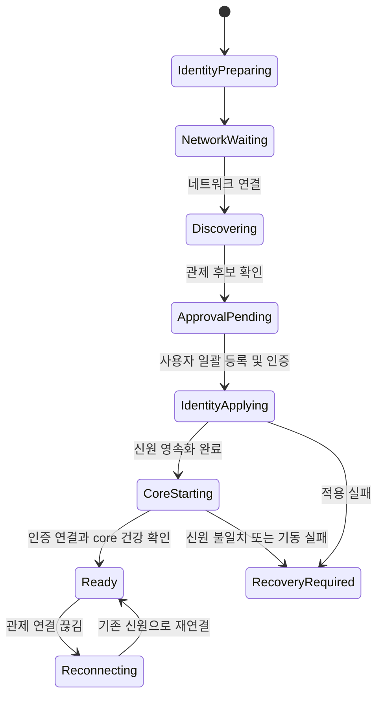

# ROSY 자동 이름 배정과 장비 등록 설계

작성: 2026-09-08. 상태: 사용자 합의 방향을 구조화한 설계 제안. 자동 등록 구현·실기 검증 완료를 의미하지 않는다.

## 1. 사용자 흐름과 범위

**공통 SD 이미지 기록 → 전원 켜기 → 관제의 발견 목록에서 장비 일괄 등록 → 자동 이름으로 사용.**

사용자는 hostname, RobotNumber, ROS 설정, 장비별 토큰을 입력하지 않는다.
정상 설치에 SSH나 장비별 배포 명령을 요구하지 않는다. SSH는 별도의 유지보수 수단이다.
이름은 처음부터 자동 생성하고 등록 시에도 자동 확정한다. 수동 이름 입력은 필수 흐름에 넣지 않는다.

네트워크의 최초 연결은 구분한다. 유선은 같은 설치 네트워크에 연결하고,
Wi-Fi는 설치 도구에서 현장 정보를 한 번 입력해 여러 SD에 주입한다.
공개 공통 이미지에는 현장 Wi-Fi 비밀번호, 장비 키, SSH 호스트 키, 등록 토큰을 포함하지 않는다.
현장 정보가 주입된 SD는 공용 이미지로 재배포하지 않는다.

첫 범위는 단일 현장·단일 관제 소유권이다. 여러 관제 간 이전, 공장 인증 장비의 완전 무승인 등록,
커널/rootfs 업데이트는 후속 범위다. 사용자의 일괄 등록 선택은 이름 설정이 아닌 장비 소유 승인이다.

## 2. 현재 코드와 변경 경계

| 현재 근거 | 현재 상태 | 필요한 변경 |
|---|---|---|
| `deploy/robot/install-pi.sh`, D-33 | RobotNumber 필수, domain=40+N, namespace=rosy_%02d | 수동 인수 대신 검증된 자동 배정 결과를 받는 내부 경로 |
| `deploy/image/build-image.sh` | 실제 이미지 생성 미구현 | 공통 이미지 제작, 장비별 비밀 제거, 최초 부팅 서비스 포함 |
| `src/rosy_core/rosy_core/fleet_agent/agent.py` | outbound Fleet 비활성 | 등록 완료 후 기존 Fleet 계약에 맞춘 연결 구현 |
| `src/rosy_fleet/` | 군집 CLI·라이브러리 | 중앙 등록부·검색·등록 화면은 별도 Fleet 서비스로 구현 |
| Fleet SRS REG-001, SEC-201/202 | 검색, 승인, 일회용 페어링 토큰 계약 | 장비별 수동 입력을 설치 세션의 자동 전달로 대체하는 계약 개정 |
| `deploy/release/cli.py` | 서명 업데이트·활성화·복구 | 등록 신원·소유권을 릴리스 롤백에서 독립적으로 보존 |

이 문서는 새로운 REST 경로나 공개 프로토콜 필드를 확정하지 않는다.
구현 전에 Fleet SRS, API Reference, 관련 스키마와 Host Agent 계약을 함께 수정한다.
일반 로봇 제어의 유일한 외부 게이트웨이는 계속 `rosy_core`다. 등록용 서비스는
등록·신원 설정만 담당하고 이동 명령이나 일반 관리 API를 제공하지 않는다.

## 3. 신원과 이름

| 개념 | 예 | 생성·소유 주체 | 유지 규칙 |
|---|---|---|---|
| 장비 ID | 무작위 UUID 전체 값 | 첫 부팅 호스트 | 일반 재부팅·업데이트·재연결 시 불변 |
| 장비 키 | 장비별 키 쌍 | 첫 부팅 호스트 | 개인키는 장비에만 저장, 이미지에 포함 금지 |
| 초기 hostname | `rosy-a3f921c8` | 장비 ID에서 자동 생성 | 짧은 이름은 식별 편의용이며 인증 ID가 아님 |
| 관제 표시 이름 | `rosy-001` | 관제 등록부 | 등록 때 자동 확정, 재연결로 재번호하지 않음 |
| 내부 로봇 번호 | `1` | 관제 배정기 | 정수 저장, 표시의 앞자리 0과 분리 |
| 기존 ROS namespace | `rosy_01` | D-33 규칙 | 기존 규칙 유지 |
| 기존 ROS domain | `41` | D-33 규칙 | 기존 규칙 유지 |

관제 등록 시 hostname도 `rosy-001`로 맞춘다. 변경 중 연결이 끊기더라도 IP나 이름 대신
장비 ID·키로 같은 등록 트랜잭션을 재개한다. 이름 충돌을 검사하고 완료를 확인하기 전까지 준비 완료로 표시하지 않는다.
서로 다른 관제가 같은 네트워크를 사용하는 경우에는 별도 네트워크 격리 또는 공동 이름·도메인 배정이 필요하다.
v1은 충돌한 이름을 임의로 덮어쓰지 않고 충돌 상태로 표시한다.

자동 배정의 v1 범위는 **1~61**로 제한한다. 현재 설치기가 ROS domain 0~101을 허용하고
domain=40+N을 사용하기 때문이다. 62번째 장비를 번호 순환으로 수용하지 않는다.
이 범위는 통신 설정 상한이며 61대 운용 성능을 검증했다는 뜻이 아니다.
더 큰 규모는 표시 번호와 DDS domain 배정을 분리하는 후속 ADR·코드 변경으로 처리한다.

## 4. 구성 요소별 책임

| 구성 요소 | 책임 | 저장하는 정보 |
|---|---|---|
| 이미지 제작기 | 검증된 런타임·등록 서비스·공개 신뢰 정보 포함, 개인화 흔적 검사 | 버전·이미지 해시·공개키 |
| 설치 도구 | SD 기록·검증, 현장 네트워크와 선택한 관제 신뢰 정보 일괄 주입 | 설치 세션, 장비별 결과 |
| 등록용 호스트 서비스 | ID·키 생성, 네트워크 대기, 발견, 승인 결과 검증·적용·복구 | 신원, 관제 소유권, 적용 저널 |
| Fleet 등록 서비스 | 발견 목록, 소유 승인, 중복 없는 번호·이름 예약, 장기 인증 발급 | 등록부, 예약, 감사 이력 |
| 관제 웹 | 발견된 장비 선택·일괄 등록, 진행·실패 사유 표시 | 서버 상태를 표시하며 별도 권위 상태 없음 |
| ROSY CORE | 등록된 신원을 읽어 core 모드 실행, 인증 후 상태 제공 | 기존 런타임 설정과 운용 데이터 |

등록용 호스트 서비스는 rclpy나 RobotNumber 없이 시작할 수 있어야 한다.
번호 없는 CORE를 임시 기본 번호로 시작하는 방식은 사용하지 않는다.
Fleet 서비스는 군집 계산·릴레이 모듈을 재사용할 수 있지만, 등록부를 CLI 파일이나 전역 변수로 대신하지 않는다.

## 5. 상태 전이

아래 이름은 설계 내부 상태이며 현재 API enum으로 추가된 값이 아니다.

네트워크 대기는 실패로 확정하지 않고 재시도한다. 관제를 못 찾으면 발견 대기 상태를 유지한다.
등록된 장비는 관제 연결이 끊겨도 새 이름을 받지 않는다. 기존 로컬 운용과 Safety 계약을 유지하고,
군집 운용의 통신 끊김 처리는 기존 세션·watchdog 계약을 따른다.
`Ready`는 관제 연결·core 정상의 뜻이며 모터 운용 승인이 아니다.

## 6. 등록 트랜잭션

1. 장비가 첫 부팅에서 ID·키를 원자적으로 저장한다. 파일 일부만 남으면 완성된 것으로 취급하지 않는다.
2. 설치 도구가 선택한 관제의 주소·신뢰 정보를 우선 사용하고, 같은 LAN의 자동 탐색을 보조 경로로 사용한다.
   탐색 응답은 위치 정보일 뿐 소유권이나 인증의 근거가 아니다.
3. 관제는 미등록 장비를 발견 목록에 표시한다. 사용자는 여러 장비를 선택해 한 번에 등록한다.
4. 등록 서비스는 인증된 설치 세션 안에서 장비 키에 묶인 만료·일회용 페어링 정보를 자동 전달한다.
   공용 이미지에 공통 페어링 토큰을 넣지 않는다. 초기 신뢰 전달과 소유 승인이 확인되지 않은 장비는 대기한다.
5. 관제 DB 트랜잭션에서 장비 ID·소유 현장·번호·이름의 유일성을 검사하고 예약한다.
   같은 장비의 반복 요청에는 기존 예약을 반환한다. 배정 순서는 등록 순서이며 물리적 배치 순서로 간주하지 않는다.
6. 장비는 검증된 결과를 적용 저널에 저장하고 hostname, runtime.env, CORE identity 설정을 준비한다.
   준비 중 CORE를 시작하지 않는다. 기존 번호가 있으면 명시적 이전 절차 없이 덮어쓰지 않는다.
7. 설정 전체의 일치와 영속화를 확인한 뒤 core만 시작한다. 장기 인증으로 관제에 완료를 알린다.
8. 관제는 장비 확인 응답과 core 건강을 확인한 뒤 등록 완료로 표시한다.

관제의 번호 예약과 장비의 적용 사이에는 하나의 분산 원자 트랜잭션이 있다고 가정하지 않는다.
장비 확인이 유실되면 같은 등록 ID로 재조회·재시도한다. 결과를 모르는 예약은 즉시 재사용하지 않는다.
관제 재시작 후에도 예약과 승인 결과를 DB에서 복원하며, 단순 OFFLINE만으로 번호를 회수하지 않는다.

## 7. 영속 데이터와 실패 처리

호스트 신원·개인키·소유 관제·등록 저널은 root 소유 영역에 저장한다. 기존 이미지 설계의
`identity.json`을 검토해 단일 소유자로 통합하고, 별도의 경쟁 신원 파일을 만들지 않는다.
이 정보는 릴리스별 config/data generation과 분리해 업데이트 롤백으로 과거 신원·폐기된 인증이 복원되지 않게 한다.

| 상황 | 처리 |
|---|---|
| 동시에 여러 대 등록 | DB 유일성 제약과 원자 예약, 충돌 시 재배정 |
| 적용 중 전원 차단 | 호스트 저널로 재개, 혼합된 번호/namespace/domain 상태에서는 CORE 기동 금지 |
| 관제 일시 중단 | 기존 배정 유지, 지수형 지연을 둔 재연결 |
| 여러 관제 발견 | 사전 선택한 신뢰 관제만 사용, 미선택이면 소유 승인 대기 |
| Wi-Fi 정보 오류 | 기존 네트워크 복구 설계와 통합, 재기록 없이 현장 정보 수정 경로 제공 |
| 초기 이름 충돌 | 전체 장비 ID를 비교하고 접미 길이 확장, 기존 장비 이름 탈취 금지 |
| 초기화된 SD 재사용 | 새 설치 신원으로 등록 대기, 기존 등록부는 자동 삭제하지 않음 |
| 이미 운용한 SD 복제 | 하드웨어 연관 정보 불일치·동시 접속을 감지해 격리, 기존 인증으로 자동 등록 금지 |
| SD 교체·다른 Pi로 이동 | 기존 장비와 자동 동일시하지 않음, 명시적 교체·복구 절차로 이력 연결 |

하드웨어 일련번호는 교체·복제 진단의 보조 증거다. 공개될 수 있는 일련번호만으로 인증하지 않는다.
공통 이미지 제작은 미등록 상태에서만 수행하며 개인화된 SD를 그대로 마스터 이미지로 만들지 않는다.

## 8. 관제 화면

발견 목록에는 자동 초기 이름, 장비 ID 일부, 실물/가상 구분, 연결 상태, 이미지 버전을 표시한다.
사용자는 체크박스로 장비를 선택하고 **등록**을 누른다. 이름·번호 입력 창은 없다.

등록 진행은 `발견 → 승인 → 자동 이름 배정 → 장비 적용 → 연결 확인 → 완료`로 표시한다.
여러 대 중 일부 실패는 장비별로 표시하고 실패한 장비만 재시도한다.
완료 목록에는 `rosy-001`, `rosy-002`처럼 확정 이름과 현재 연결·core 상태를 표시한다.
장비 구별이 필요하면 향후 표시등 점멸 등 식별 동작을 추가하며 번호 수동 설정으로 되돌리지 않는다.

## 9. 구현 순서와 완료 기준

| 단계 | 구현 산출물 | 통과 기준 |
|---|---|---|
| A. 계약 정리 | D-33 호환 자동 배정, SEC-201 자동 전달, 등록 상태·소유권 계약 | API Reference·스키마·Host Agent 계약 간 일치 |
| B. PC 등록 시험 | 영속 Fleet 등록부, 가상 호스트 등록 에이전트 3개 | 번호·키 중복 없음, 동시 등록·중복 요청·서버 재시작 통과 |
| C. 관제 화면 | 발견·일괄 등록·자동 이름·실패별 재시도 | 사용자가 이름/번호/토큰을 입력하지 않고 3대 등록 |
| D. 부팅·복구 연결 | 호스트 등록 서비스, 설정 적용 저널, CORE 기동 게이트 | 적용 단계별 강제 종료 후 일관된 신원으로 복구 |
| E. 공통 이미지·설치 도구 | 이미지 제작, SD 기록·검증, 현장 정보 일괄 주입 | 개인키·등록 상태 없는 공통 이미지, 재현 가능한 이미지 검사 |
| F. 실제 Pi 1→3대 | SD 첫 부팅, 등록, 재부팅, 네트워크 단절, 업데이트·롤백 | SSH·장비별 수동 설정 없이 동일 신원 유지 |

PC 시험에는 재전송, 관제 위장, 만료·재사용 페어링, 62번째 번호 요청, SD 복제,
hostname 변경 중 단절, 설정 일부 기록 후 중단, 업데이트 후 인증 유지 사례를 포함한다.
Gazebo는 등록 뒤 실제 CORE API·군집 동작을 검증하는 다음 층이며 등록 트랜잭션 시험의 필수 의존성이 아니다.
가상 호스트 등록 에이전트는 이번 설계의 새 구현 대상이지 기존 Gazebo 기능으로 완료된 것으로 간주하지 않는다.

## 10. 선택한 접근과 대안

- 선택: 공통 이미지 + 장비 첫 부팅 신원 + 관제 자동 배정. 카드별 이름 사전 관리가 필요 없고 현장별 등록 이력을 유지한다.
- 카드별 번호를 굽는 방식: 초기 코드는 간단하지만 SD와 번호의 재고·복제 관리가 사용자에게 남으므로 기본 경로로 채택하지 않는다.
- 장비가 번호까지 독자 생성하는 방식: 관제 없이 이름 생성은 가능하지만 연속 번호와 충돌 처리가 분산되므로 초기 임시 이름에만 사용한다.

현재 결과물은 구조화 문서다. 다음 구현 시작점은 **계약 정리 후 PC의 가상 장비 3대 자동 등록**이며,
공개 GitHub 저장소 생성·실제 SD 기록·실기기 변경은 이 문서 작성에 포함하지 않았다.
