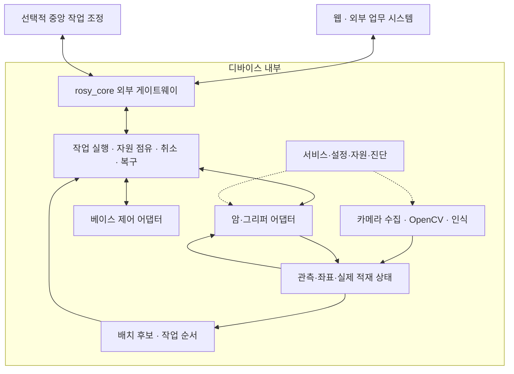

# ROSY 디바이스 기반 이동·조작·적재 플랫폼 재조사

> 2026-09-13 편입 안내: 이 문서는 작성 당시의 조사·평가 근거다. 현재 제품 경계와 구현 순서는 [ADR D-37~D-44](../reference/ROSY%20ADR%20Log.md), [흡수 실행 계획](2026-09-12-rosy-control-absorption-plan.md), [최신 실행 결과](2026-09-12-control-absorption-results.md)를 우선한다. 조사 당시의 미실행·별도 Control 표기는 현재 배포 상태를 뜻하지 않는다.

작성·공개자료 확인: 2026-09-12
상태: 조사 및 설계 제안. 제품 구현·실물 탑재 승인·안전 인증·성능 검증 보고가 아니다.
사용자 확인: OMX 모델은 아직 결정 전. 신형 OMX-F와 구형 OpenMANIPULATOR-X를 구분한다.

## 1. 사용자 목표와 범위

ROSY는 디바이스 내부에 상주하며 센서 수집, OpenCV 영상 전처리, 물체 인식, 공간 상태, 이동·로봇암 실행을 연결한다. 웹은 작업 지정·상태·설정 인터페이스다. 중앙 서버 연결이 필수인 제어 구조로 목표를 바꾸지 않는다.

목표 작업:
1. 크기와 무게가 다양한 소형 직육면체 블록을 바닥에서 찾는다.
2. 집을 수 있는 물체를 선택하고 핑키 적재 공간에 싣는다.
3. 지정 장소로 이동한다.
4. 핑키에서 꺼내 바닥의 팔레트 또는 지정 영역에 배치·적층한다.
5. 실제 결과를 확인하고 다음 물체의 위치·순서·이동 계획을 갱신한다.

최종 목표는 이동형 로봇암이다. 초기 고정 암 작업대는 독립적으로 검증할 수 있는 중간 배치안이며 사용자 목표를 대체하는 확정 결정이 아니다. 초기 물체 수, 정확한 치수·무게, 적층 높이, 작업 속도는 미정이다.

## 2. 읽는 순서와 근거 수준

| 문서 | 내용 |
|---|---|
| [기존 사양 조사](2026-09-12-pinky-omx-mounting-spec-research.md) | 핑키 제원 이미지와 OMX 도면 판독, 모델 혼동 정정 |
| [하드웨어 재조사](2026-09-12-mobile-manipulation-hardware-research.md) | 하중·전도·장착·전원·기구 검증 및 배치 대안 |
| [영상·제어 재조사](2026-09-12-mobile-manipulation-vision-control-research.md) | 보정·인식·OpenCV·ROS·장치 연산 경계 |
| [단계별 검증 계획](2026-09-12-mobile-manipulation-validation-plan.md) | 준비 정보, 실험 순서, 합격 기준을 정하는 방법, 중단 조건 |
| 이 문서 | 제품 개념, 실행 책임, 적재 알고리즘, 선택지 및 미결정 사항 |

문서의 진술은 다음과 같이 구분한다.
- **공식 사실:** 제조사 사양 또는 공식 소프트웨어 문서가 설명한 범위.
- **현 코드:** 현재 로컬 파일을 읽어 확인한 구현·설정. 실물 동작 증거와 구분.
- **추론:** 위 사실로 도출한 판단이며 추가 조건에 따라 달라질 수 있음.
- **제안:** 앞으로 구현·검증할 구조와 시험 방법. 기존 API 계약 또는 승인된 ADR가 아님.
- **미확인:** 공개자료만으로 답할 수 없거나 실물 확인이 필요한 값.

## 3. 먼저 바로잡은 판단

### 3.1 OMX 모델을 구분한다

[ROBOTIS OMX 공식 사양](https://ai.robotis.com/omx/hardware_omx.html)은 OMX-F follower와 OMX-L leader를 구분한다. 박스를 드는 검토 대상은 follower다. [구형 OpenMANIPULATOR-X](https://emanual.robotis.com/docs/en/platform/openmanipulator_x/specification/)는 별도 모델이다.

| 항목 | OMX-F | 구형 OpenMANIPULATOR-X |
|---|---|---|
| 자체 무게 | 560g | 700g |
| 팔·그리퍼 | 5축 + 그리퍼 | 4축 + 그리퍼 |
| 최대 도달 | 400mm | 380mm |
| 가반하중 | full reach 100g / normal reach 250g | 500g |
| 입력 | 12V | 12V |

normal reach의 거리·자세는 확인한 표에 정의되지 않았다. 최대 도달거리와 최대 가반하중을 동시에 사용할 수 있다고 가정하지 않는다. 모델 선정 전에도 공통 구조 조사는 진행할 수 있지만, 최종 작업물 규격과 기구·전원은 고정할 수 없다.

### 3.2 기본판 크기가 탑재 불가능을 증명하지 않는다

[핑키 제조사 소개](https://github.com/pinklab-art/pinky_study/wiki)의 공식 이미지에서 전체 외형 110×120×142mm를 확인했다. [OMX-F 도면](https://docs.robotis.com/assets/images/omx_follower_layout-045a39b46c53c8684fbad95c81c1180b.png)의 기본판은 120×150mm다.

이는 기본판 돌출과 장착·LiDAR 시야·적재 공간을 검토해야 한다는 근거다. 별도 하중 전달 구조, 장착 방향, 판 교체 가능성 등을 검토하지 않고 물리적으로 불가능하다고 단정할 수 없다. 반대로 크기만 맞는 브래킷을 만든다고 허용 하중이나 안정성이 증명되지도 않는다.

현재 판정: **핑키 직접 탑재는 HOLD — 불가능 판정이 아니라 실측·제조사 조건 부족.**

### 3.3 모델 질량과 설정값은 실물 사양이 아니다

[로컬 핑키 프로필](../../src/rosy_core/config/profile.pinky_pro.yaml)의 wheel_base는 0.15다. [제조사 URDF](https://raw.githubusercontent.com/pinklab-art/pinky_pro/main/pinky_description/urdf/pinky.urdf.xacro)의 바퀴 joint 위치는 y=±0.04055m다. 두 값의 정의·작성 목적·실측 일치를 확인하기 전에는 어느 것도 이번 전도 계산의 확정 지지 폭으로 사용하지 않는다. URDF base_link 질량도 배터리 포함 실물 총중량으로 인용하지 않는다. 이번 조사에서는 해당 코드를 수정하지 않는다.

## 4. 가능한 배치와 선택 조건

| 배치 | 검증할 수 있는 것 | 미해결·추가 조건 | 현재 위치 |
|---|---|---|---|
| A. 핑키에 OMX 직접 탑재 | 최종 이동·집기·적재 전체 | 암·짐·전원 총하중, 무게중심, 고정 강성, 센서 가림, 바닥 도달, 적재함 | 실측 전 HOLD |
| B. 고정 OMX 작업대 + 핑키 운반 | 인식·집기·적재·하역·정렬·작업 상태 | 핑키 짐 적재하중, 작업대 접근·정지, 팔 도달 영역; 임의 장소 바닥 수거는 미지원 | 초기 검증 후보 |
| C. 더 넓은 이동 베이스 + OMX | 최종 이동형 목표와 넓은 적재 공간 | 베이스 모델·비용 미정, 실제 하중·전원·암 연동 검증 | 필요 시 비교 후보 |

제안: 먼저 B에서 인식과 집기·배치의 독립 성공을 확인하고 A의 기구 타당성을 병행 조사한다. A의 조건이 충족되면 같은 작업 모델을 탑재형으로 확장한다. 충족되지 않으면 C를 별도로 선정한다. 특정 베이스 구매 또는 B 채택을 사용자 승인 없이 확정하지 않는다.

B에서도 핑키에 짐을 실을 수 있다는 가정은 검증 대상이다. OMX를 작업대에 고정하면 암 무게가 베이스에서 빠지는 장점이 있을 뿐이다.

## 5. 디바이스 내부 구조

아래는 모듈 책임의 제안이다. 기존 패키지 이름·프로세스·REST 경로를 변경하는 문서가 아니다.

| 책임 | 소유할 판단 | 소유하지 않을 판단 |
|---|---|---|
| 웹·중앙 조정 | 작업 요청·진행·운영 설정 | 주기적 관절 제어, 영상 수신 여부만으로 물체 상태 확정 |
| rosy_core | 외부 인증·명령 접수·상태·이벤트 | 무거운 프레임 처리 전체를 API 프로세스에 집중 |
| 작업 실행 | 명령 실행권, 단계 전환, 재시도 한도, 중단·복구 | 제조사 제어기의 내부 서보 루프 대체 |
| 영상 서비스 | 시각·보정 정보가 있는 관측 | 인식 결과를 직접 모터 명령으로 발행 |
| 공간 상태 | 물체·적재함·팔레트·관절·좌표의 유효성 | 예정 위치를 실측 위치처럼 취급 |
| 적재 계획 | 실행 가능한 위치·순서 후보 | 실제 집기·배치 성공 보증 |
| 장치 어댑터 | 목표 전달, 피드백, 오류·중단 결과 | 지원하지 않는 장치 기능을 가능하다고 광고 |

현 코드의 [main.py](../../src/rosy_core/rosy_core/main.py)는 rclpy와 FastAPI의 한 프로세스 경계를 설명한다. [CommandManager](../../src/rosy_core/rosy_core/command/manager.py)는 베이스 속도 명령을 중재하며, [StateManager](../../src/rosy_core/rosy_core/state/manager.py)는 상태 스냅샷을 관리한다. 이 구성은 그대로 보존하고 암의 궤적·그리퍼 제어는 별도 어댑터 책임으로 제안한다. 팔 궤적을 cmd_vel에 합치지 않는다.

[기존 비전 설계](2026-09-05-vision-accelerator-shield-design.md)의 인지 프로세스 분리 및 [Lite 계획](2026-09-08-lite-os-fleet-vision-plan.md)의 호스트/ROS/확장 구분을 유지한다. 이번 문서는 새 runtime mode, capability 이름, API endpoint를 확정하지 않는다.

고정 작업대와 핑키가 분리되면 각각 장치 신원과 로컬 실행 책임을 가진다. 상위 조정은 공통 작업 ID로 연계하되 한쪽의 응답만으로 양쪽 물리 동작을 완료 처리하지 않는다.

## 6. 물체·공간·관측의 최소 개념

아래는 개념 데이터이며 확정 JSON 스키마가 아니다.

| 개념 | 필요한 정보 | 미확인 시 처리 제안 |
|---|---|---|
| 물체 규격 | ID, 실측 길이·폭·높이, 질량, 허용 자세, 표면·그리퍼 조건 | 초기 자동 처리 대상에서 제외 |
| 관측 | 촬영 시각, 좌표계, 추정 위치·자세, 불확실성, 보정 버전 | 오래되거나 유효하지 않으면 재관측 |
| 집기 후보 | 잡을 면, 손가락 간격, 접근·후퇴 방향, 암 자세 | IK 또는 충돌 검증 실패 시 후보 폐기 |
| 적재 공간 | 유효 내측 영역, 금지 영역, 높이·하중 한도, 바닥 좌표 | 외형 치수를 유효 내측치수로 대신하지 않음 |
| 배치 계획 | 대상 위치·자세, 지지 물체, 순서, 예약 공간, 계획 버전 | 장면 변경 시 재검사 |
| 실제 물체 상태 | 바닥·집는 중·그리퍼·적재함·팔레트·확인 불가 | 확인 불가를 임의 위치로 확정하지 않음 |

초기 블록은 실측 규격표로 관리한다. 영상으로 보이는 색과 윤곽만으로 질량·재료 강도·숨겨진 지지 면을 알 수 없다. 부분 가림에서는 알려진 규격과 관측 가정을 명시하고 검증 실패 시 보류한다.

한 층의 알려진 블록과 고정 평면부터 시작한다. 적층 단계에서는 박스 윗면 높이를 바닥 평면으로 잘못 변환하지 않도록 깊이 또는 알려진 3D 모델·추가 시점을 검토한다. 자세 추정은 [OpenCV 보정·3D 문서](https://docs.opencv.org/4.x/d9/d0c/group__calib3d.html)의 기능을 후보로 삼되 카메라 모델·배치 실험으로 검증한다.

## 7. 실행 가능한 테트리스: 적재·순서·동작의 결합

### 문제의 정의

사용자 표현인 테트리스는 이 문서에서 **직육면체 공간 배치 + 지지 안정성 + 로봇 접근 + 적재·하역 순서**로 정의한다. 블록이 공중에서 자유롭게 회전·낙하할 수 있다고 가정하지 않는다.

[Google OR-Tools bin packing 예제](https://developers.google.com/optimization/pack/bin_packing)는 물체 무게와 용기 용량을 기반으로 배정한다. 이 예제를 그대로 사용해도 3D 좌표, 손가락 간섭, 암의 도달성과 물리적 적층 안정성은 해결되지 않는다.

[Zhao 등, Online 3D Bin Packing 연구](https://arxiv.org/abs/2006.14978)는 충돌과 물리적 안정성 제약을 다룬다. 이는 공간 활용률 외의 제약을 포함해야 한다는 근거다. 해당 학습 정책의 성능을 우리의 박스·그리퍼·Pi에 그대로 적용하거나 학습 모델을 안전 판정기로 사용하지 않는다.

### 초기 알고리즘 제안

1. 실측 박스, 현재 적재 상태, 유효 공간과 검증된 암 자세를 입력한다.
2. 바닥 및 이미 지지가 확인된 윗면에서 위치 후보를 만든다.
3. 허용된 방향만 열거한다. 초기에는 세운 상태의 0/90도 후보부터 시작하되 실제 그리퍼와 암이 실행할 수 있는 방향만 남긴다.
4. 공간 경계, 박스끼리의 겹침, 지지, 총하중, 베이스 균형을 먼저 검사한다.
5. 접근·집기·놓기·그리퍼 열기·후퇴 전체 동작을 검증한다.
6. 나중에 꺼내야 하는 물체가 막히는지 검사한다.
7. 가능한 후보 중 낮은 적층, 균형, 적은 재배치, 이동 비용, 공간 활용률 순으로 비교하는 초기 정책을 만든다.
8. 다음 한 동작을 실행하고 결과를 재관측해 계획을 갱신한다.

처음부터 최적해 보장을 목표로 하지 않는다. 결정론적 휴리스틱으로 실패 이유를 재현 가능하게 만들고, 필요할 때 제한 시간의 탐색/최적화 솔버와 비교한다. 시간 제한 내 가능한 해가 없으면 작업을 보류하고 다시 인식하거나 배치를 바꾼다.

| 반드시 만족할 조건 | 관측·실험에서 필요한 근거 |
|---|---|
| 용기 밖·금지 영역·다른 박스와 겹치지 않음 | 실제 치수 및 오차 여유 |
| 지지 면과 적층 안정성 | 받침 형상, 무게중심, 접촉·재료 조건 |
| 베이스 적재·전도 한도 | 총무게, 짐 위치, 암 자세, 가감속·정지 시험 |
| 그리퍼 접근·개방·후퇴 가능 | 도구 충돌 형상과 전체 궤적 |
| 하역 순서 실행 가능 | 선후 관계 및 가림·점유 검사 |
| 관측과 계획이 같은 장면을 가리킴 | 시각·보정·장면 버전 |

지지 면적 비율만으로 적층 안전을 보증하지 않는다. 초기에는 평평하고 단단한 블록의 충분한 지지를 확보하는 보수적 규칙을 시험하고, 높이가 올라가면 전체 적층의 무게중심과 하부 블록 조건도 평가한다.

## 8. 한 작업의 실행과 결과 확인

제안 흐름:
관측 → 후보 선택 → 공간 예약 → 베이스 접근 → 정지 확인 → 재관측 → 계획 검증 → 집기 → 집기 확인 → 적재/배치 → 놓기 확인 → 후퇴 → 실제 상태 확정 → 다음 작업.

- 베이스의 '명령 속도 0'만으로 정지를 확인하지 않는다. 실제 움직임·자세 안정성 기준을 시험으로 정한다.
- 암 수납 및 짐 고정 상태를 확인한 뒤 이동한다. 초기에는 베이스 이동과 팔 작업을 동시 허용하지 않는다.
- 이동 후 물체·작업영역을 다시 관측한다. 지도상의 도착 성공을 집기 좌표 정밀도 증거로 사용하지 않는다.
- 그리퍼 닫힘은 집기 성공이 아니다. 실제 물체 존재와 동반 이동 확인 방법을 별도로 정한다.
- 중단 후에도 물체가 그리퍼에 있는지 모르면 장면을 '확인 불가'로 유지한다. 재시작 시 저장된 계획을 자동 재실행하지 않는다.
- 재전송·재연결로 같은 동작이 중복 실행되지 않도록 작업/동작 식별과 피드백 조정을 설계한다.
- 통신 단절·비상 상태의 베이스 정지와 팔 처리 정책은 분리한다. 토크 해제 시 낙하·처짐이 발생할 수 있으므로 모델별 보호·정지 기능을 먼저 검증한다.

MoveIt Task Constructor는 단계별 pick/place 계획을 구성할 수 있다. 그러나 [공식 튜토리얼](https://moveit.picknik.ai/main/doc/tutorials/pick_and_place_with_moveit_task_constructor/pick_and_place_with_moveit_task_constructor.html)의 collision object attach/detach는 계획 장면의 변경이다. 이것만으로 물체의 실제 이동을 확인한 것이 아니다.

[Nav2 footprint](https://docs.nav2.org/rolling/configuration_and_development/first_time_robot_setup_guide/footprint/setup_footprint/)는 바닥에 투영한 형상이며 적재·암 상태에 따른 갱신을 지원한다. MoveIt의 3D 충돌 장면과 별도로 관리하되 같은 실물 상태에서 생성해야 한다. 2D footprint만으로 높이가 다른 물체·팔의 모든 충돌을 검사할 수는 없다.

## 9. 영상·CPU·GPU·NPU 및 전원

장치 내부 영상 경로: 카메라 → 프레임/시각 확보 → 보정·ROI·색상/크기 처리 → 인식/측정 → 좌표 변환 → 유효성 검사 → 공간 상태.
원본과 전처리 영상의 픽셀 변환, 보정 버전, 카메라 자세를 추적한다. 외부 웹에는 필요한 미리보기와 결과를 제공하며 제어에 쓰는 영상이 웹 왕복에 종속되지 않게 한다.

제안 비교 구성:
- CPU OpenCV + 알려진 블록: 최소 기준선.
- CPU 전처리 + 가속기 추론: 실제 인식 모델이 필요하고 기준선 성능이 부족할 때.
- 더 큰 로컬 연산 장치: 모델·ROS·계획을 동시에 실행할 수 없을 때 검토.

GPU/NPU의 TOPS만으로 전체 성능을 예측하지 않는다. 카메라·변환·메모리 복사·큐 대기·추론·계획·통신 전체 지연을 측정한다. 같은 Linux 컨테이너에 모든 카메라·가속기 드라이버가 들어간다는 가정을 하지 않는다. 학습 PC와 디바이스 추론 실행환경은 구분한다. 구체 제품 선택은 영상·제어 재조사의 지원 상태 및 실물 공간·전원 여유를 확인한 뒤 결정한다.

정확한 ARM64 패키지 버전, 호스트 OS·커널, ROS Jazzy 패키지, OMX 펌웨어, 카메라 드라이버, 보정값, 모델 파일을 검증 조합으로 고정해야 한다. 현재 문서는 그 조합을 이미 시험했다고 주장하지 않는다.

## 10. 결정 및 다음 단계

| 결정 | 현재 내용 |
|---|---|
| 제품 중심 | 디바이스 내부 실행 미들웨어 유지 |
| OMX 선정 | 미정; F와 구형 X 각각 검토 |
| 첫 인식 대상 | 실측한 단단한 직육면체 블록을 제안 |
| 직접 탑재 | HOLD; 기본판 크기만으로 불가능 확정 금지 |
| 첫 검증 배치 | 고정 암+핑키 협업 후보; 사용자 목표 대체 아님 |
| 최종 이동형 | 기구·하중·전원·실행 검증 통과 후 선택 |
| API/코드 | 이번 작업에서 변경하지 않음 |

우선 닫을 질문: OMX 정확 모델, 핑키 배터리 포함 무게와 적재 허용 조건, arm/tray/camera 장착 도면, 전원 정격·순간 전류, 물체 규격표, 집기·적재 높이, 동작 오차·시간 목표.
공개자료로 확인되지 않는 값은 [검증 계획](2026-09-12-mobile-manipulation-validation-plan.md)의 실측·제조사 확인 항목에 연결한다.

조사 문서 완성은 하드웨어 타당성 완료가 아니다. 물리적 합격 기준과 결과가 채워질 때까지 직접 탑재·자율 적층의 실물 수락은 HOLD다.

## 후속 모듈 평가와 유지보수

[모듈 평가 설계](2026-09-12-rosy-os-module-evaluation-maintenance-design.md), [목표·평가표](2026-09-12-rosy-os-evaluation-scorecard.md), [현재 소스 근거](2026-09-12-rosy-os-module-evidence-baseline.md)를 후속 기준으로 사용한다. 목표와 실행 실적은 구분한다.
