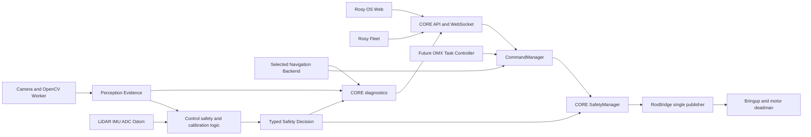

> **Historical design baseline.** This 2026-09-12 document preserves the design snapshot. Current source integration and Device status are maintained in the 2026-09-13 Device validation plan and absorption results; D-47 through D-53 record subsequent boundaries. Physical acceptance remains HOLD/PARKED.

# Rosy OS 제어 기능 통합 상세 설계

작성일: 2026-09-12

상태: D-37~D-40 Accepted, D-41~D-44 Proposed. 소스 흡수 T0·T1 완료, T2 진행 중, T3~T8 예정

대상: Rosy OS, Pinky Pro, 향후 OMX 계열 로봇암

관련 문서: [흡수 실행 계획](2026-09-12-rosy-control-absorption-plan.md), [흡수 실행 결과](2026-09-12-control-absorption-results.md), [이전 대장](2026-09-12-control-absorption-inventory.csv)

## 1. 문서 목적과 현재 판단

정식 결정 기록은 [ROSY ADR Log](../reference/ROSY%20ADR%20Log.md)의 D-37~D-44다. Accepted는 채택한 설계 방향이며 구현 완료를 뜻하지 않는다. Proposed의 후보 계약은 검증 전까지 운영 계약으로 확정하지 않는다.

| ADR | 내용 | 상태 |
|---|---|---|
| D-37 | Control의 OS 내부 편입과 제품·모듈 소유권 | Accepted |
| D-38 | 단일 최종 명령권과 정지 후 명령 폐기 | Accepted |
| D-39 | 운용·정비·복구와 증거 단계 통합 | Accepted |
| D-40 | Nav2 기본 유지와 단일 backend | Accepted |
| D-41 | 카메라/OpenCV worker 실행 위치 | Proposed |
| D-42 | 안전 판단 전달 방식과 내부 스키마 | Proposed |
| D-43 | 보정 schema와 generation별 저장 매핑 | Proposed |
| D-44 | ControlBackend 채택과 OMX 액션 경계 | Proposed |

Rosy Control의 기능과 소스는 Rosy OS 내부 `src/rosy_control` 패키지로 편입되었다. 이로써 Rosy OS 저장소가 원본 코드, 테스트, 설정, launch, 카메라·보정·주행·안전 로직을 소유한다. 이것은 **소스 흡수 완료**를 뜻한다. OS 이미지에서 해당 기능을 기동하고 CORE API, 최종 모터 명령, 진단, 업데이트 및 실물 장치까지 하나로 운영하는 **런타임 흡수**는 아직 남아 있다.

제품 이름과 설치 단위는 Rosy OS 하나로 통일한다. `rosy_control`은 이행 중인 내부 ROS 패키지 이름이며 별도 제품이나 별도 외부 API가 아니다. 운영자는 Rosy OS 대시보드와 API만 사용하고, Fleet는 로봇의 공개 API와 WebSocket만 사용한다.

이번 통합의 직접 목표는 다음과 같다.

1. Rosy OS checkout 하나로 빌드, 설치, 운전, 진단, 업데이트, rollback을 수행한다.
2. 수동 운전, 자율 주행, 보정 및 향후 작업 명령이 하나의 명령 중재기와 안전 판단을 통과한다.
3. 최종 모터 속도 발행자를 하나로 유지한다.
4. 카메라와 OpenCV 전처리 결과를 장치 내부에서 생성하고, 상태와 근거를 CORE에서 관측한다.
5. Pinky Pro에 OMX를 결합할 때 기존 주행 안전과 제어 계약을 깨지 않고 작업 계층을 추가할 수 있게 한다.

OMX 모델 선정, 박스 의미 인식, hand-eye 보정, grasp planning, 적재 최적화와 실제 로봇암 구동은 후속 범위다. 다만 이번 계약은 그 기능이 들어올 위치와 안전 경계를 미리 고정한다.

## 2. 확정된 설계 원칙

### 2.1 소유권

| 영역 | 최종 소유 모듈 | 설계 규칙 |
|---|---|---|
| 외부 HTTP·WebSocket·대시보드 | `rosy_core` | Control의 별도 웹 서버와 외부 URL은 운영 배포에서 제거한다. |
| 세션·명령 선택 | `rosy_core.command.CommandManager` | manual, navigation, Fleet, calibration, future task 후보를 한 곳에서 선택한다. |
| 안전 정책과 최종 제한 | `rosy_core.safety` | Control의 순수 판단 로직을 재사용하되 최종 적용은 CORE가 소유한다. |
| 최종 속도 발행 | `rosy_core.bridge.RosBridge` | 로봇 namespace의 상대 `cmd_vel` publisher는 런타임에 하나다. |
| 모터 deadman과 하드웨어 실행 | 기존 bringup·motor 계층 | CORE 단절 또는 명령 만료 시 물리 계층도 정지한다. |
| 감지·보정·자율 로직 | 내부 `rosy_control` worker와 순수 함수 | 절대 토픽과 최종 속도 발행을 제거하고 OS 계약으로 연결한다. |
| 설정·보정 영속 데이터 | Rosy OS 배포·데이터 경로 | 이미지 기본값과 장치별 쓰기 데이터를 분리한다. |
| 설치·업데이트·복구 | `deploy/robot` | 별도 Control 설치 스크립트를 운영 경로로 사용하지 않는다. |

`rosy_core`는 FastAPI와 rclpy를 함께 실행하는 현재 구조를 유지한다. 장치 파일, Docker socket, systemd 또는 root 권한을 CORE에 추가하지 않는다. 하드웨어 접근은 기존 IO·bringup 경계 안에서 처리한다.

### 2.2 기능 분류

T2 시작 전에 이전 대장에 아래 제품 분류를 추가한다. 단순히 존재하는 레거시 기능 전체를 영구 지원 대상으로 만들지 않는다.

- **운영 필수:** 수동 운전, e-stop, 안전 제한, 센서 상태, Nav2 주행, 취소, 진단.
- **OMX 준비:** 카메라 전처리, 장치별 보정, 좌표·기구값 revision, 작업 명령 확장점.
- **정비·검증:** graph/watch, calibration evidence, 시뮬레이션 및 현장 측정 도구.
- **격리 보존:** 회귀 근거로 필요하지만 운영 launch에서 시작하지 않는 legacy node와 fixture.
- **폐기 후보:** CORE가 대체했고 직접 사용자 가치가 없는 별도 웹 서버·배포 도구·중복 발행 경로.

동등성 완료 조건은 운영 필수, OMX 준비 및 채택된 정비 기능에 적용한다. 격리 보존과 폐기 후보는 대장에 사유와 대체 경로를 기록한다.

## 3. 현재 구현과 목표 구조

### 3.1 현재 확인된 구현

- CORE API는 `src/rosy_core/rosy_core/api`에서 control, navigation, safety, robot, sensor, power, system, diagnostics, map 기능을 제공한다.
- `CommandManager`는 manual과 navigation 후보, 모드, 500 ms teleop watchdog을 관리한다.
- `SafetyManager`는 e-stop, 속도, 배터리, Fleet 연결, 세션 제한을 적용한다.
- `RosBridge`가 50 Hz 제어 주기에서 최종 상대 `cmd_vel`을 발행한다.
- 기존 Nav2 실행 경로는 `rosy_navigation`과 CORE `NavigationManager`에 있다.
- 흡수된 Control은 `/cmd_vel_raw`, `/cmd_vel`, `/camera/*`, `/calibration/*`, `/goal/*`, `/robot/*` 등 절대 토픽을 사용한다.
- legacy `SafetyNode`는 센서 융합과 최종 `/cmd_vel` 발행을 함께 수행한다. 이 노드를 현재 형태로 CORE 옆에 켜면 최종 발행자가 중복된다.
- 현재 robot Dockerfile은 `rosy_control`을 이미지 빌드 대상으로 포함하지 않는다. `runtime-mode.sh`는 `core`, `motor`, `hardware`만 지원한다.

### 3.2 목표 배치

Control worker는 센서 관측, 보정, 후보 경로 또는 후보 속도, 안전 판단 근거를 만든다. 실제 모터 토픽을 발행하지 않는다. CORE는 후보 명령의 소유권과 유효성을 확인하고 안전 결정을 적용한 뒤 RosBridge를 통해서만 속도를 내보낸다.

현재의 단일 `rosy_control` 패키지는 안전하게 소스를 옮기기 위한 이행 경계다. 다음 조건 중 하나가 생기면 T4 전에 내부 하위 패키지 또는 adapter 분리를 검토한다.

- ROS 없이 재사용해야 하는 순수 로직에 ROS·카메라 의존성이 역으로 들어오는 경우
- 장치 profile마다 선택 설치가 필요한 무거운 의존성이 생기는 경우
- `rosy_control`에서 `rosy_core` 구현으로 역방향 import가 필요한 경우
- 카메라, 보정, 주행 또는 안전 worker의 장애를 프로세스 단위로 격리해야 하는 경우
- 서로 다른 릴리스 주기 때문에 전체 패키지 재배포가 반복되는 경우

## 4. ROS 그래프와 namespace 계약

모든 운영 토픽과 frame은 로봇 namespace 아래 상대 이름을 사용한다. launch가 `namespace`와 `frame_prefix`를 주입하며 Python 코드에 `/robot-name/...`을 하드코딩하지 않는다. 절대 토픽을 유지해야 하는 외부 드라이버는 launch remap에서만 연결한다.

T2에서 다음을 수행한다.

1. 흡수된 launch와 `*_node.py`의 절대 토픽을 전수 대장화한다.
2. camera, calibration, safety evidence, goal, route, state, watch 토픽을 OS 상대 이름에 매핑한다.
3. QoS, message type, publisher 수, freshness, 소비자를 그래프 계약에 기록한다.
4. 로봇 두 대를 같은 ROS domain에 띄워 namespace와 TF가 섞이지 않는 시험을 만든다.
5. legacy launch는 비교·시험 자료로 남기고 OS 기본 launch에서 직접 포함하지 않는다.

운영 그래프의 필수 불변 조건은 다음과 같다.

- 최종 `cmd_vel` publisher는 RosBridge 하나다.
- 선택된 주행 backend는 하나다.
- e-stop은 latched 상태로 다루되 해제 후 이전 명령을 자동 재개하지 않는다.
- 센서, 판단, 경로, 명령에는 관측 시각 또는 생성 시각과 만료 기준이 있다.
- stale, non-finite, 잘못된 revision, 장치 불일치 입력은 준비 상태나 이동 권한을 만들지 못한다.

## 5. 설정과 보정 데이터

일반 설정 로더의 기존 우선순위는 `config/rosy_default.yaml → ~/.rosy/rosy.yaml → ROSY_CONFIG`로 유지한다. 아래는 데이터 소유 계층이며 새 merge 순서가 아니다. 필드별 결합과 충돌 규칙은 D-43에서 검증한다.

1. 패키지의 읽기 전용 기본값
2. `/etc/rosy`의 장치 profile과 capability overlay
3. `/var/lib/rosy`의 장치별 보정 및 승인된 운영 값

보정값은 패키지 share 또는 컨테이너 이미지에 쓰지 않는다. 제안 경로 `/var/lib/rosy/calibration/<device-id>/`는 컨테이너 내부 경로이며 호스트에서는 D-36의 활성 `data-working/<generation>`에 대응해야 한다. generation 사이의 전역 mutable 파일 공유는 허용하지 않는다. D-43에서 파일명·schema·migration과 rollback 호환성을 확정한다.

보정 레코드는 최소한 아래 필드를 가진다.

- 장치 식별자와 하드웨어 모델
- schema version, calibration revision, geometry revision
- 생성 시각, 적용 시각, 적용 주체
- 센서 및 카메라 배치 식별값
- 측정값과 단위, 유효 범위, 품질 결과
- 이전 revision과 rollback 가능 여부
- 내용 digest와 원자적 저장 상태

쓰기 권한은 지정된 보정 서비스에만 준다. 변경 전후 값을 감사 로그에 남기고, 장치 식별 불일치·범위 초과·손상·미지원 schema·저장 실패 시 새 값을 적용하지 않는다. 이미지 업데이트는 장치 보정을 초기화하지 않는다.

보정 UX는 `장치 확인 → 준비 점검 → 시작 확인 → 진행 → 안전 중단/실패 → 저장 → 적용 대기 → 적용 확인` 상태를 가진다. 이전 revision 복구도 별도 확인과 결과 증거를 남긴다. 모터가 움직이는 보정은 안전 공간과 정지 수단이 확인된 경우에만 시작한다.

## 6. 단일 명령과 안전 결정 계약

### 6.1 후보 명령

모든 이동 요청은 CORE 내부의 후보 명령으로 정규화한다. 후보는 source, command/session id, 생성 시각, 만료 시각, 선속도, 각속도와 운전 모드를 가진다. 허용 source는 manual, navigation, fleet, calibration, future task이며 우선순위와 모드 전이는 `CommandManager`가 소유한다.

manual watchdog과 navigation 후보의 현재 0.5초 freshness 동작을 기준선으로 유지한다. 보정이나 OMX 작업도 무기한 명령을 만들 수 없다.

### 6.2 안전 결정

다음 typed decision은 D-42의 내부 계약 후보이며 현재 구현된 message나 공개 API 필드가 아니다. 동기 평가와 비동기 전달을 비교하고 명령별 판단·센서 공통 제한의 구분, 시계 domain, 재시작 epoch, 수신 시각과 만료 의미까지 T3에서 검증한다.

| 필드 | 의미 |
|---|---|
| `decision_id` | 중복·재생을 구분하는 식별자 |
| `command_id` / `source` | 어떤 후보 명령을 평가했는지 표시 |
| `observed_at` / `expires_at` | 판단 시점과 만료 |
| `disposition` | allow, limit, stop 중 하나 |
| `linear_limit` / `angular_limit` | 허용 상한 |
| `reasons` | cliff, tilt, pickup, obstacle, localization, calibration, stale 등 |
| `sensor_revisions` | 판단에 사용한 센서·기구·보정 revision |

CORE `SafetyManager`는 현재 선택된 후보와 id/source가 일치하고 만료되지 않은 결정만 적용한다. 판단이 없거나 stale이거나 잘못된 입력이면 위험도에 따라 zero 또는 이동 불가 상태로 fail closed한다. 비동기 방식이면 요청과 결과의 일치 및 만료를 검사하고, 동기 방식이면 50 Hz 제어 주기 안에서 최악 처리 시간을 측정한다.

최종 처리 순서는 `후보 선택 → 세션·freshness 검사 → 안전 결정 검증 → 제한 적용 → RosBridge 발행 → motor deadman`이다. e-stop, 안전 정지, backend 교체, 프로세스 재기동 시 기존 후보 명령을 폐기한다. 정상화 후에는 사용자가 새 명령이나 명시적 재개 동작을 보내야 한다.

### 6.3 안전 상태와 UI

| 상태 | 화면과 허용 동작 |
|---|---|
| 정상 | 이동 요청 가능. 적용 source와 제한을 표시한다. |
| 제한 | 원인, 실제 제한값, 최신 시각을 표시한다. 제한 범위 안의 조작만 허용한다. |
| 정지 | 원인과 복구 조건을 표시하고 이동 조작을 막는다. 진단과 취소는 허용한다. |
| e-stop 잠김 | 최상위 경고로 표시한다. 해제 권한과 물리 상태를 확인한다. |
| 복구 확인 대기 | 센서는 정상이어도 이전 명령은 폐기된 상태다. 새 운전 시작을 명시적으로 확인한다. |

## 7. 주행 backend 계약

초기 운영 기본값은 현재 Rosy OS가 이미 사용하는 Nav2다. CORE `NavigationManager`가 goal, session, cancel, result의 유일한 소유자다. Control의 GoalBrain, route 및 wander 로직은 T4에서 아래 중 하나로만 사용한다.

- Nav2 앞단의 목표·경로 평가 또는 진단 보조
- 장치 profile에서 명시적으로 선택하는 `ControlBackend`
- 비교·시험 전용 격리 실행

한 로봇에서 Nav2Backend와 ControlBackend가 동시에 활성화되지 않는다. backend interface는 goal, cancel, status, feedback, result와 선택적 candidate twist를 제공한다. 늦은 결과는 현재 session을 덮지 못하며 취소 완료 전 새 목표의 실행을 시작하지 않는다.

T2에서 backend ADR을 작성한다. 동일한 지도와 장애물 시나리오에서 localization 호환성, 경로 품질, 안전한 우회, 취소 지연, 재기동 복구, CPU·메모리, 다중 namespace, 유지보수 비용을 비교한다. 현재 기본 결정은 Nav2이며, ControlBackend는 이 비교에서 명확한 운영 이점과 동등한 안전 계약을 증명할 때만 활성 후보가 된다.

공통 상태는 `목표 입력 → 승인 → 계획 중 → 이동 중 → 우회/재계획 → 일시 제한 → 막힘 → 취소 요청 → 취소 완료/성공/실패`다. 경로 생성은 이동 완료가 아니다. 안전한 우회 경로가 있으면 재계획하고, 실행 가능한 안전 경로가 없을 때 정지한다.

T4 완료 증거에는 backend 단일 선택, goal/session 상관관계, 취소 뒤 늦은 결과 무시, 재기동, 경로 없음, 장애물 우회, 최종 도착의 실측이 포함된다.

## 8. 카메라와 OpenCV 전처리

카메라는 장치 내부에서 처리한다. 현재 흡수된 범위는 Picamera2 또는 ROS image 입력, BGR frame, HSV 기반 감지와 형태학 처리, obstacle/floor 계열 근거 생성이다. 이 결과를 박스 종류나 grasp pose를 이해하는 의미 인식으로 표현하지 않는다.

목표 파이프라인은 다음과 같다.

1. 카메라 장치와 배치 revision 확인
2. exposure와 white balance를 안정화한 frame 획득
3. 왜곡·crop·resize 등 기초 전처리
4. HSV/마스크/형태학 처리와 기존 감지 근거 생성
5. timestamp, frame id, calibration revision, 품질을 포함한 evidence 출력
6. CORE diagnostics와 향후 perception 모듈에 전달

Picamera2/libcamera 실행 위치는 T2~T6의 실물 수직 시험으로 결정한다. 후보는 권한이 제한된 hardware/vision 컨테이너 또는 호스트 장치 서비스다. CORE 컨테이너에 광범위한 `/dev` 권한을 주는 방식은 채택하지 않는다. 캡처 성공, processing latency, frame drop, CPU·메모리, 단절 복구를 각각 측정한다.

카메라·지도·위치 데이터는 운영 현장 정보를 포함하므로 역할별 접근과 원격 노출 여부를 API 대장에 기록한다. 오래된 frame은 마지막 수신 시각과 `지연/단절` 표식을 유지하고 실시간 영상처럼 보이지 않게 한다.

## 9. 웹, API와 정보 구조

Control의 `/state.json`, navigation, goal, calibration, camera, map, maintenance 기능을 CORE의 기존 API와 화면에 대조한다. 단순 URL 호환 프록시를 만들지 않는다. 기존 계약으로 표현할 수 없는 기능만 schema와 API 문서를 함께 변경한다.

업무 페르소나는 기존 CORE 역할에 매핑하며 흡수 과정에서 새 인증 역할을 만들지 않는다.

- 작업자: 현재 임무, 안전 상태, 주행 시작·취소, 즉시 정지 중심
- 정비 업무: 센서 상태, 보정, 진단, 복구 중심
- 관리자 업무: 구성, 권한, 감사 이력 중심

외부 API와 WebSocket은 읽기, 운전, 보정, 정비, 관리 작업별 대장을 갖는다. 각 항목에 허용 역할, 기본 거부, 세션 권한 회수 반영, 위험 작업 재확인, Origin/CSRF 및 재생 방지, TLS 종료 위치, 감사 이벤트를 기록한다. UI 제한만으로 직접 API 호출을 허용하지 않는다.

모든 실시간 영역은 마지막 수신 시각과 `최신/지연/단절` 상태를 표시한다. stale 시 서버와 화면 모두 위험 조작을 차단한다. 안전·주행·보정 상태 변화는 색상 외의 텍스트와 아이콘으로도 표현하고, 키보드 포커스와 터치 조작은 실제 지원 viewport에서 검증한다.

## 10. 배포, 보안과 복구

T6에서는 robot Dockerfile과 compose에 채택된 `rosy_control` runtime 의존성과 worker를 명시적으로 추가한다. 현재 `core`, `motor`, `hardware` 모드 의미를 우선 유지한다. 새 모드가 필요하면 board profile, capability, install, verify 및 rollback 계약을 함께 바꾼다.

ROS graph는 장치 내부 신뢰 영역으로 제한하고 외부 LAN이나 Fleet에 DDS를 직접 노출하지 않는 구성을 기본으로 한다. 실행 계정, 컨테이너 네트워크, 허용 노드와 토픽의 publish/subscribe 권한을 기록한다. 배포 환경에서 비인가 publisher가 command, e-stop 또는 sensor 토픽을 주입하지 못하는지 검증한다. 환경상 DDS 공유가 필요하면 SROS2 정책과 자격 증명 수명주기를 별도로 확정한다.

릴리스는 기존 Rosy OS 서명·검증·복구 계약을 그대로 통과해야 한다. source SHA, 이미지 digest, manifest 서명, 장치 설치 revision, profile, capability, calibration schema 호환성을 하나의 증거 묶음으로 남긴다. 서명 불일치, 변조 manifest, 호환되지 않는 schema와 승인되지 않은 downgrade는 설치하지 않는다. 긴급 rollback은 승인된 이전 artifact와 보정 호환성을 확인한 뒤 수행한다.

복구 수준은 구분한다.

- 프로세스 재시작: 명령 폐기 후 준비 상태부터 다시 평가
- 이전 컨테이너 bundle: 코드·설정 계약 rollback
- 장치 데이터 rollback: 승인된 이전 보정 revision 적용
- 전체 OS 이미지 복구: 기존 Rosy OS 복구 절차 사용

## 11. 장애 처리 기준

| 장애 | 자동 동작 | 운용 표시 | 복구 조건 |
|---|---|---|---|
| Control worker 단절 | 해당 evidence 만료, 이동 권한 차단 | 단절 원인과 마지막 시각 | worker 정상화 후 새 명령 |
| 센서 stale/non-finite | fail closed 또는 해당 기능 unavailable | 센서명과 만료 | 연속 정상 sample과 준비 재평가 |
| 카메라 단절 | vision 기능 unavailable, 기존 frame stale 표시 | 마지막 frame 시각 | 캡처·revision·품질 정상 |
| 안전 decision 불일치 | 후보 명령 폐기, zero | decision/command 불일치 | 새 후보와 새 decision |
| navigation backend 단절 | session 실패 또는 취소, zero | backend와 session | 재기동 후 새 goal |
| 보정 손상·불일치 | 새 값 거절, 준비 상태 차단 | 장치와 revision | 유효 이전값 복구 또는 재보정 |
| CORE 단절 | motor deadman 정지 | 외부에서 disconnected | CORE·graph 정상 후 명시 재개 |
| e-stop 해제 | 과거 명령은 재개하지 않음 | 복구 확인 대기 | 새 운전 명령 |

## 12. 구현 순서와 중간 게이트

### T2. 그래프·설정·보정 경계

- 절대 토픽과 frame을 상대 namespace 계약으로 이전한다.
- 보정 schema, 저장 위치, 권한, 원자적 쓰기와 rollback을 구현한다.
- 기능 대장에 제품 분류와 채택 여부를 추가한다.
- 결과: 다중 namespace, 손상·장치 불일치·재부팅 보정 시험 통과.

### T3. 명령·안전 단일화

- typed safety decision과 candidate command 상관관계를 구현한다.
- legacy SafetyNode의 최종 `cmd_vel` 발행을 운영 launch에서 제거한다.
- CommandManager와 RosBridge가 최종 명령을 단독 소유하게 한다.
- 결과: publisher 1개, timeout, deadman, e-stop, stale, 비정상 입력 시험 통과.

기존 Control과 결과가 같은지는 회귀 증거일 뿐 안전 합격을 뜻하지 않는다. 위험원별 fail-safe 상태, 센서 단절·모순·stale 처리, 속도 제한 우선순위, 부팅·재시작·e-stop 해제 뒤 자동 재가동 금지를 독립 안전 계약으로 시험한다. 최대 정지 지연과 정지 거리는 G2·G3 실측으로 장치 profile별 판정값을 고정한다.

발행권 전환 전에는 기록 재생과 shadow 평가를 수행한다. 기존 승인된 발행 경로만 모터를 구동하고 신규 중재기는 동일 입력에서 선택·제한 결과와 처리 지연만 기록한다. 불일치 유형과 원인을 모두 판정한 뒤 정지된 장치에서 발행권을 한 번에 교체한다. 두 발행자가 실제 모터 토픽을 동시에 발행하는 비교는 허용하지 않는다.

### G2. ARM64 카메라·장치 경계 결정

T2 초기에는 실제 Pinky Pro에서 카메라 실행 위치를 결정하는 짧은 spike를 수행한다. 후보별 실제 캡처, 최소 장치 권한, 컨테이너 재시작, frame 전달 지연과 손실, CPU·메모리를 측정하고 결과를 그래프·배포 ADR에 고정한다. 장치가 없으면 이 결정은 HOLD로 남기고 카메라 경계에 의존하는 T3~T6 구현을 확정하지 않는다.

### G3. Pinky Pro 최소 수직 실물 시험

T4 이후로 넘기기 전에 OS artifact 하나로 `카메라/센서 입력 → 안전 판단 → 수동 후보 → 최종 제한 → 모터 → CORE 진단`을 실제 Pi와 안전 시험 공간에서 확인한다. 이 게이트에서 카메라 실행 위치, 처리 지연과 장치 권한을 확정한다. 하드웨어가 준비되지 않으면 G3는 HOLD이며 시뮬레이션으로 대체하지 않는다.

### T4. 주행 backend 연결

- Nav2를 기본 backend로 고정하고 Control 로직의 역할을 분류한다.
- goal/session/cancel/result와 candidate twist 만료 계약을 구현한다.
- 결과: 우회, 막힘, 취소, 늦은 결과, 재기동, 도착 실측 통과.

### T5. 웹·정비·진단

- 기능 대조표, API 권한 대장, 역할별 화면 위치를 작성한다.
- 안전·주행·보정 상태와 freshness를 UI에 연결한다.
- 별도 `web_node` 서버를 운영 배포에서 제거한다.
- 결과: 실제 로그인, 허용·거절 직접 경로, 세션 권한 회수, 단절, 중복 조작, 접근성 시험 통과.

### T6. 이미지·CI·릴리스

- Dockerfile, compose, profile, capability, CI, ARM64 artifact를 연결한다.
- 서명·digest·호환성·rollback 검증을 추가한다.
- 결과: clean build, boot, ROS graph, 변조 거절, 이전 bundle 복구 통과.

### T7. Pi 현장 인수

- 실제 장치에서 전체 센서, 수동·자동 주행, 안전 정지, 보정, 진단, 복구를 검증한다.
- source, artifact, 설치, 장치, calibration evidence를 각각 기록한다.
- 결과: 선택한 Pinky Pro profile의 실물 인수. 문서나 CI 통과로 대체하지 않는다.

### T8. 유지보수 전환

- 기능별 소유 모듈·설정·시험·진단·복구 대장을 완성한다.
- Rosy OS 단독 운영 runbook과 대상 장치별 전환·rollback 절차를 완성한다.
- legacy Control runtime의 병행 운용을 종료하고 원본은 provenance로 보존한다.
- 결과: 원본 프로젝트 없이 checkout부터 현장 복구까지 재현한다.

## 13. 평가와 유지보수 목표

완료 판단은 증거 단계를 분리한다.

| Gate | 확인 내용 | 현재 상태 |
|---|---|---|
| SOURCE | 소스·테스트·설정·이전 대장 소유 | GO, T0·T1 완료 |
| BUILD | clean ROS Jazzy build와 install overlay | GO, `rosy_control` package 확인 |
| LOCAL | CORE 계약, 순수 로직, 권한과 실패 처리 | T2~T5 예정 |
| SIM | ROS graph, publisher 단일성, navigation 상태 | T2~T4 예정 |
| ARTIFACT | ARM64 이미지, 서명, digest, rollback | T6 예정 |
| DEVICE | Pinky Pro 설치와 센서·모터 실측 | HOLD, G3·T7 필요 |
| FIELD | 실제 운용·정비·복구와 사용자 전환 | HOLD, T8 필요 |

유지보수 지표는 다음을 기록한다.

- Rosy OS 단독 설치 성공률과 설치 소요 시간
- 부팅 후 준비 상태 도달 시간
- 센서·worker 단절 감지 시간과 모터 정지 시간
- 카메라 FPS, p95 전처리 지연, frame drop
- 명령 주기 p95/p99 처리 시간과 deadman 동작
- 보정 적용·복구 성공률과 장치 불일치 차단
- 현장 장애의 진단 시간과 이전 bundle 복구 시간
- legacy Control 별도 실행이 필요한 장치 수: 최종 목표 0

수치는 G3에서 첫 기준선을 측정한 뒤 장치 profile별 허용치를 확정한다. 측정 전 임의 숫자를 합격 기준으로 만들지 않는다.

T0에서 확보한 원본 동작과 G2·G3 측정을 같은 방법으로 반복해 기준표를 만든다. 최소 측정 항목은 명령 선택·취소·e-stop 응답, motor deadman, 정지 지연과 거리, 카메라 FPS·frame freshness, CPU·메모리, 경로 완료·우회 성공률, 감지 오탐·미탐, 재기동·복구 시간이다. 각 항목에는 환경, 반복 횟수, 측정 도구, 원본 값, 통합 값, 허용 편차와 GO/HOLD 판정을 기록한다.

## 14. OMX와 이동형 로봇암 연결점

아래 작업 흐름은 D-44 Proposed의 확장 후보이다. D-12의 Fleet 상위 임무와 로봇 원자 액션 경계를 유지한다. OS 내부 연속 작업 오케스트레이션을 운영 기능으로 채택하려면 D-12 확장 여부를 별도 ADR로 결정한다.

향후 OMX-F 또는 OMX-AI가 선정되면 `rosy_manipulation` 또는 이에 준하는 내부 모듈을 추가한다. 이 모듈은 작업 목표와 팔 상태를 소유하지만 베이스 최종 속도를 직접 발행하지 않는다.

모바일 매니퓰레이션 작업은 다음 순서를 따른다.

1. 박스 후보와 위치 evidence 생성
2. 베이스 접근 pose 요청
3. CORE navigation session 완료와 정지 확인
4. 베이스 고정·안전 조건 확인
5. hand-eye revision과 grasp pose 검증
6. arm trajectory 실행
7. grasp/placement 결과 확인
8. 적재 상태와 다음 작업 갱신

베이스 이동과 팔 동작을 동시에 허용하는 기능은 별도 위험 평가와 실물 시험 전에는 활성화하지 않는다. 박스 적재의 질량, 중심, Pinky Pro 허용 하중, arm reach, tipping margin, 전원 예산이 정해져야 기구 및 동역학 설계를 확정할 수 있다.

## 15. 남은 기술 결정

다음 항목은 제품 방향이 아니라 T2~T6 구현에서 실측과 기존 계약을 근거로 확정할 기술 결정이다.

1. Picamera2/libcamera 실행 프로세스와 최소 장치 권한
2. typed safety decision의 ROS message 또는 동일 프로세스 내부 호출 방식
3. calibration schema의 정확한 파일 형식과 migration 정책
4. Control GoalBrain의 운영 채택 범위와 `ControlBackend` 필요 여부
5. DDS를 장치 밖에 노출해야 하는 배포의 SROS2 적용 범위
6. G3와 T7에 사용할 Pinky Pro 장치, 시험 공간, 복구 SD와 현장 책임자
7. 기존 Control 장치의 전환 목록, 장치별 책임자, 병행 운용 종료 시점과 현장 rollback 승인자

이 결정이 남아 있어도 T2 구현은 시작할 수 있다. 각 항목은 관련 테스트를 먼저 만들고, 선택 이유와 rollback 경로를 같은 변경에 기록한다.

## 16. 통합 완료 정의

다음 조건이 모두 충족되어야 Rosy Control이 Rosy OS에 완전히 흡수되었다고 말한다.

- Rosy OS 저장소와 artifact만으로 전체 채택 기능을 빌드하고 기동한다.
- 외부 조작 경로는 CORE API와 대시보드 하나다.
- 최종 속도 publisher와 활성 navigation backend는 각각 하나다.
- 모든 이동 후보는 상관관계가 확인된 최신 안전 판단과 deadman을 통과한다.
- 보정은 장치별로 영속화되고 업데이트·rollback에서 무결성을 유지한다.
- 카메라와 센서 단절을 stale 데이터와 구분해 표시하고 위험 조작을 차단한다.
- native ARM64 artifact, 실제 Pinky Pro, 현장 운용과 복구 증거가 각각 존재한다.
- 별도 Rosy Control runtime, 웹 서버 및 배포 스크립트를 어떤 장치에서도 사용하지 않는다.
- 유지보수 대장과 운영 runbook만으로 담당자가 원본 프로젝트 없이 장애를 진단하고 복구한다.
