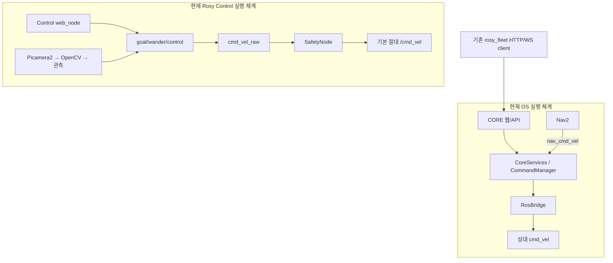
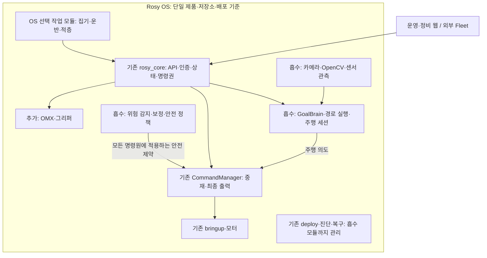

# 현재 코드 기준 ROSY OS 구조와 개발 계획

> 2026-09-13 편입 안내: 이 문서는 작성 당시의 조사·평가 근거다. 현재 제품 경계와 구현 순서는 [ADR D-37~D-44](../reference/ROSY%20ADR%20Log.md), [흡수 실행 계획](2026-09-12-rosy-control-absorption-plan.md), [최신 실행 결과](2026-09-12-control-absorption-results.md)를 우선한다. 조사 당시의 미실행·별도 Control 표기는 현재 배포 상태를 뜻하지 않는다.
작성일: 2026-09-12. 상태: 현재 소스 추적 및 선택 로컬 테스트 확인. Pi 설치·실물 동작은 이번에 확인하지 않았다.

실행 기준: [Control 흡수 실행 계획](2026-09-12-rosy-control-absorption-plan.md). 내부 참조 검토 결과 첫 이전은 OS/src/rosy_control 패키지 편입으로 진행한다. 아래 perception/autonomy/calibration 분리는 논리 목적지 후보이며 이번 필수 패키지 분리 작업이 아니다. 실제 작업 순서는 실행 계획 T0–T8을 우선한다.

## 1. 이전 계획의 정정
이전 로드맵은 Rosy OS 저장소 중심으로 구조를 그려 Rogic/Rosy Control의 기존 개발을 충분히 반영하지 못했다. “공통 런타임 → 비전 → 주행을 새로 구축”하는 계획으로 읽힐 여지가 있었다. **현재는 서로 다른 두 로봇 실행 체계와 Fleet 코드가 존재하며, 이들의 연결·명령권·배포 경계를 먼저 정해야 한다.**

14개 모듈은 평가 분류로만 유지한다. 실제 개발 단위는 아래 기존 코드 경로와 통합 차이로 정한다. 기존 기능과 테스트를 보존하면서 OS 내부로 단계적으로 흡수한다.

## 2. 실제 개발 구조

| 영역 | 현재 코드·연결 | 판단 |
|---|---|---|
| ROSY CORE | [node.py](../../src/rosy_core/rosy_core/node.py) → [CoreServices.build](../../src/rosy_core/rosy_core/services.py) → RosBridge 및 API. FastAPI 스레드와 rclpy executor가 같은 프로세스 | 공통 API·명령·상태 기반 존재. 신규 구축 대상 아님 |
| OS 기능 조립 | CoreServices가 command/safety/navigation/power/battery/docking/swarm/maps/audit를 생성하고 연결 | 단순 API 껍데기가 아님. 기능별 실제 배포 지원은 따로 판정 |
| OS 주행 출력 | [ros_bridge.py](../../src/rosy_core/rosy_core/bridge/ros_bridge.py)의 nav_cmd_vel 입력 → CommandManager.select_output → cmd_vel 발행 | Nav2와 CORE의 기존 명령 체계 |
| OS 배포 | [compose.yaml](../../deploy/robot/compose.yaml): rosy-core, motor 선택, hardware 선택; hardware는 rosy_navigation/hardware.launch.py | 기존 배포를 확장할 위치가 있음 |
| Control 처리 체계 | [robot.launch.py](../../src/rosy_control/launch/robot.launch.py)가 safety·camera·wander·web·watch·calibration 등을 선택 기동 | OS compose와 동일 실행 체계로 볼 수 없음 |
| Control 주행·안전 | [goal_node.py](../../src/rosy_control/rosy_control/goal_node.py)의 GoalBrain/route, control/planning의 순수 로직, [safety/node.py](../../src/rosy_control/rosy_control/safety/node.py)의 cmd_vel_raw → safety → cmd_vel | 이미 개발된 계획·주행·안전 자산. 최종 명령권이 OS와 중복될 수 있음 |
| Control 비전 | [camera_detect_node.py](../../src/rosy_control/rosy_control/camera_detect_node.py) → sensing/camera.py, camera_controls, camera_ground, camera_policy, camera_evidence | Picamera2, HSV·morphology 전처리, 노출 고정, 바닥 보정, 관측 출력 존재 |
| Control 웹·작업 세션 | [web_node.py](../../src/rosy_control/rosy_control/web_node.py), [navigation_session.py](../../src/rosy_control/rosy_control/control/navigation_session.py) | 별도 HTTP/ROS 연결과 시간 제한 주행 세션 존재. 범용 집기 작업 엔진은 아님 |
| Fleet | [transport.py](../../src/rosy_fleet/rosy_fleet/swarm/transport.py), session/relay/formation 코드 | 실제 코드는 OS/src/rosy_fleet 안에 있음. Rogic/Rosy Fleet 디렉터리가 비어 있어도 미구현으로 판정하면 안 됨 |
| 업데이트·진단 | deploy/release/updater.py, diagnostics/collector.py 등 | 기존 자산 유지. 전체 OS A/B 및 실물 복구 완료와 구분 |
| OMX·박스 적층 | OS/src와 Control/rosy_control의 Python/YAML/XML/URDF에서 omx/moveit/gripper/hand-eye/packing 검색 | 해당 범위에서 구현 확인 못함. 모델 선정·조작 계약·업무 확장이 필요 |

Control 비전은 현재 장애물·바닥 관측이다. 박스 분류·정확한 3D 집기 자세·질량 인식이 완성됐다는 뜻은 아니다. ground 보정은 hand-eye 보정을 대체하지 않는다.

## 3. 현재 실행 경로와 통합 문제

두 cmd_vel이 반드시 현재 장치에서 충돌한다고 단정하지 않는다. OS 상대 토픽은 namespace를 따르고 Control 기본 토픽은 절대 경로이므로 실제 충돌 여부는 domain·namespace·remap·모터 구독에 달려 있다. 그러나 **같은 모터로 통합할 때 최종 발행권과 안전 경로를 정하지 않고 병렬 기동해서는 안 된다.**

소스 검색에서 Control의 rosy_core/api/v1 호출 어댑터는 확인하지 못했다. 현재 Control을 이미 CORE 하위의 작업 앱이라고 그리는 것은 부정확하다.

추가 차이:
- Control launch에는 pinky_imu_bno055와 lcd_control 의존이 남아 있다. OS의 rosy_* 패키지 및 배포 이미지와 호환되는지 확인해야 한다. 이름만 바꾸지 않는다.
- OS hardware capability는 navigation을 광고하지만 docking/swarm은 false, sensors는 lidar/encoder다. Control의 camera·IR·IMU 존재를 OS 배포 지원으로 확대 해석하지 않는다.
- OS 도킹 서비스는 기본 SimulatedDetector를 조립한다. 실제 검출기 경로와 인수가 별도다.
- 두 웹의 기능과 제어 경로가 다르다. 화면을 먼저 합치면 제어권 문제를 가릴 수 있다.

## 4. 확정 방향: Rosy Control을 Rosy OS로 흡수

사용자 결정: **제품·저장소·배포·운영의 기준은 Rosy OS이며, Rosy Control의 기존 기능은 OS 내부 기능으로 흡수한다.** 별도 Control 제품을 유지한 채 API로 연결하는 것이 목표가 아니다. 현재 두 실행 체계는 이전 전 상태를 설명한 것이다.

흡수는 모든 코드를 rosy_core 한 패키지나 프로세스에 넣는다는 뜻이 아니다. OS 저장소 안의 기능 모듈로 소유권·테스트·설정·기동·배포·진단을 옮긴다. 외부 API와 운영 웹은 기존 CORE를 기준으로 통합하며 FastAPI+rclpy 단일 프로세스 계약을 유지한다. Fleet의 외부 조정 책임은 이 결정으로 바꾸지 않는다.

그림은 목표다. 현재 연결 완료를 의미하지 않는다. 적층의 업무 규칙은 OS 내 선택 작업 모듈에 두고 CORE 공통 명령 정책과 분리한다.

### 기존 코드의 흡수 위치

아래 신규 경로는 계획상 목적지다. 현재 존재한다고 주장하지 않으며 구현 전 패키지 의존성과 빌드를 검토한다. 원본의 테스트와 설정도 함께 이전한다.

| 기존 Control 자산 | OS 내 흡수 목적지 | 처리 원칙 |
|---|---|---|
| sensing/camera*·camera_detect_node.py | 신규 후보 src/rosy_perception/ | 기존 전처리·노출·관측·보정 유지. 박스 인식은 이 기반을 확장 |
| planning/·control/·wander/·goal_node.py | 신규 후보 src/rosy_autonomy/ | ROS 없는 결정 로직 보존. OS navigation의 실행 backend로 연결; Nav2와 활성 명령권 배타 |
| safety/의 위험 감지·제약 | 센서 해석은 perception/autonomy, 공통 실행 제한은 기존 rosy_core/safety·command | 자동·수동·Fleet 모두 보호. 기존 SafetyNode 최종 cmd_vel 발행은 OS 전환 시 제거/비활성화 |
| calib_node·startup_calibration 및 설정 저장 | 신규 후보 src/rosy_calibration/와 OS 정비 계약 | 보정 수치·단위·장치 식별·쓰기 위치·버전 이관. CORE의 직접 장치 접근 금지 |
| watch.py·watch_node | 기존 rosy_core/system·diagnostics와 필요 내부 노드 | 그래프·독점 발행·센서 준비 검사를 OS 상태로 통합 |
| web_node·web/ | 기존 rosy_core/api·web/ | 기존 화면 기능 대조 후 이관. 별도 Control HTTP 제어 서버는 최종 배포에서 제외 |
| launch/·config/·deploy 도구 | 기존 OS catalog·launch·deploy/robot·release | OS 모드/설정 우선순위·상대 토픽·namespace에 맞춤. 별도 Control 설치 절차 해소 |
| pinky_imu_bno055·lcd_control 참조 | 기존 rosy_imu_bno055·rosy_emotion 등 대응 기능 검토 | 이름 치환만 하지 않고 실행 파일·메시지·설정·기능 차이 확인 |

안전 정책의 흡수는 단순 remap으로 끝내지 않는다. 감지 시각·유효성·기능 준비·명령 우선순위와 취소를 검증한 후 기존 최종 발행 노드를 대체한다. 구현·검증 중 원본 저장소는 비교·복구 근거로 보존하되 최종 OS 런타임이 원본 경로를 참조하지 않게 한다.

## 5. 흡수 개발 순서와 완료 조건

| 순서 | 실제 작업 | 산출물·완료 조건 |
|---|---|---|
| A0 이전 기준선 | 원본 SHA·미커밋 변경·기능·설정·테스트·배포 의존성 목록, 파일별 목적지와 중복 비교 | 기존 기능 누락과 원본 변경 유실을 확인할 수 있는 이전 대장 |
| A1 순수 로직·테스트 흡수 | 감지·계획·주행 세션·보정 계산을 OS 내부 후보 패키지로 이전하고 기존 테스트 함께 편입 | 원본 디렉터리/PYTHONPATH 없이 OS에서 import·해당 회귀 통과 |
| A2 ROS·명령·안전 흡수 | 내부 노드·상대 토픽·namespace·시간/준비 계약과 CORE 명령 중재 연결 | 실제 모터 토픽 최종 발행자 하나, 모든 명령원 안전 제한, 만료·중단·다중 요청 시험 |
| A3 웹·정비·배포 통합 | Control 운영 기능을 CORE API/웹으로 이관, catalog·이미지·설정/보정 migration·진단·복구 편입 | OS 설치만으로 기동, 별도 Control 서버·설치 불필요, 기능 대조표 충족, 복구 재현 |
| A4 OS 흡수 인수 | 기존 카메라·보정·주행·회피·세션·정비 기능을 통합 OS에서 검증 | 원본 런타임 미기동 상태로 로컬·격리 ROS·Pi 검증. 이전 Control 기동 경로는 인수 후 배포에서 폐기 |
| A5 조작·업무 확장 | 흡수된 비전 기반에 박스 관측·hand-eye 보정 추가, OMX 어댑터·집기·배치·작업 모듈 구현 | 고정 암의 실제 집기/배치와 실패 복구, Pinky 운반 통합 |
| A6 모바일 탑재 인수 | 하중·전원·무게중심·시야·도달 결과를 OS 장치 profile·제약에 적용 | 모바일 집기·운반·적층 및 정비 재현 |

하드웨어 조사는 A0부터 병행한다. OMX 독립 작업대 조사는 흡수와 병행할 수 있으나 통합 제품의 조작·업무 기능은 OS 내부 계약을 사용한다. 기간은 A0에서 실제 이전량과 하드웨어 미정 항목을 확인한 뒤 산정한다.

## 6. 평가·유지보수 목표

- **기능 보존:** 이전 대상 기능마다 원본→OS 목적지→테스트→실물 인수 증거를 연결한다.
- **독립 설치:** OS 빌드·설치·기동에 Rogic/Rosy Control 경로, 별도 editable install, 별도 Control 서버가 필요하지 않는다.
- **명령권:** 모터별 최종 발행권과 안전 제한 적용 지점을 검증한다. 두 기존 런타임 동시 기동을 완료 상태로 인정하지 않는다.
- **단일 운영:** 운영자·정비자는 OS 웹/API·진단·업데이트 절차를 사용한다. 기능별 내부 패키지 경계는 유지한다.
- **복구:** OS release manifest가 흡수된 모듈·설정·보정 버전을 포함한다. 원본 버전은 이전 추적 자료로 남긴다.
- **회귀:** 원본 테스트를 OS CI에 편입하고 Fleet 소비자 계약도 확인한다. 로컬 통과와 Pi/현장 인수는 분리한다.
- [평가표](2026-09-12-rosy-os-evaluation-scorecard.md)의 시간 목표는 통합 OS에서 측정한다. 원본 저장소 삭제는 흡수 완료 조건이 아니며 이 계획에서 수행하지 않는다.

## 7. 흡수 전 기준선 테스트 기록
Windows 로컬 Python에서 기존 테스트 일부를 실행했다. 아래 명령은 각 저장소 루트 기준이다. ROS 노드·Pi·브라우저·모터·암은 실행하지 않았다.

| 범위 | 실행 | 결과 |
|---|---|---|
| Control 카메라·보정·정책·주행 세션 | python -m pytest test/test_camera.py test/test_camera_ground.py test/test_camera_controls.py test/test_camera_policy.py test/test_navigation_session.py -q -p no:cacheprovider | 121 passed, 6.55s |
| Fleet 전송·경계·세션 | python -m pytest src/rosy_fleet/test/test_transport.py src/rosy_fleet/test/test_boundaries.py src/rosy_fleet/test/test_session.py -q -p no:cacheprovider | 77 passed, 2.02s |
| CORE 로직·API·운영 여정 | PYTHONPATH를 OS/src/rosy_core로 설정 후 python -m pytest src/rosy_core/test/test_core_logic.py src/rosy_core/test/test_api.py src/rosy_core/test/test_operational_journey.py -q -p no:cacheprovider --tb=short | 68 passed, 3.43s |

CORE 첫 실행은 임시 경로 PermissionError로 14 passed/54 setup errors였다. 정상 권한에서 같은 대상 재실행이 68 passed다. 이를 제품 결함이나 전체 테스트 통과로 확대 해석하지 않는다. 합계 266개의 선택 테스트 통과는 현재 소스 일부의 로컬 증거이며 두 런타임 통합 성공의 증거는 아니다.

## 8. 기존 문서 적용 순서
사용자가 지정한 Control의 OS 흡수 방향과 이 문서의 A0–A6를 우선한다. [모듈 설계](2026-09-12-rosy-os-module-evaluation-maintenance-design.md)와 [소스 부록](2026-09-12-rosy-os-module-evidence-baseline.md)은 OS 저장소 중심의 분류였으며, Control/Fleet를 포함하는 범위는 이 문서로 보완한다. 이전 “모든 실행 미실행” 표기는 이전 조사 시점에만 해당한다.

바로 다음 산출물은 **A0 파일·기능별 이전 대장과 A1 OS 내부 패키지·테스트 이전 계획**이다. 이 문서는 계획 수정이며 코드 흡수 자체를 수행한 것은 아니다.
