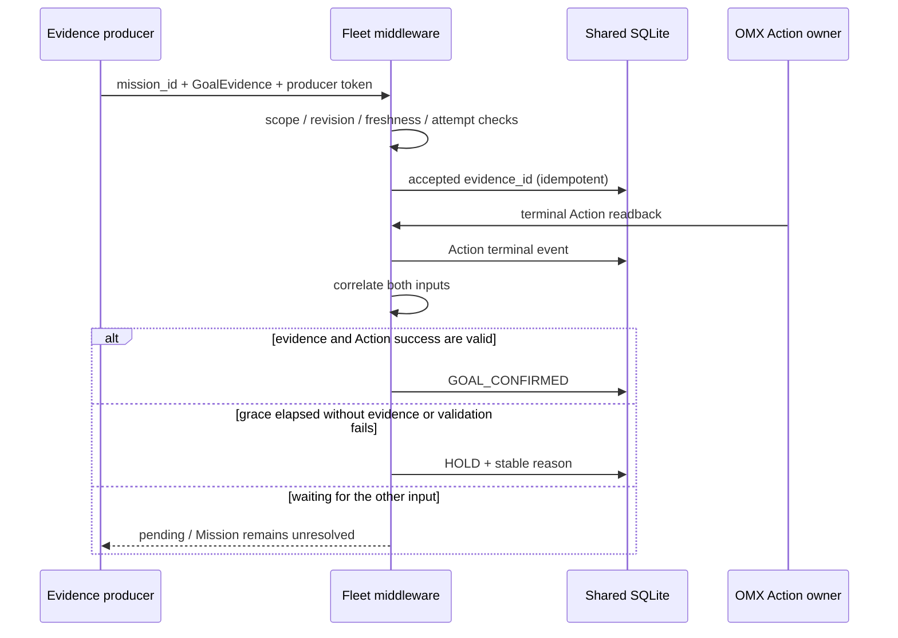

# D-348 목표 증거 생산자와 검증기 연결 설계

**작성:** 2026-09-30

**상태:** D-348 Accepted; 구현 SOURCE/LOCAL 완료

**관련:** [D-348 ADR](../adr/D-348-goal-evidence-producer-and-verifier-wiring.md), D-328, D-330, D-333, D-334, D-336, API Reference v1.59

## 목표

ER 2는 장면 해석과 작업 후보를 낸다. Fleet middleware는 Mission, 권한, 증거, stop generation과 상태 원장을 통제하고, ROS/OMX는 로컬 Action과 모터·그리퍼·정지 readback을 소유한다. 작업을 `집어 옮겨라`라고 표현해도, 모델 응답을 모터 명령으로 직접 변환하거나 픽셀 좌표를 ROS 실행 계약으로 승격하지 않는다.

이번 경계는 Mission Action 성공 뒤 **독립 목표 증거가 도착하고 검증되는 경로**다. 기존 `FleetActionGrant`의 source/destination resolved evidence는 실행 전 계획 근거이며 배치 완료 증거가 아니다. Action journal의 `SUCCEEDED`도 목표 predicate 성공과 다르다.

## 컴포넌트와 계약

| 구성요소 | 소유 책임 |
|---|---|
| Producer registry | 비밀이 아닌 scope/policy 설정과 token 환경변수 resolve; 만료 및 evaluator allowlist |
| Producer ingress | source token 인증, 고정 Mission predicate/Action attempt와의 상관, bounded payload 검증 |
| GoalEvidenceStore | 수락한 증거의 동일 DB 영속성, `evidence_id` 멱등성, changed replay 충돌 |
| Mission verifier | Action 종단 성공과 독립 evidence의 두 입력 순서를 결합하고 `confirm_goal()` 또는 `HOLD` 수행 |
| ROS/OMX Action boundary | 모터/그리퍼 제어, 로컬 stop/readback. Fleet은 이를 대체하거나 병렬 발행하지 않음 |

`POST /api/fleet/goal-evidence` envelope는 `{mission_id, evidence}`다. 별도 `X-Goal-Evidence-Token`은 site-user bearer token과 다르다. Evidence 본문은 기존 strict `GoalEvidence` 필드만 받으며 producer ID, evaluator revision, predicate/object/destination, observation digest, Action/attempt, post-action timestamp, gripper `OPEN` readback을 포함한다.

Registry의 `max_age_s`는 서버 정책이고 `received_at`은 서버가 정한다. Evidence의 관측시각은 정책 수명과 terminal Action 시점 모두를 통과해야 한다. Registry는 deployment-controlled read-only YAML이며 토큰 원문을 포함하지 않는다. Registry가 없는 app은 endpoint를 내놓지 않고 MissionService verifier 부재 시 완료가 거부된다.

## 순서와 상태

Evidence-first remains pending until the matching terminal success. Action-first remains `ACTION_SUCCEEDED` during the registry grace interval. Matching evidence triggers validation immediately; missing evidence after grace becomes `HOLD/GOAL_EVIDENCE_TIMEOUT`. A failed/unknown Action cannot confirm a goal. Conflicting evidence IDs and stale or mismatched evidence do not advance the Mission.

## 거부와 안전 경계

- Unknown/expired producer token: `401 PRODUCER_UNAUTHORIZED`.
- Unknown Mission: `404 MISSION_NOT_FOUND`.
- Scope, replay, mismatch, stale, or terminal verification error: `409` with stable reason code.
- Invalid envelope: `422 INVALID_GOAL_EVIDENCE_ENVELOPE`.
- Invalid evidence raw body is never persisted; audit retains bounded summaries only through existing Mission rejection handling.
- The feature adds no model call, model tool grant, dispatch admission, ROS topic/API, actuator command, or stop bypass. Mission dispatcher remains opt-in; automatic policy dispatch remains disabled.

## 미결 gate

SOURCE/LOCAL은 fake producer와 fake time으로 계약을 검증한다. 실 카메라 producer, evaluator revision provisioning, calibration/frame lineage, independent gripper readback, false-positive/false-negative rate, ROS-SIM, device stop/standstill, and field acceptance are separate gates. Any such evidence must be named and reviewed before a runtime producer is enabled.
