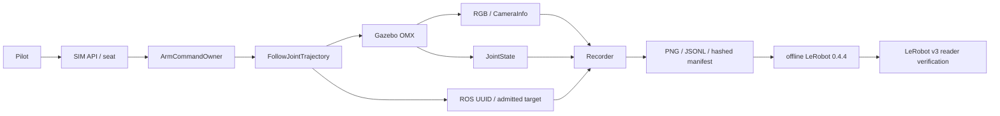

# OMX-AI Pilot 시연 기록과 LeRobot 데이터셋 연계

날짜: 2026-10-01 · branch: `feat/omx-learning` · 결정: D-390 부록

## 선택과 예제의 차이

사용자 우선순위는 **시연 기록·LeRobot 데이터셋 연계**다. 조사 정본은
[공식 예제 조사](2026-10-01-omx-lerobot-examples-research.md)다.
native `omx_follower`는 USB/Dynamixel과 정규화 관절·그리퍼 값을 사용한다.
Pilot은 ROS joint 이름과 rad 목표를 사용하므로 바로 replay할 수 없다.
ROBOTIS ROS bag 변환 예제는 별도 leader 입력을 action으로 저장한다.
Pilot에서는 단일 명령 소유자가 **ROS 수락한 절대 목표**를 action으로 저장한다.
이는 trajectory의 매 시각 보간 목표나 토크가 아니다. 목표 유지 구간도 같은 목표를 저장한다.

## 구조

- 고정 SIM 카메라: 320×240 RGB, 10 simulation FPS, 정확한 Image/CameraInfo stamp pairing.
- 상태는 camera 시각 이전의 가장 가까운 JointState를 사용한다. skew ≤50 ms.
  미래 상태, NaN, joint 누락, 한계 초과, 프레임 누락·시계 역행은 완성 데이터로 인정하지 않는다.
- 원본은 source/vendor revision, 실제 adapter tree/world/camera-info SHA256,
  joint 순서·rad limits·명령 UUID·목표 duration·source/receipt 시각·과제 결과를 보존한다.
- action 성공과 과제 성공은 별개다. 결과 미선택, lease 반납·만료, 취소,
  HOLD, 촬영 오류, 서버 종료는 `incomplete`다. 원본은 남기고 export를 거부한다.
- API가 받는 저장 경로는 없다. 서버의 `/recordings` 외부 mount와 로컬 exporter만 파일을 쓴다.
  Windows의 기록·export·검증 출력은 `X:/DevTemp`다.
- exporter는 `lerobot==0.4.4`, `video_backend=pyav`, `vcodec=h264`, video dtype을 사용한다.
  실제 0.4.4의 frame validation은 explicit timestamp를 거부한다. 영상 축은 index/fps,
  정확한 source clocks는 별도 int64 feature와 원본으로 보존한다.
- `robot_type=omx_sim_ros`; state/action은 float32 rad, gripper도 rad다.
  native follower의 normalization이나 물리 calibration으로 가장하지 않는다.
- writer finalize 뒤 모든 state/action/clock/영상 차원과 압축 오차를 실제 reader로 검증한다.
  원본도 `rosy_provenance/<episode_id>`에 복사한다. Hub 업로드·학습·정책 실행은 이 변경에 없다.

## 실행 계획과 수용

1. [x] 공식 OMX/ROBOTIS/LeRobot 예제와 버전별 API 차이 조사.
2. [x] 원본 recorder, state/video pairing, ROS 수락 경계, 조종권 검사와 오류 시험.
3. [x] 고정한 LeRobot writer/reader의 실제 MP4·Parquet 재독출 시험.
4. [x] Pilot 기록 패널: 미리보기, 시작 실패와 재시도, 결과 선택, 오래된 영상, dispose 반납 시험.
5. [x] 실제 Gazebo 영상/JointState/goal UUID를 기록하고 해당 원본을 실제 LeRobot reader로 검증.
6. [x] 계약·모듈 기록·quick gate를 갱신하고 검증한 변경을 커밋.

현재 증거와 남은 조건은 마지막 검증 섹션에 추가한다. HOST 시험 통과는
실제 Gazebo 기록, 물리 OMX, ARM64 이미지, 학습된 정책의 성능을 대신하지 않는다.

## 검증 기록

실제 Gazebo 시연 15프레임을 LeRobot 0.4.4/v3.0로 export하고 모든 프레임을 다시 읽었다. [증거·재현·제한](../validation/omx-demonstration-lerobot-2026-10-01/README.md). 전체 모듈 gate는 유지한다. 물리·학습 정책 수용은 수행하지 않았다.

최종 소스 해시가 일치하는 Gazebo 시연 12프레임도 동일하게 검증했고, lease 만료 기록을 incomplete로 닫았다. 독립 리뷰의 저장 오류/hidden seat/종료 경합 3개를 수정하고 재검토했다. 회귀 624 passed, 6 skipped; Chromium 2 passed.

커밋: 54e58c69 구현, 87d1f1e2 polling 중 기록 오류 표시 유지. main의 D-395/v1.69와 통합하며 OMX 추가분을 API v1.70으로 승격했다. 병행 변경의 source/문서/로그를 보존하고 생성 색인은 재생성한다.
