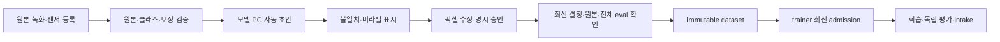

# 모델 PC 픽셀 자동 라벨 처리 파이프라인 구축 계획

> **For Claude:** REQUIRED SUB-SKILL: Use superpowers:executing-plans to implement this plan task-by-task.

**Goal:** 모델 PC에서 차선·바닥·벽의 자동 픽셀 초안을 생성하고, 사람이 승인한 최신 마스크만 기존 학습 자격 검증으로 연결한다.

**Architecture:** D-465의 로컬 추론 중심·선택 외부 보조를 D-434 모델 PC에 배치한다. D-446 고정 source 실행기와 GPU lock, D-462 픽셀 검수 앱, D-464 immutable dataset builder 및 기존 learning cycle을 재사용한다. 초안 완료·사람 승인·데이터셋 게시·trainer admission·모델 수용은 각각 다른 결과다.

**Tech Stack:** Python, NumPy/OpenCV, 기존 ONNX 차선 모델, 선택 PyTorch/SAM 2, SQLite 검수 앱, 기존 store/job receipt, Linux GPU 실행기. 외부 비전 API는 선택이다.

**Status:** 실행 전 계획. 사용자 요청은 D-465 병합과 구축 계획 수립이다. 이 문서의 작성·검증은 제품 구현, 실제 모델 PC 설치, 외부 호출, 학습 실행 또는 주행 모델 활성화의 증거가 아니다.

**Branch:** `docs/model-pc-pixel-plan`. 후속 구현은 별도의 `feat/` worktree에서 한다.

## 현재 확인한 연결 지점과 부족 조건

| 경로 | 확인한 기능 | 이번 작업에서 필요한 연결 |
|---|---|---|
| `dataset/autolabel.py`, `labels.py`, `geometry.py` | LiDAR 벽·주행 궤적의 자동 후보, 출처/불일치 | 유효 보정·센서 범위를 확인해 초안 작업에 포함 |
| `dataset/frames.py`, `extract.py`, `bag_to_video.py` | 시간·프레임 선택, 중복 제거, sidecar | 원본 영상 hash/frame/시간 근거를 유지하는 입력 목록 |
| `dataset/prelabel.py` | 차선 모델 초안, 불확실성 순위, CVAT 색상 ZIP | 원본 크기 indexed 초안과 receipt를 직접 전달 |
| `dataset/review_ingest.py`, `review_masks.py` | 원본 hash·크기·클래스 검증, pending import, 픽셀 CAS | indexed PNG의 255 보존과 초안 재생성의 명시적 revision 처리 |
| `training/job_state.py` | 불변 입력 signature, 단계 receipt, 재개/lock | 프레임별 출력 hash 검증 및 초안 단계 진행률 |
| `deploy/site/rosy_model_code.py` | 고정 code/environment, GPU/작업 lock | 새 CLI가 같은 실행기로 실행되는지 검증 |
| `training/review_bridge.py`, `review_authority.py`, `review_dataset.py` | 최신 승인 전달, 원본·전체 eval 검증, dataset 구성 | 자동 초안과 기존 사람 승인 경로를 구분해 재사용 |
| `training/learning_cycle.py`, `train_job.py` | 단계 학습과 authority 확인 | 승인0/HOLD는 새 학습 요청0, 게시와 admission 구분 |

`review_masks.from_color`는 미등록 색상을 거절한다. `prelabel.colorize`의 255는 기본 LUT 색상으로 변환되므로 미라벨 의미 보존을 보장하지 않는다. 따라서 색상 ZIP으로 255를 우회하거나 background로 바꾸지 않는다. 기존 색상 import는 유지하면서 검증된 indexed 입력을 별도로 연결한다.

RTX 5080/16 GB는 D-465의 설계 기준이다. D-434의 장비 기록은 이번 계획에서 live 확인하지 않았다. GPU 모델/VRAM, 호환 환경, 실제 녹화·보정·checkpoint·고정 eval inventory, 원격 접근·검수자 연결은 착수 때 다시 확인한다. 주소·계정·토큰은 private 설정만 사용한다.

## 운영자가 걷는 흐름



시작 전 원본 영상·촬영 component·classes·모델/보정 refs와 실행 source를 고정한다. 작업자는 선택 프레임 수/실패/검수 대기를 확인하고 픽셀 검수로 이동한다. 전체/배경 확인 뒤 승인한 자료만 export한다. 파일 생성 완료가 아닌 실제 trainer admission과 평가 receipt로 학습 완료를 확인한다. 실패·HOLD는 이유와 재개할 단계가 보이며, 로봇 운용 승격은 기존 절차다.

## 구축 순서와 책임

| 단계 | 소유 책임 | 완료 증거 |
|---|---|---|
| P0 환경·입력 확인 | 모델 PC 실행 담당 | GPU/environment/source와 자료 inventory; 누락은 blocker |
| P1 로컬 baseline | learning 도구 담당 | 원본 크기 indexed 초안·출처·재개 receipt |
| P2 검수 연결 | 기존 픽셀 앱 소유자 | 255·원본 identity·CAS·승인 해제와 재시작 복구 |
| P3 승인→학습 연결 | builder/trainer 담당 | 독립 component 분리·전체 eval 제외·최신 admission |
| P4 로컬 경계 보완 | 모델 PC 추론 담당 | SAM 후보 대비 baseline 품질/수정시간 비교 |
| P5 외부 보조 | provider adapter 담당 | opt-in·비용 제한·오류 격리·출처 고정; 선택 단계 |
| P6 파일럿 수용 | 별도 평가 담당/운영자 | 실 GPU run과 독립 사람 평가, 승인 또는 HOLD |

담당은 책임이며 아직 특정 세션을 지정하지 않았다. 기존 앱의 소유 경로와 후속 실행자 claim을 확인한 뒤 구현한다. 새 앱·별도 scheduler·새 store·새 최상위 source part는 만들지 않는다.

## Task 1 — 착수 inventory와 doctor

**Files:** Create `learning/training/perception/dataset/pixel_label_job.py`; Test `learning/training/perception/test/test_pixel_label_job.py`; reuse `rosy_ml.py`, `operator_ssh.py`, D-446 executor.

1. 실패 시험을 작성한다: 입력 이미지 bytes/hash/크기, 원본 video hash/frame, source_session/capture_group, classes hash, 모델/기하 refs가 없거나 변경되면 실행 전 거절한다. sensor 없는 입력에는 geometry source를 만들지 않는다.
2. 새 시험을 실행해 미구현 실패를 확인한다. `pixel_label_job.py --help`와 `doctor --config FILE --out DIR`는 후속 구현 목표 CLI이며 현재 존재하지 않는다.
3. 고정 source/environment, 원본 참조·checkpoint·선택 보정·고정 eval 목록을 읽는 doctor를 만든다. 라이브 `nvidia-smi`의 GPU 모델·총/가용 VRAM·driver와 torch CUDA 확인을 private receipt로 기록한다. GPU/센서 확인 실패는 UNKNOWN/HOLD다.
4. missing/hash 변경/잘못된 classes/공개 receipt secret 누출 거절 시험을 통과시킨다. doctor는 설치·학습·원격 쓰기를 수행하지 않는다.
5. 자기 파일만 add하고 `feat(learning): add pixel label job input checks`로 커밋한다.

## Task 2 — 기존 baseline과 재개 가능한 초안 job

**Files:** Modify `dataset/pixel_label_job.py`, `dataset/prelabel.py`; reuse `autolabel.py`, `frames.py`, `training/job_state.py`; Test `test_pixel_label_job.py`.

1. 중단/재개에서 완료 출력 hash를 재확인하고 변조된 완료 결과를 재사용하지 않는 시험을 먼저 만든다. checkpoint·classes·프롬프트·source 변경은 같은 job 재개를 거절한다.
2. doctor → select → geometry → lane → compose → review-pack 순서를 기존 `Job` 단계로 연결한다. 원본 영상/frame/hash와 원본 이미지 bytes를 보존하고 resize/crop/letterbox 변환을 기록한다. 기하/학습 후보가 충돌하거나 근거가 없으면 255로 둔다.
3. `prelabel.py`의 검증된 모델 로딩을 재사용해 원본 크기 indexed PNG를 만든다. 기존 CVAT output의 사용자 계약은 유지한다. BGR/RGB·normalize는 한 번, 마스크 resize는 nearest다. 모델 confidence는 검수 순위이지 자동 승인이 아니다.
4. 프레임별 실패·진행률·출력/근거 hash·attempt를 기록하고 최종 job receipt를 원자적으로 쓴다. 실패 프레임은 background 마스크나 완료 목록으로 들어가지 않는다. 같은 완료 job은 불변이며 변경 입력은 새 job이다.
5. 실제 원본 pixels를 확인하는 identity 보존, 중단 후 재개, corrupted output, 센서 미관측, 충돌255, 원본 비정방 크기 roundtrip 시험 후 커밋한다.

**제안 내부 출력:** job 폴더의 `state.json`, `drafts/`, `draft-receipt.json`, `verified-inputs.jsonl`과 classes 원본. 공용 schema를 추가하지 않고 기존 `Job` receipt/verified-inputs 필드를 활용한다. 새 필드가 필요하면 구현 전 producer와 consumer를 함께 확정하고 시험으로 고정한다.

## Task 3 — indexed 초안을 기존 픽셀 앱으로 연결

**Files:** Modify `dataset/review_ingest.py`, `review_masks.py`, `review_app.py`, `review_app_web/pixels.js`, `review_app_web/pixels.html`; Test `test_review_app.py`, `test_pixel_review_browser.py`, Create `test_pixel_draft_import.py`.

1. 255가 포함된 실제 8bit indexed PNG의 원본 크기·classes/hash 보존 import 시험을 작성한다. RGB 위장/16bit/미등록 class/이미지 hash 불일치/경로 탈출은 거절한다.
2. 기존 `verified-inputs.jsonl` 입력의 mask 참조에 indexed 방식을 추가한다. 색상 ZIP과 구별하는 필드는 내부 구현 계약으로 producer/consumer를 동시에 고정하며 기존 CVAT import를 깨지 않는다. 전체 bundle 검증 전 DB/승인을 바꾸지 않는다.
3. 최초 import는 pending이다. 같은 원본의 재생성 초안은 별도 후보로 보존하고 운영자가 현재 revision을 지정해 명시 적용한 경우만 새 pending revision이 된다. 기존 승인·수동 수정·제외를 자동으로 덮어쓰지 않는다. 과거 결과/원본/수정 이력을 보존한다.
4. UI에 출처·미라벨·불일치·적용/재검수 다음 행동을 표시한다. 늦게 도착한 프레임 callback, 다른 탭 CAS 충돌, 저장/적용 중 승인 금지, 새로고침/서버 재시작 복구를 검증한다.
5. 수정·새 초안 적용이 픽셀 승인을 해제하고 객체 revision과 독립적인지 host + 실제 PC/터치 browser 증거로 확인한다. 승인 실행은 사람이 전체/배경을 확인하는 기존 기능만 사용한다. 검수자 신원이 인증되지 않았다면 그 한계를 기록한다.
6. 앱 소유자와 변경 범위를 합의하고 커밋한다. 원격 검수 연결·인증·배포는 별도 기존 승인 절차다.

## Task 4 — 승인 라벨의 builder/trainer 연결

**Files:** reuse `training/review_bridge.py`, `review_authority.py`, `review_dataset.py`, `learning_cycle.py`, `train_job.py`; 필요 wiring은 `pixel_label_job.py`; Test `test_review_dataset.py`, `test_learning_cycle_authority.py`, `test_review_bridge_authority.py`.

1. 자동 초안만/승인0/255 잔존이면 dataset·train request·READY 생성0을 확인한다. pending을 사람이 승인한 것으로 위장하지 않는다.
2. D-462의 current delivery와 봉인된 export를 D-464 builder에 넘긴다. 원본 MP4 독립 proof·최신 결정/TTL·classes·최소 두 촬영 component·전체 고정 eval inventory를 검증한다. 같은 영상의 JPEG/PNG나 시간 인접 프레임을 train/eval로 나누지 않는다.
3. builder의 `PUBLISHED_CONTENT_NOT_ADMITTED`와 `training_admission=false`를 그대로 보존한다. trainer가 시작 직전 최신 authority·eval·입력 proof를 다시 확인한 뒤에만 요청을 소비한다.
4. 승인 철회·제외·게시 중 eval 추가·원본 변조·stale 전달·재생성 초안에 대한 회귀를 돌린다. source/eval 미확정이면 기존 HOLD와 생성0을 유지한다.
5. 기존 흐름과 identity가 실제로 이어지는 integration receipt를 남기고 wiring 변경만 커밋한다. 자동 초안 job이 모델 전달/watch를 직접 실행하지 않는다.

## Task 5 — 선택 로컬 분할 보완

**Files:** Create `dataset/pixel_label_local.py`; Modify `pixel_label_job.py`; Test `test_pixel_label_local.py`; 모델 PC 환경의 dependency pin은 private 환경 manifest와 기존 설치 경로.

1. adapter 경계의 class remap·원본 좌표·255·checkpoint hash 및 OOM 복구 시험을 먼저 만든다. mock 결과를 실 GPU 추론 증거로 부르지 않는다.
2. SAM 2의 작은 후보부터 batch 1·짧은 구간으로 시험한다. 기존 기하/차선 후보 또는 검수자가 지정한 점/영역으로 경계를 보완하고 semantic class를 임의로 정하지 않는다. 얇은 차선·가림·반사에서는 기존 baseline도 유지한다.
3. D-446 고정 실행기 아래에서 실행하고 Isaac/학습과 GPU를 직렬화한다. 별도 lock을 만들어 기존 GPU lease를 우회하지 않는다. peak VRAM·처리시간·입력 크기·precision·device·실패를 측정한다.
4. baseline보다 품질/수정시간 이득이 없거나 OOM이면 adapter를 사용하지 않아도 P1~P3이 동작해야 한다. checkpoint 다운로드·패키지 설치 후 실제 환경 fingerprint와 isolated 진입점 검증을 남긴다.
5. host 계약과 실제 GPU 결과를 구분해 커밋/운영 수용을 보고한다.

## Task 6 — 선택 외부 비전 보조

**Files:** Create `dataset/pixel_label_provider.py`; Modify `pixel_label_job.py`; Test `test_pixel_label_provider.py`.

1. 외부 기능 기본 off, 키 없음에도 로컬 흐름 정상, 429/timeout/5xx/잘못된 JSON/미등록 class·범위 밖 좌표 시험을 작성한다.
2. 첫 adapter는 실제 시험에서 선택한 모델 ID/제공자를 고정한 OpenRouter 또는 직접 API 하나로 제한한다. 여러 제공자 추상화와 자동 라우팅은 첫 범위에 넣지 않는다. API key는 환경/기존 secret 경로에서만 읽는다.
3. 외부 전송 범위·보관 정책·예산을 확인한 opt-in 설정에서만 호출한다. schema 지원을 확인하고 응답은 클래스/영역 제안으로 저장한다. geometry나 semantic mask를 확정하는 권위로 쓰지 않는다.
4. attempt 상한·timeout·동시 요청 한도·이미지/request hash 캐시·budget을 둔다. 비용은 보수적으로 예약하고 불명확한 과금 응답/timeout을 비용0으로 간주하지 않는다. 재시작 중복 과금 위험과 API idempotency의 한계를 receipt에 남긴다.
5. provider 실패는 local draft와 사람 검수를 막지 않는다. 예상/실제 비용, 선택 모델·제공자·프롬프트 버전과 실패를 기록하고 키·민감 이미지 응답을 공개 로그에서 제외한다.
6. 네트워크 없는 계약 시험 후 제한된 실 API 파일럿은 별도 실행 승인을 받은 자료/예산으로 수행한다. 외부 adapter 미수용이어도 로컬 파이프라인을 사용할 수 있다.

## Task 7 — 작업 화면·운영 절차와 GPU 파일럿

**Files:** Modify `dataset/learning_workspace.py`, `review_app_web/learning.js`, `learning.html`; Create `learning/training/perception/docs/pixel-label-pipeline.md`; Test `test_learning_workspace.py`, `test_review_flow_browser.py`.

1. 기존 `/learning`은 결과 연결 화면이며 실행 API가 아니다. 첫 버전은 D-446 CLI로 실행하고 기존 화면에서 작업 결과·오류·검수 대기·다음 단계 링크를 보여준다. 웹 실행/원격 scheduler가 필요하면 인증·소유·취소 계약을 별도 결정한다.
2. 실제 CLI가 구현된 뒤 `doctor`/`run`/재개 명령을 `rosy_model_code.py exec dataset/pixel_label_job.py ...` 경로로 문서화한다. 도움말·설정 검증·고정 payload 포함·작업 중 updater held를 검증한다.
3. 녹화가 포함된 최소 두 독립 촬영 component에서 100~200 대표 프레임을 선정한다. 반사·희미한 차선·교차·벽 가림·센서 없는 자료를 포함하고 빈 클래스는 품질 UNKNOWN이다. 독립 평가자는 비교 모델의 마스크를 정답으로 복사하지 않는다.
4. 같은 입력으로 baseline, local 보완, 선택 provider 보조를 비교한다. class IoU/차선 경계·누락, 장당 수정 시간, 처리시간, peak VRAM, 실패율, 비용을 남긴다. 프레임 평균만 보지 않고 촬영 component별 결과를 함께 보고한다.
5. 실행 전 평가 담당자가 클래스별 품질 하한·허용 누락·수정시간 목표·작업 비용/시간 상한을 승인 기록에 숫자로 고정한다. 현재 합격 숫자는 정하지 않았으며 그 전에는 QUALITY/GPU ACCEPTANCE는 HOLD다. 자동 초안 성능과 최종 학습 모델 성능을 각각 평가한다.
6. 실제 중단→재개, 입력/출력 변조 거절, OOM, 승인 철회, 재시작, 신규 eval 추가를 확인하고 적용 source/environment/checkpoint/dataset/eval refs와 receipt 경로를 묶어 인계한다.

## 검증 명령과 변경별 커밋

신규 시험 경로는 구현 단계에서 생성한다. 없는 시험을 현재 PASS로 보고하지 않는다. 각 task에서 실패 시험 → 최소 구현 → 관련 suite → known failures 비교 → 자기 경로만 커밋 순서다.

```powershell
python -m pytest learning/training/perception/test -q -rfE -p no:cacheprovider
python test/known_failures.py X:/DevTemp/pixel-label-impl/run.txt
python tools/harness/rosy_harness.py generate
python tools/harness/rosy_harness.py lint
```

pytest 출력은 위 명령 그대로 콘솔만 읽지 말고 Python subprocess로 stdout/stderr를 UTF-8 로그 `X:/DevTemp/pixel-label-impl/run.txt`에 저장한다. PowerShell 구버전의 기본 `>` UTF-16 파일을 known_failures에 넘기지 않는다. exit와 전체 FAILED/ERROR summary를 함께 확인한다. 새 실패를 기존 실패 목록에 추가해 숨기지 않는다. browser suite·실 GPU·실 provider 실행은 각각 별도 결과다.

이번 계획 문서 검증은 `test/test_network_topology_contracts.py`, `test/test_harness_contracts.py`, harness lint를 사용한다. 산출물·환경 변경 전 모델 PC 상태를 live 확인한다. GPU doctor·100~200장 생성·픽셀 import/수정/승인·독립 builder/admission·재개/철회·독립 품질 평가 중 하나라도 미실행/불명확이면 그 항목을 NOT_RUN/UNKNOWN/HOLD로 인계한다.

## 종료와 인계

구축 완료는 실 모델 PC에서 고정 source의 job이 원본 크기 초안을 생성하고 검수 앱에 pending으로 연결되며, 사람이 승인한 자료의 최신 authority·독립 source/eval·trainer admission이 확인된 상태다. 외부 모델은 선택이며 미사용 상태를 명시한다. 생산 주행·로봇 모델 활성화·ARM64/DEVICE/FIELD 승격은 이 파이프라인 완료와 별도다.

인계에는 실행 source/environment, task별 구현/실행 상태, 데이터/마스크/checkpoint hash, GPU/품질 결과, evidence 경로, 남은 blocker, 다음 소유자·명령을 적는다. 계획 작성 시점의 실제 실행 상태는 전부 NOT_RUN이며 기존 source 기능의 존재만 확인했다. 이 문서로 기존 실물 수용을 덮어쓰지 않는다.

**Related:** D-465, D-434, D-446, D-462, D-464, D-356, D-373, D-379, D-427/D-429/D-430; `2026-10-04-learning-pipeline-closure.md`, `2026-10-05-pinky-review-consumer.md`.
