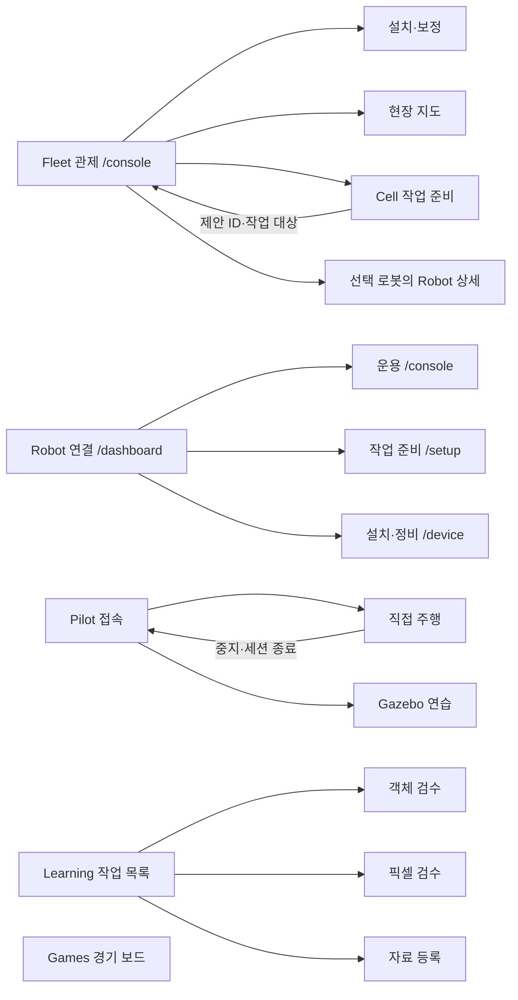

# ROSY 활성 웹 화면 전체 레이아웃·내비게이션 설계

**작성:** 2026-10-09
**상태:** 화면 구조 제안. 코드 적용·ADR 변경·사용성 수용 전.
**범위:** `shared/web/surfaces.yaml`의 활성 웹 사용자 화면 5개 제품, 16개 주요 화면/상태.

## 한눈에 보기

[전체 와이어프레임 모음](../assets/rosy-web-wireframe-overview.png) · 각 화면 아래에 데스크톱 1600px와 모바일 390px 그림을 연결했다. 이 그림은 배치와 정보 우선순위 초안이며 실행 화면이나 검증 캡처가 아니다.

## 평가와 구조 결론

현재 화면은 공통 토큰과 컴포넌트가 있어도 제품별 머리 구성과 `ui-brand` 이동, 문서 탐색 위치가 다르다. Fleet의 접속/역할/표시 설정은 오른쪽 위에서 범위가 모호하고, 좁은 화면에서 다음 조치·복귀 위치가 첫 화면 밖으로 밀릴 수 있다. 지도·영상·설정의 비중은 해당 화면에서 내려야 할 결정에 따라 달라져야 한다. D-543의 작업 목적, D-425의 소유권, D-153의 상태·검증 기준을 구조의 기준으로 쓴다.

| 영역 | 확정할 역할 |
|---|---|
| 좌상단 제품명 | 해당 제품의 진입점으로 이동. Fleet `/console`; Robot `/dashboard`; Learning `/learning`; Pilot은 제어 세션 종료 절차를 거쳐 접속 게이트. 경기 보드는 단일 화면이므로 보드 진입점. 브랜드 클릭이 안전상 세션/조작을 몰래 끝내서는 안 된다. |
| 상단 중앙 | 제품 내 현재 화면명, 현장/로봇/작업 대상, 현재 위치. Breadcrumb는 실제 상위 경로가 있을 때만. |
| 우상단 | 연결·데이터 시각·역할·계정/접속·표시. 메뉴 이름에 효과 범위를 쓴다. 운영 중지는 메뉴에 숨기지 않는다. |
| 좌측 | 제품 내부 화면 또는 현재 작업 단계. 현재 위치는 아이콘+텍스트와 `aria-current`로 표시한다. 아이콘만으로 뜻을 전달하지 않는다. |
| 본문 | 이 화면의 첫 질문에 답하는 관측/편집 영역. 상태→근거→동작→결과 순서. 지도·영상은 판단에 필요할 때 크게 둔다. |
| 우측 | 선택 대상·차단 이유·최근 결과·다음 안전한 행동. 선택 대상이 없으면 안내를 보이고 빈 장식 패널은 만들지 않는다. |
| 하단/좁은 화면 | 390/320px에서 본문 우선, 화면 이동은 명명된 메뉴/하단 이동, 우측 맥락은 전체 폭 시트. 중지와 현재 상태는 계속 보인다. |

### 현재 계약과 제안의 경계

- **현행 계약:** D-501은 Fleet 네 문서의 동일한 **상단 탭**을 요구하고 다른 문서 링크 제거를 요구한다. 아래 Fleet 좌측 레일은 탭의 즉시 교체 지시가 아니라 다음 개정 후보이다. 실제 적용에는 별도 ADR로 D-501의 해당 절을 대체하고, 동일 경로·현재 표시·키보드·좁은 화면·문서 간 이동 시험을 갱신해야 한다. 그 전에는 상단 탭을 유지한 채 좌측 영역을 문서 내부 작업 단계에만 쓸 수 있다.
- **현행 계약:** D-493의 Fleet 관제 지도:개입 3:2와 D-540의 단계별 구조는 구현 시 유지·조정 근거를 확인한다. 와이어프레임의 카드 비율은 화면 밀도를 시험하기 위한 도식이다.
- **제품 경계:** Fleet는 사이트, Robot은 단일 로봇/로컬 설정, Pilot은 직접 조종 세션, Games는 경기, Learning은 로컬 검수 도구를 소유한다(D-425). 외부 API·권한·모드·제어 주체를 이 설계로 새로 만들지 않는다.
- **인계:** `Cell 작업 준비 → 제안 → Fleet 승인/실행 상태 확인`에는 대상·제안 ID·유지되는 입력·돌아가기 링크를 보여 준다. Fleet→Robot 세부 진입도 로봇 식별자와 사이트 맥락을 전달하되 실제 링크/권한 가능 여부를 구현 전 확인한다.

## 화면별 역할과 와이어프레임

표의 질문이 화면 첫 줄에 답해야 할 내용이다. “근거”는 성공 표시와 구분되는 관측 또는 기록을 뜻한다.

| 제품 | 화면·경로 | 역할 | 첫 질문 | 주 동작 | 완료/실패 근거 | 복귀 | 그림 |
|---|---|---|---|---|---|---|---|
| Fleet | 현장 관제 `/console` | 운영자 | 어느 로봇·작업에 개입해야 하는가 | 중지 요청·상세 진입 | 명령 수락과 실제 상태, 수신 시각 | 관제 유지 | [데스크톱](../assets/rosy-web-wireframe-fleet-console.png) · [모바일](../assets/rosy-web-wireframe-fleet-console-mobile.png) |
| Fleet | 설치·보정 `/console/install` | 설치 관리자 | 어떤 장비가 발견·등록·보정되었는가 | 등록·카메라 승인·보정 | 연결 승인과 보정 결과 | 관제 | [데스크톱](../assets/rosy-web-wireframe-fleet-install.png) · [모바일](../assets/rosy-web-wireframe-fleet-install-mobile.png) |
| Fleet | 현장 지도 `/console/site-map` | 지도 관리자 | 현재 활성 지도와 초안의 차이는 무엇인가 | 편집·검증·활성화 | 검증 결과와 적용 버전 | 관제 | [데스크톱](../assets/rosy-web-wireframe-fleet-map.png) · [모바일](../assets/rosy-web-wireframe-fleet-map-mobile.png) |
| Fleet | Cell 작업 준비 `/console/cell` | 작업 준비자 | 레시피·셀 설정으로 실행 가능한가 | 문서·미리보기·제안 | 제안 ID, 승인·진행 원장 | 관제 | [데스크톱](../assets/rosy-web-wireframe-fleet-cell.png) · [모바일](../assets/rosy-web-wireframe-fleet-cell-mobile.png) |
| Robot | 연결 및 작업 선택 `/dashboard` | 로봇 사용자 | 어느 로봇에 무슨 목적으로 들어가는가 | 인증·작업 선택 | 대상 식별·권한 | 선택한 화면 | [데스크톱](../assets/rosy-web-wireframe-robot-entry.png) · [모바일](../assets/rosy-web-wireframe-robot-entry-mobile.png) |
| Robot | 한 대 운용 `/console` | viewer/operator | 로봇 상태와 제어 가능 여부는 무엇인가 | 상태 확인·허용된 조작·중지 | CORE 상태와 명령 수락/관측 | 작업 준비 또는 Fleet | [데스크톱](../assets/rosy-web-wireframe-robot-console.png) · [모바일](../assets/rosy-web-wireframe-robot-console-mobile.png) |
| Robot | 작업 준비 `/setup` | operator | 목표·정위치·도킹 준비가 되었는가 | waypoint·localization·docking 확인 | 준비 조건과 적용 결과 | 운용 | [데스크톱](../assets/rosy-web-wireframe-robot-setup.png) · [모바일](../assets/rosy-web-wireframe-robot-setup-mobile.png) |
| Robot | 설치·정비 `/device` | administrator | 장치·호스트·보안 상태는 무엇인가 | 진단·설정·정비 | 장치 readback·이벤트 | 운용 | [데스크톱](../assets/rosy-web-wireframe-robot-device.png) · [모바일](../assets/rosy-web-wireframe-robot-device-mobile.png) |
| Pilot | 접속 게이트 `/pilot 접속 상태` | 조종자 | 대상·영상·제어권이 준비되었는가 | 세션 시작 | 인증·세션·안전 조건 | 접속 상태 | [데스크톱](../assets/rosy-web-wireframe-pilot-connect.png) · [모바일](../assets/rosy-web-wireframe-pilot-connect-mobile.png) |
| Pilot | 직접 주행 `/pilot 주행 상태` | 조종자 | 영상과 제어권이 유효한가 | hold-to-run·중지·종료 | 영상/명령 시각과 CORE 상태 | 접속 게이트 | [데스크톱](../assets/rosy-web-wireframe-pilot-drive.png) · [모바일](../assets/rosy-web-wireframe-pilot-drive-mobile.png) |
| Pilot | OMX-AI Gazebo 연습 `/pilot 연습 상태` | 개발/연습자 | 시뮬레이션 세션인가 | 팔 연습·중지 | 시뮬레이터 반응 | 접속 게이트 | [데스크톱](../assets/rosy-web-wireframe-pilot-arm.png) · [모바일](../assets/rosy-web-wireframe-pilot-arm-mobile.png) |
| Games | 경기 보드 `/board` | 경기 호스트 | 경기 단계·점수·필드는 어떤가 | 경기 진행·중지 | 경기 이벤트·필드 관측 | 경기 준비 | [데스크톱](../assets/rosy-web-wireframe-games-board.png) · [모바일](../assets/rosy-web-wireframe-games-board-mobile.png) |
| Learning | 작업 목록 `/learning` | 검수자 | 어떤 학습 작업이 대기·실패·완료인가 | 작업 선택·결과 확인 | 작업 상태·export 자격 | 작업 목록 | [데스크톱](../assets/rosy-web-wireframe-learning-jobs.png) · [모바일](../assets/rosy-web-wireframe-learning-jobs-mobile.png) |
| Learning | 객체 검수 `/` | 검수자 | 박스가 원본과 일치하는가 | 박스 수정·전체 확인·승인 | 독립 객체 승인 상태 | 작업 목록/다음 사진 | [데스크톱](../assets/rosy-web-wireframe-learning-object.png) · [모바일](../assets/rosy-web-wireframe-learning-object-mobile.png) |
| Learning | 픽셀 검수 `/pixels` | 검수자 | 미검수 영역 없이 경계가 맞는가 | 마스크 수정·전체/배경 확인·승인 | 독립 픽셀 승인 상태 | 작업 목록/다음 사진 | [데스크톱](../assets/rosy-web-wireframe-learning-pixel.png) · [모바일](../assets/rosy-web-wireframe-learning-pixel-mobile.png) |
| Learning | 자료 등록 `/catalog` | 자료 관리자 | 자료 출처와 등록 결과는 무엇인가 | 소스 등록·검사 | 등록/오류 기록 | 작업 목록 | [데스크톱](../assets/rosy-web-wireframe-learning-catalog.png) · [모바일](../assets/rosy-web-wireframe-learning-catalog-mobile.png) |

## 이동 지도

제품 사이 이동은 전역 포털이 현재 없으므로 공통 헤더에 가상의 제품 메뉴를 넣지 않는다. 제품 간 맥락 링크는 실제 배포 주소·인증·권한·복귀가 검증된 경우에만 노출한다. `Robot /console`과 `Fleet /console`은 경로 문자열이 같아도 서비스 출처가 다르므로 화면명·제품명을 함께 표시한다.

## 좁은 화면·상태 규칙

1. `wide ≥64rem`: 상단 + 좌측 이동 + 주 작업 + 우측 맥락. 우측은 선택 대상/차단 근거가 있을 때만 의미 있게 표시한다. `medium 30–64rem`: 좌측을 접을 수 있는 텍스트 메뉴로, 우측 맥락은 열고 닫는 패널로. `compact <30rem`: 한 열, 화면 이동 메뉴, 우측 맥락 전체 폭 시트. 실제 경계는 각 surface의 `surfaces.yaml` 선언과 D-359를 따른다.
2. 320px에서도 화면명·상태·중지 조작과 주 행동은 수평 스크롤 없이 접근 가능해야 한다. 지도 편집·픽셀 편집은 축소만으로 해결하지 않고 도구/캔버스/검수를 단계로 나눈다.
3. `fresh / delayed / disconnected / unavailable`, 빈 데이터, 첫 설치, 권한 거부, 오류, SAFE_STOP에서 값의 출처와 시각, 가능한 다음 행동을 붙인다. 미확인 충전/장치 상태를 정상·불가로 단정하지 않는다.
4. 명령 요청, 서버 수락, 물리 상태/완료 관측을 별도 행으로 표시한다. 위험 동작과 세션 이탈은 실제 서버 권한과 안전 절차를 따른다. Pilot 주행과 Games는 큰 작업 영역을 유지하되 중지 조작을 상시 접근 가능하게 한다.
5. Learning은 `surface: dev`인 로컬 검수 도구이다. Pilot arm은 Gazebo 연습이다. 이 두 화면을 현장용 기능으로 오해할 표현을 피한다.

## 적용 순서와 수용 기준

1. Fleet 현행 탭/브랜드/상단 정보의 실제 런타임을 고친 뒤, 좌측 레일 도입 여부를 D-501 개정과 작업 시험으로 결정한다. Fleet 네 문서의 `ui-brand` 목적지 `/console`과 화면 이름·우상단 접속/역할/표시 그룹을 먼저 검증한다.
2. 각 제품에서 한 화면씩 첫 질문·근거·다음 행동·복귀를 실제 데이터와 권한 상태에 연결한다. 공통 컴포넌트 변경과 각 페이지 구성을 구분해 반영한다.
3. 화면마다 G1 정적 계약, G2 선언된 폭/높이·상태의 브라우저 캡처, G3 사람의 8축 평가(D-153)를 수행한다. 설치 이미지, 실제 장치 readback, 현장 사용자 작업은 별도 증거로 기록한다. 와이어프레임과 로컬 캡처만으로 상용/현장 GO를 선언하지 않는다.

## 범위 제외

`control-diagnostic`은 PARKED(D-266), `lane-live-view`는 개발/시뮬레이터 뷰어, `web-common`은 라이브러리, Robot face는 LCD, Pilot Android 셸과 Cam Android는 웹 페이지가 아니므로 이 16개 화면에 넣지 않았다. `middleware/ui/robot/styleguide.html`은 개발 스타일 가이드이다.

## 근거

- `shared/web/surfaces.yaml`, 각 화면 HTML, Robot `panels.yaml`
- [D-425](../adr/D-425-app-surface-ownership-shared-boundaries-and-source-layout.md), [D-501](../adr/D-501-fleet-document-tabs-and-operator-wording.md), [D-543](../adr/D-543-task-purpose-navigation-and-layout-review.md), [D-153](../adr/D-153-ui-ux.md)
- [기존 목적·레이아웃 평가 파이프라인](2026-10-09-uiux-purpose-and-layout-pipeline.md)
