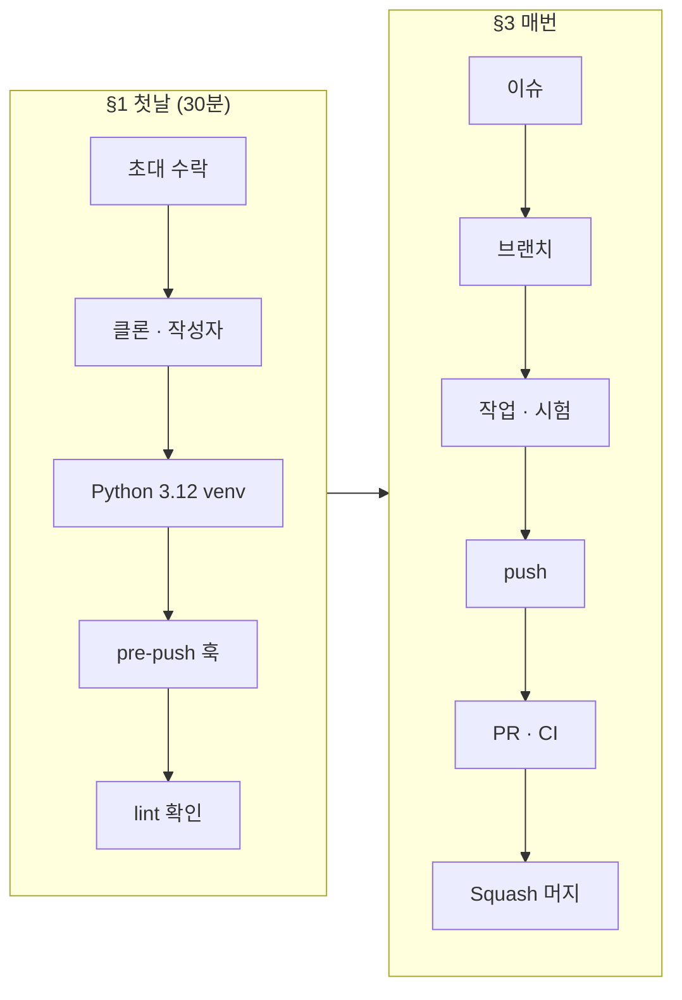
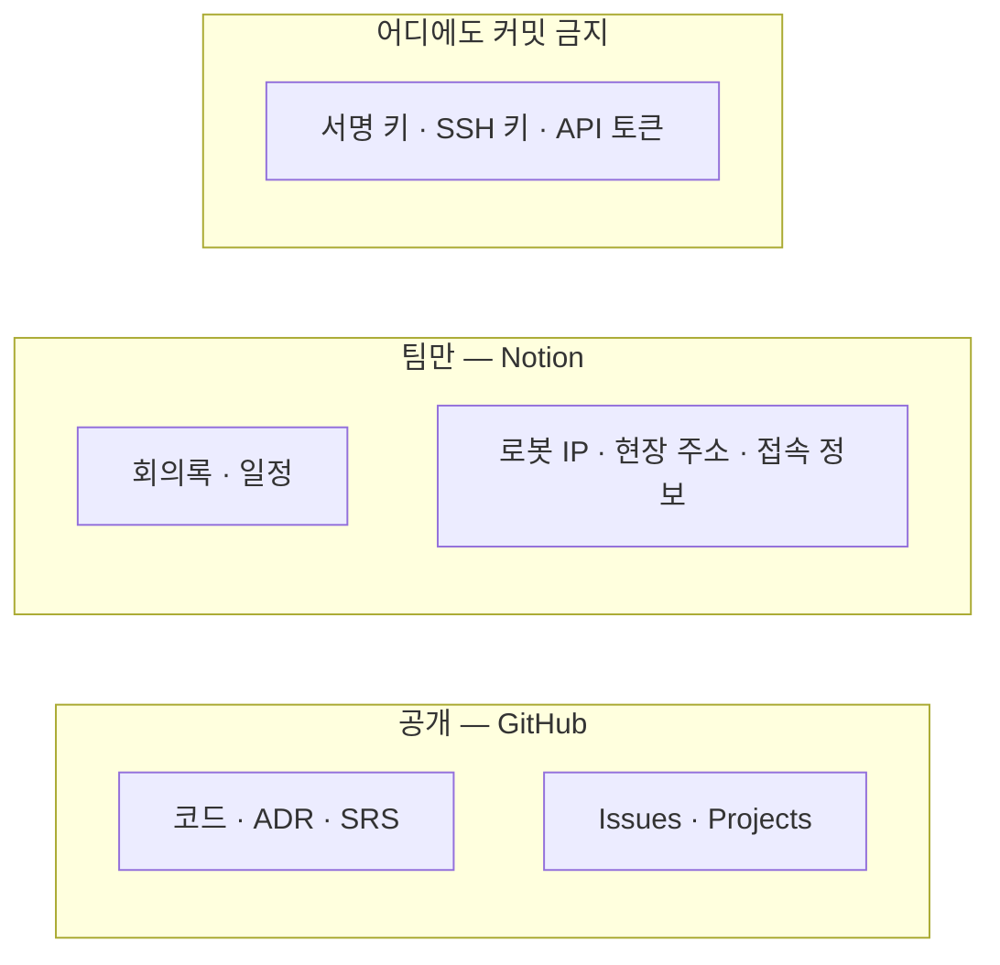
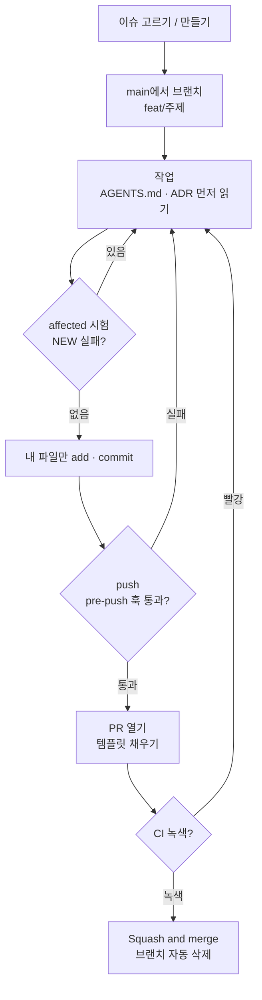

# ROSY 팀 가이드

- **대상:** `robotics-team-1213` org에 새로 합류한 팀원
- **갱신:** 2026-10-05 · Windows 새 클론에서 §1 명령을 그대로 실행해 확인함
- **규칙 원본:** 이 문서는 안내다. 계약과 다르면 [README 「핵심 계약」](../../README.md#핵심-계약), SRS, ADR이 이긴다.

이 문서를 위에서 아래로 따라 하면 첫 PR까지 갈 수 있다.



---

## 1. 첫날 설정 (30분)

### 1.1 준비물

| 무엇 | 확인 명령 | 없으면 |
|---|---|---|
| GitHub 계정 | — | github.com 가입 |
| Git (Windows는 **Git for Windows** — Git Bash 포함) | `git --version` | git-scm.com |
| **Python 3.12** (기준 버전) | `py -3.12 --version` (Windows) / `python3.12 --version` | python.org 3.12 설치 |

### 1.2 org 초대 수락

메일의 초대 링크, 또는 https://github.com/orgs/robotics-team-1213/invitation 에서 **Join**.
수락하면 팀 `core`로 `rosy-platform`에 **write** 권한이 생긴다. `main`에는 직접 push할 수 없고 PR로만 들어간다.

### 1.3 클론과 작성자 설정

```bash
git clone https://github.com/robotics-team-1213/rosy-platform.git
cd rosy-platform
git config user.name  "<내 GitHub 아이디>"
git config user.email "<내 GitHub 이메일>"
```

`<내 GitHub 이메일>`은 GitHub → Settings → **Emails**에 있는 주소 중 하나다. 메일 주소를 공개하고 싶지 않으면 같은 화면의 `숫자+아이디@users.noreply.github.com` 주소를 쓴다.

> 이 이메일이 **내 계정에 등록된 것**이어야 GitHub이 커밋을 내 이름으로 보여 준다. 다른 사람 이메일을 쓰면 커밋이 그 사람 것으로 표시된다. 확인: `git config user.email`

### 1.4 Python 환경

저장소 루트에서 실행한다. `.venv/`는 gitignore되어 있다.

**Windows (PowerShell)**

```powershell
py -3.12 -m venv .venv
.\.venv\Scripts\Activate.ps1
```

`Activate.ps1`이 실행 정책 때문에 막히면 한 번만 `Set-ExecutionPolicy -Scope CurrentUser RemoteSigned`.

**Linux / WSL / macOS**

```bash
python3.12 -m venv .venv
source .venv/bin/activate
```

**공통 — 의존성 설치.** 로봇 이미지와 같은 버전으로 맞춘다 (D-189).

```bash
python -m pip install --upgrade pip
python -c "import re; src=open('deploy/robot/pinky_pro/image/device-python-requirements.txt'); open('.venv/constraints.txt','w').write(''.join(l.split()[0]+'\n' for l in src if re.match(r'[A-Za-z0-9._-]+==', l)))"
python -m pip install -c .venv/constraints.txt fastapi uvicorn pydantic starlette websockets pyyaml httpx jsonschema pytest
```

### 1.5 pre-push 훅 설치

Windows는 **Git Bash**에서, 나머지는 터미널에서:

```bash
bash tools/hooks/install.sh
```

`installed .git/hooks/pre-push`가 나오면 끝. 이후 `git push`마다 lint와 빠른 계약 시험(약 3분)이 먼저 돈다. 훅은 venv의 Python을 쓰므로 **push할 때도 venv를 켠 터미널**에서 한다.

### 1.6 설정 확인

```bash
python tools/harness/rosy_harness.py lint
```

마지막 줄이 `0 error(s)`면 된다. 경고(warning)는 기존 것이라 무시한다.

### 1.7 첫날 체크리스트

- [ ] org 초대 수락, People에 내 아이디가 보인다
- [ ] `git config user.email`이 내 GitHub 이메일
- [ ] venv를 켜면 `python --version`이 3.12.x
- [ ] `.git/hooks/pre-push`가 있다
- [ ] `rosy_harness.py lint`가 `0 error(s)`
- [ ] §4 읽기 순서의 1–3번을 읽었다

---

## 2. 공유하는 것 / 공유하지 않는 것



| 무엇 | 어디 | 누가 보나 |
|---|---|---|
| 코드, ADR, SRS, API reference, 계획·검증 문서 | GitHub `robotics-team-1213/rosy-platform` | **전 세계 공개** |
| 버그, 할 일 | GitHub Issues + Projects | 공개 |
| 회의록, 일정 | Notion 팀 페이지 (리드가 게스트로 초대 — 준비 중) | 팀 |
| 현장 주소, 로봇 IP, 접속 정보 | Notion 비공개 페이지 (준비 중) | 팀 |
| Notion MCP 연동 토큰 | 리드가 메신저로 개별 전달 | 필요한 팀원 |

**저장소에 절대 올리지 않는 것.** 공개 저장소라 한 번 push하면 회수할 수 없다.

| 금지 | 대신 |
|---|---|
| 릴리스 서명 키 | 서명은 리드가 오프라인 로컬에서만 한다 (D-437) |
| 로봇 SSH 비밀번호·개인 키 | 접속 등록 절차 [robot-ssh-access.md](../deployment/robot-ssh-access.md) (D-418) |
| 실제 로봇 IP·현장 주소·계정 | 문서에는 `<robot-ip>`처럼 쓴다 (D-226) |
| API 토큰 (W&B, Notion, Bearer …) | 환경변수로 읽는다 |

GitHub push protection이 알려진 형식의 토큰은 push 단계에서 막는다. 형식이 없는 값은 못 막으니 `git diff`로 직접 확인한다.

---

## 3. 일하는 방법 — 이슈에서 머지까지

### 3.1 순서



```bash
# 1) 최신 main에서 브랜치
git switch main && git pull
git switch -c feat/<짧은-주제>          # type: feat | fix | refactor | docs | uiux

# 2) 작업 — 고칠 경로의 AGENTS.md와 관련 ADR을 먼저 연다

# 3) 바꾼 범위의 시험 (venv 켠 상태)
python tools/harness/rosy_harness.py affected --base origin/main --run

# 4) 커밋 — 내가 바꾼 파일만
git status --short
git add <파일> <파일>
git commit -m "feat(fleet): 한 줄 요약"

# 5) push → 훅이 lint + 빠른 시험을 돌린다
git push -u origin feat/<짧은-주제>
```

6. GitHub에 뜨는 **Compare & pull request**로 PR을 연다. 템플릿 체크리스트를 채운다.
7. PR에서 CI(`ci` 워크플로)가 돈다. 빨간불이면 로그를 보고 고친다.
8. 리뷰가 끝나면 **Squash and merge**. 브랜치는 자동으로 지워진다.

### 3.2 규칙

| 규칙 | 이유 |
|---|---|
| 한 브랜치 = 한 주제, 이름은 `<type>/<topic>` (D-372) | 리뷰와 되돌리기가 쉽다 |
| `git add -A` / `git add .` 대신 파일을 지정 | 의도하지 않은 파일·비밀값이 섞이지 않게 |
| 외부 API·모드·프로토콜 필드는 SRS·API reference·ADR에 있는 것만 | 로봇·Fleet·앱이 같은 계약을 본다 |
| 계약·구조를 바꾸는 결정은 ADR (§3.4) | 말로 정한 것은 남지 않는다 |
| `concern: safety` 경로를 바꾸는 커밋은 메시지에 `Safety-Review: <리뷰어> <근거>` 줄 (D-430 §5) | CI가 검사한다. 경로는 `tools/harness/platform_parts.yaml` |
| force-push 하지 않는다 | 다른 사람의 작업이 사라진다 |
| **실물 로봇을 움직이기 전에 반드시 먼저 묻는다** | 로봇은 팀이 같이 쓴다. 기본은 Gazebo 시뮬 |

### 3.3 시험 결과 읽기

```bash
python -m pytest <경로> -q -rfE -p no:cacheprovider > ../run.txt
python test/known_failures.py ../run.txt
```

`NEW`가 있으면 내 브랜치가 만든 실패다. `known`은 기존 실패라 괜찮다. 호스트 pytest 통과는 장치·ARM64 이미지·현장 수용이 아니다.

### 3.4 ADR 쓰기

1. 번호는 파일을 만들기 **직전에** 고른다. `docs/adr/`, [ADR Log](ROSY%20ADR%20Log.md)의 `| D-nnn |` 행, `tools/harness/harness.yaml`의 `adr_gaps`를 보고 가장 큰 번호의 다음.
2. `docs/adr/D-<번호>-<slug>.md`와 ADR Log 행을 **한 커밋**에.
3. `python tools/harness/rosy_harness.py lint`

### 3.5 main이 앞서 나갔을 때

```bash
git fetch origin
git merge origin/main      # 충돌을 고치고 커밋
git push
```

---

## 4. 읽기 순서

| # | 문서 | 얼마나 |
|---|---|---|
| 1 | [README](../../README.md) — 「핵심 계약」 | 5분, 필수 |
| 2 | [CONCEPTS.md](../../CONCEPTS.md) | 10분, 필수 |
| 3 | [STATUS.md](../../STATUS.md) — 모듈별 게이트 (SOURCE → LOCAL → ROS-SIM → ARTIFACT → DEVICE → FIELD) | 5분, 필수 |
| 4 | [개발 가이드](developer-guide.md) — 구조·빌드·시뮬·테스트 | 맡을 일을 정한 뒤 |
| 5 | 맡을 모듈의 `AGENTS.md`, `progress.md` | 작업 시작 전 |
| 6 | [CORE SRS](../spec/ROSY%20CORE%20SRS.md), [FLEET SRS](../spec/ROSY%20FLEET%20SRS.md), [API reference](ROSY%20API%20&%20Protocol%20Reference.md) | 필요할 때 |

---

## 5. 무엇을 작업하나

### 5.1 작업 영역

담당은 팀 리드가 정한다. 빈 칸은 아직 담당자가 없다는 뜻이다.

| 영역 | 경로 | 내용 | 실물 장치 | 담당 |
|---|---|---|---|---|
| CORE (로봇 게이트웨이) | `middleware/core/` | 외부 API, 유일한 `cmd_vel` 발행, 서비스·이벤트 | 일부 | |
| 인지·차선 | `middleware/perception/` | 카메라·LiDAR 차선/장애물 증거 | 일부 | |
| 내비게이션 | `middleware/core/navigation/` | Nav2 / SLAM | 시뮬로 가능 | |
| 장치·드라이버 | `middleware/apps/device/`, `middleware/drivers/` | Pinky Pro bringup, LED·램프·IMU·ADC, OMX | **필요** | |
| Fleet (현장 관제) | `operations/fleet/` | 미션 하달, 교통정리, 콘솔 | 불필요 | |
| 현장 비전·앱 | `operations/vision/`, `operations/ui/cam/` | 천장 카메라, Rosy Cam 앱 | 일부 | |
| 화면 (웹·앱) | `middleware/ui/`, `shared/web/` | 대시보드, Pilot 앱 ([DESIGN.md](../../DESIGN.md)) | 불필요 | |
| 시뮬레이션 | `integrations/simulation/` | Gazebo 월드·다로봇 시뮬 | 불필요 | |
| 학습 | `learning/` | 데이터셋, 학습, 모델 배달 | 불필요 | |
| 배포·릴리스·CI | `deploy/`, `.github/workflows/`, `tools/` | 이미지·payload 빌드, CI | 일부 | |
| 문서·거버넌스 | `docs/` | ADR, SRS, 검증 기록 | 불필요 | |

### 5.2 처음 잡기 좋은 일

장치 없이 할 수 있고 팀 전체에 도움이 되는 것부터. 고르기 전에 Issues에 같은 일이 있는지 보고, 없으면 이슈를 만들어 담당을 적는다.

| 일 | 왜 | 영역 |
|---|---|---|
| `ci` 워크플로 실패 원인 정리 | 최근 실행의 절반 가까이가 실패. 녹색이 돼야 PR 필수 검사로 걸 수 있다 | CI |
| `Payload boot smoke (arm64)` 실패 원인 정리 | 최근 10회 중 9회 실패 | CI·배포 |
| `tools/*.sh`의 하드코딩 Bearer 토큰을 환경변수로 | 공개 저장소에 토큰 문자열이 남지 않게 | 도구 |
| 5MB 넘는 파일 추가를 CI에서 경고 | 큰 바이너리가 이력에 쌓이지 않게 | CI |
| [STATUS.md](../../STATUS.md)에서 `ROS-SIM`이 `HOLD`인 모듈을 시뮬로 올리기 | 장치 없이 게이트를 한 단계 올린다 | 각 모듈 |

---

## 6. 막혔을 때

| 증상 | 원인 → 해결 |
|---|---|
| `py -3.12`가 `No suitable Python runtime found` | 3.12가 없거나 py 런처에 등록되지 않았다 → python.org에서 3.12 설치 |
| push할 때 `[pre-push] no python interpreter with PyYAML` | venv가 꺼진 터미널에서 push → venv 켜고 다시 |
| push할 때 `user.email ... is not yours` | 작성자 이메일이 잘못됨 → §1.3 |
| push할 때 `generated records are regenerated but uncommitted` | `python tools/harness/rosy_harness.py generate`가 바꾼 파일(`STATUS.md`, `docs/index.md` 등)을 커밋 |
| `main`에 push가 거절됨 | 정상. `main`은 PR로만 → §3.1 |
| push가 `secret detected`로 거절됨 | 토큰이 커밋에 들어갔다 → 그 커밋에서 빼고 환경변수로 |
| pre-push가 **내가 건드리지 않은** 시험에서 실패 | `python test/known_failures.py`로 확인. `NEW`인데 내 변경과 무관하면 main이 이미 깨진 것 → Issue로 알리고 리드에게 공유. 우회(`--no-verify`)하지 않는다 |
| 줄 끝 경고 `LF will be replaced by CRLF` | 무시해도 된다 (`.gitattributes`가 정한다) |

## 7. 소통

| 용도 | 어디 |
|---|---|
| 버그, 할 일, 질문 | GitHub Issues (Projects 보드에서 상태) |
| 코드 리뷰 | PR 코멘트 |
| 회의, 일정, 비공개 자료 | Notion |
| 결정 | ADR (`docs/adr/`) |
