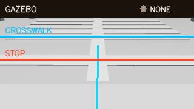

# Semantic road control validation (2026-09-21)

## Actual Gazebo runtime result

`GAZEBO_CAMERA_GRAPH_PASS` / `GAZEBO_POSE_DISTANCE_PASS` /
`ENFORCED_TRAFFIC_STOP_PASS`

WSL2 Ubuntu 24.04.4, ROS 2 Jazzy, Gazebo Sim 8.11.0에서 실제
`semantic_road_dashboard.launch.py gazebo_gui:=false`를 실행했다. Gazebo가
설치 overlay의 `map_260905_traffic.world`를 로드했고 소스와 설치본의
SHA-256은 `af70bbd...a87373`으로 일치했다.

로봇은 차선 중심의 정지선 상류 `(-0.20, -0.15, yaw=0)`에 생성됐다.
실제 `/camera/front` 프레임은 `GAZEBO`, `front_camera_link`, 320x180으로
수신됐고, 흰색 표식만 분리하도록 Gazebo 전용 밝기 임계값을 220으로
설정했다. production detector가 동일 프레임 경로에서 차선, 정지선,
횡단보도를 모두 검출했다.

정지 상태에서 Gazebo pose와 semantic truth로 계산한 카메라-정지선 거리는
`0.113843 m`, 검출 거리는 `0.118260 m`였다. 절대 오차는 `0.004417 m`
(약 4.4 mm, 3.88%)다. 이 비교는 이전처럼 화면의 임의 수평선을 정지선으로
간주하지 않고 로봇 pose, 카메라 URDF offset, 정지선 world 좌표를 함께
사용한다.



CORE는 `CAMERA_LINE + ENFORCED`로 실행됐다. 차선 추종 후보는 linear
`0.079820 m/s`, angular `-0.002776 rad/s`였고, 정지선 접근 중 traffic
scale이 `0.1968`에서 최저 `0.15`로 내려갔다. 로봇은 약 `0.04768 m`
전진한 뒤 정지선 거리 `0.118260 m`에서 `WAIT_SIGNAL / signal_unknown`으로
전환됐다. 이때 최종 readback은 linear `0.0 m/s`, angular `0.0 rad/s`였다.
따라서 이번 결과는 관측 연결만이 아니라 비영점 후보에 대한 실제 강제 차단도
증명한다.

현재 아래로 25도 기울어진 한 개 카메라 시야에는 신호등 램프가 들어오지 않아
camera signal 검출은 PASS로 올리지 않았다. 신호 미확인 상태에서 진행하지 않는
fail-closed 동작은 확인됐으며, 실제 신호 검출은 별도 시야/마운트 검증이 남아 있다.

이 호스트에서 raw ROS camera는 `4.111~4.360 Hz`, dashboard preview는
7초 표본에서 약 `1.63 Hz`였다. semantic launch의 `camera_width`,
`camera_height`, `camera_update_rate`로 호스트 성능에 맞게 조정할 수 있다.

## Simulation-only distance safety boundary

Gazebo pinhole 거리 모델은 다음 세 조건을 모두 만족해야만 생성된다.

1. `allow_simulation_ground=true` 명시적 opt-in
2. `use_sim_time=true`
3. dashboard source가 `GAZEBO`

기하 파라미터 전체가 캐시 키에 포함되므로 런타임 파라미터가 바뀐 뒤 오래된
모델을 재사용하지 않는다. 물리 기본값은 `camera_ground_mode=homography`,
`allow_simulation_ground=false`다. 사용자가 제공한
`approximate_requires_physical_validation` homography는 활성화하지 않았다.

## Deterministic host simulation result

`SEMANTIC_ROAD_HOST_SIM_PASS`

`map_260905_update_v2` 기하를 보존한 파생 scene에는 차선, 정지선, 횡단보도,
신호등이 들어 있다. host simulation은 production detector, strict bridge
decoder, line-follow manager, traffic policy, 최종 atomic command gate를 검사한다.

| Phase | Detected / policy state | Final linear command |
|---|---|---:|
| clear | lane / `FOLLOW` | 0.07984 m/s |
| approach | stop line + red / `APPROACH` | 0.04139 m/s |
| red stop | crosswalk + stop line + red / `STOP_REQUIRED` | 0.00000 m/s |
| red wait | crosswalk + stop line + red / `WAIT_SIGNAL` | 0.00000 m/s |
| green proceed | crosswalk + stop line + green / `PROCEED` | 0.02457 m/s |
| stale | expired observation / `HOLD` | 0.00000 m/s |

Semantic YAML truth는 scene 생성과 감사에만 쓰며 detector 입력으로 전달하지 않는다.
`result.json`은 `semantic_truth_fed_to_detector: false`와
`physical_device_validated: false`를 기록한다.

## Evidence

- `gazebo_runtime_result.json`: 실제 Gazebo camera, pose-ground-truth 거리 비교,
  detector, ENFORCED CORE readback.
- `gazebo_camera_frame.jpg`: CORE authenticated preview endpoint에서 받은 실제
  Gazebo 프레임. HOST-SIM fixture가 아니다.
- `result.json`: deterministic policy/command 표본.
- `semantic_road_simulation.svg`: 상태/명령 timeline.
- `camera_detection_montage.png`: production detector의 합성 camera 입력.
- `camera_live_dashboard.png`: 과거 HOST-SIM browser fixture이며 이번 실제 Gazebo
  browser 증거가 아니다.
- `traffic_policy_dashboard.png`: 과거 browser policy control 증거.
- `src/core/control/map/map_260905_update_v2/review/map_260905_traffic.png`:
  측정된 16-wall map 위 semantic overlay.
- `src/core/control/map/map_260905_update_v2/worlds/map_260905_traffic.world`:
  lane, crosswalk, stop line, signal model이 포함된 Gazebo world.

이번 실행에서 in-app browser inventory가 비어 있어 live full-dashboard screenshot은
찍지 못했다. 위 API frame과 API state readback은 실제 런타임 증거지만 browser
gate는 fixture로 대체하지 않고 `HOLD_NO_BROWSER_BACKEND`로 유지한다.

## Reproduce

```bash
source /opt/ros/jazzy/setup.bash
source <workspace>/install/setup.bash
ros2 launch gz_sim semantic_road_dashboard.launch.py gazebo_gui:=false
```

필요한 경우 카메라 부하만 조정한다.

```bash
ros2 launch gz_sim semantic_road_dashboard.launch.py \
  camera_width:=640 camera_height:=360 camera_update_rate:=5
```

`http://127.0.0.1:8080/dashboard`에서 Viewer token을 입력하고 camera source가
`GAZEBO`인지 확인한다.

## Acceptance boundary

이번 증거는 실제 Gazebo camera/ROS graph, 정확한 installed semantic world,
pose-ground-truth 기반 simulation 거리, 차선·정지선·횡단보도 검출, adaptive
approach, ENFORCED 최종 정지를 증명한다. 현재 마운트에서 실제 camera signal
검출, Pi/ARM64, 물리 Pinky Pro camera mounting/homography, braking distance,
motor response, 무인 field acceptance는 증명하지 않는다. 이 항목은 DEVICE와
FIELD gate로 남는다.
